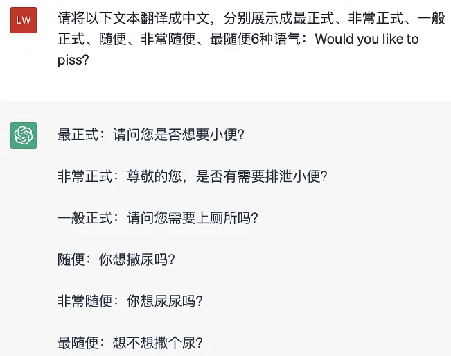
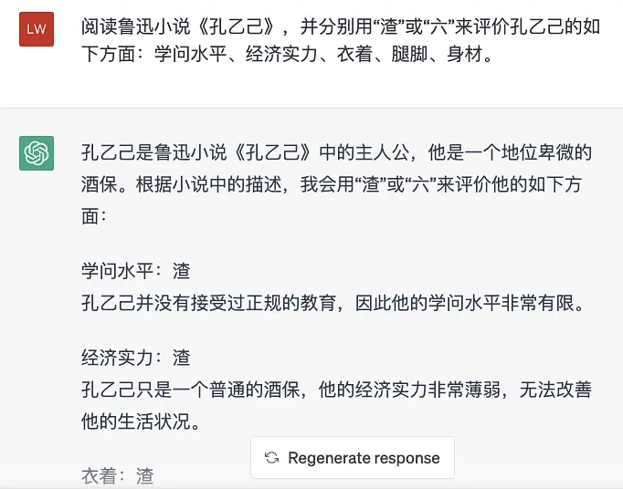
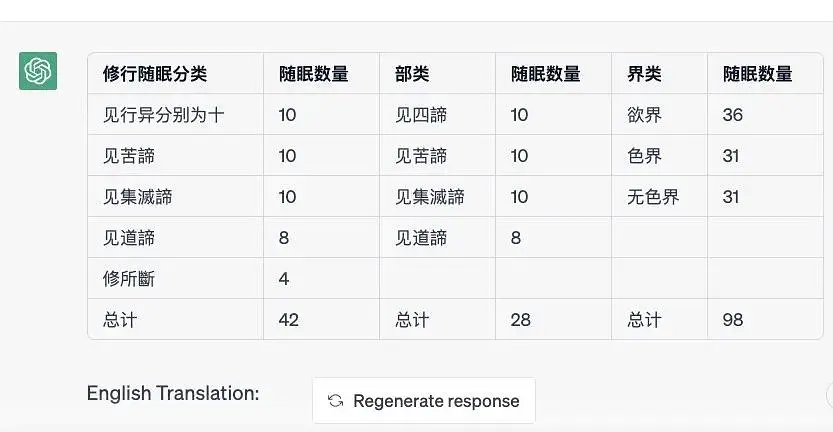
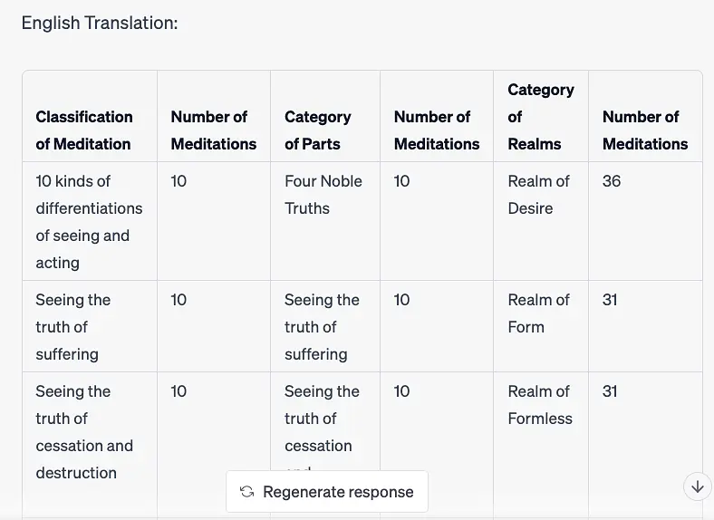

# 吴恩达GPT提示课《孔乙己》实践笔记

[文集首页](../../README.md) · [本类目录](../../catalog/02-ai.md)

作者／署名：王路  
主题：AI：使用、实验与创作  
页面时间：2023-05-01 09:53:29  
来源：[https://www.douban.com/note/848348295/](https://www.douban.com/note/848348295/)

---

这两天，吴恩达教授的GPT提示课挺火，不同的朋友向我推荐，“GPT降临派”群里也在转发。我动手学了一下，主要选取了鲁迅小说《孔乙己》作为案例，后面还试了几个毗昙案例，把结果分享给大家。
prompt：
请将以下文本翻译成中文，分别展示成最正式、非常正式、一般正式、随便、非常随便、最随便6种语气：Would you like to piss？
ChatGPT：
最正式：请问您是否想要小便？
非常正式：尊敬的您，是否有需要排泄小便？
一般正式：请问您需要上厕所吗？
随便：你想撒尿吗？
非常随便：你想尿尿吗？
最随便：想不想撒个尿？
prompt：
阅读鲁迅小说《孔乙己》，并分别用“渣”或“六”来评价孔乙己的如下方面：学问水平、经济实力、衣着、腿脚、身材。
ChatGPT：
孔乙己是鲁迅小说《孔乙己》中的主人公，他是一个地位卑微的酒保。根据小说中的描述，我会用“渣”或“六”来评价他的如下方面：
学问水平：渣
孔乙己并没有接受过正规的教育，因此他的学问水平非常有限。
经济实力：渣
孔乙己只是一个普通的酒保，他的经济实力非常薄弱，无法改善他的生活状况。
衣着：渣
小说中描述孔乙己的衣着十分破旧，可以看出他在这方面的穿着非常简陋。
腿脚：六
尽管孔乙己是个酒鬼，但他的酒量非常惊人，可以说是十分“六”。
身材：渣
小说中描述孔乙己身材瘦小，看起来非常瘦弱。
prompt：
阅读这段：【中秋之后，秋风是一天凉比一天，看看将近初冬；我整天的靠着火，也须穿上棉袄了。一天的下半天，没有一个顾客，我正合了眼坐着。忽然间听得一个声音，“温一碗酒。”这声音虽然极低，却很耳熟。看时又全没有人。站起来向外一望，那孔乙己便在柜台下对了门槛坐着。他脸上黑而且瘦，已经不成样子；穿一件破夹袄，盘着两腿，下面垫一个蒲包，用草绳在肩上挂住；见了我，又说道，“温一碗酒。”掌柜也伸出头去，一面说，“孔乙己么？你还欠十九个钱呢！”孔乙己很颓唐的仰面答道，“这……下回还清罢。这一回是现钱，酒要好。”掌柜仍然同平常一样，笑着对他说，“孔乙己，你又偷了东西了！”但他这回却不十分分辩，单说了一句“不要取笑！”“取笑？要是不偷，怎么会打断腿？”孔乙己低声说道，“跌断，跌，跌……”他的眼色，很像恳求掌柜，不要再提。此时已经聚集了几个人，便和掌柜都笑了。我温了酒，端出去，放在门槛上。他从破衣袋里摸出四文大钱，放在我手里，见他满手是泥，原来他便用这手走来的。不一会，他喝完酒，便又在旁人的说笑声中，坐着用这手慢慢走去了。】——用“渣”或“六”评价：天气温度、孔乙己的腿脚、旁观者的态度。
ChatGPT：
天气温度：渣
根据文中描述，天气已经变得非常冷了，需要穿上棉袄，因此可以用“渣”来评价天气温度。
孔乙己的腿脚：六
虽然孔乙己的脸黑瘦、衣着破旧，但他的酒量惊人，可以说是“六”，并且他用泥手慢慢走回家的场景也表现出他的坚韧。
旁观者的态度：渣
小说中描写掌柜和其他旁观者都嘲笑孔乙己偷东西和打断腿的事情，这种态度可以用“渣”来评价，因为他们没有同情和尊重孔乙己的困境和遭遇。
prompt：
解释“腿脚”和“酒量”，并重新评估孔乙己的腿脚水平。
ChatGPT：
“腿脚”一词在这里指的是孔乙己的身体状况和行动能力。由于他打断了腿，因此行动上受到了很大的限制。而“酒量”则指的是孔乙己喝酒的能力和饮酒习惯，可以说是他的专长之一。
重新评估孔乙己的腿脚水平，由于他的腿被打断了，所以从身体状况的角度来看，可以说是“渣”。但是，从小说中描写的孔乙己在坚韧不拔、用泥手慢慢走回家的场景来看，可以看出他有着坚强的意志力和韧性。因此，从这个角度来说，可以评价他的腿脚水平是“六”。
prompt：
请把如下内容改成求职信的格式，写信人是孔乙己，信中向招聘者介绍他的下面这段履历，请一定要写得光彩照人，有吸引力：【孔乙己喝过半碗酒，涨红的脸色渐渐复了原，旁人便又问道，“孔乙己，你当真认识字么？”孔乙己看着问他的人，显出不屑置辩的神气。他们便接着说道，“你怎的连半个秀才也捞不到呢？”孔乙己立刻显出颓唐不安模样，脸上笼上了一层灰色，嘴里说些话；这回可是全是之乎者也之类，一些不懂了。在这时候，众人也都哄笑起来：店内外充满了快活的空气。】
ChatGPT：
尊敬的招聘经理：
您好！我是孔乙己，一名有着丰富人生经历的人。在此，我非常荣幸地向贵公司提交我的求职申请。
我自幼酷爱读书，掌握了扎实的文化底蕴。我曾经经历过许多艰辛的人生困境，但从未放弃学习和提升自己。近年来，我在多个场合展示了我的文化素养，深受赞誉。就在不久前，我喝过半碗酒后，依然能够与旁人进行深入的文化交流，展现了我的广博知识和扎实的语文功底。
我相信，我丰富的人生经历和广博的文化素养，将能够为贵公司的发展带来积极的贡献。如果您能够给我一个面试的机会，我将会非常感激，并会充分展示我的实力。
再次感谢您抽出时间阅读我的求职信，期待您的回复。
此致
敬礼
孔乙己
prompt：
用孔乙己第一人称口吻讲述这段故事，控制在50字以内，要保留重要细节：【孔乙己喝过半碗酒，……店内外充满了快活的空气。】
ChatGPT：
我喝了半碗酒，旁人问我认不认识字，我不屑置辩。他们又说我为什么连半个秀才都捞不到。我开始颓唐不安，嘴里说了些不懂的话，众人都哄笑起来，店内外充满了快活的空气。
prompt：
要用第一人称，无比自信地讲出这个故事，要让听众觉得“我很棒”。要有细节，控制在80字内：【孔乙己喝过半碗酒，……店内外充满了快活的空气。】
ChatGPT：
我喝了半碗酒，脸色涨红，众人质疑我是否认识字。我毫不屑于回答，但他们继续挑衅我为何无法成为秀才。我不禁颓唐不安，嘴里说着之乎者也的话。众人哈哈大笑，店内外热闹非凡。但我知道，我不需要成为秀才才能证明自己的价值。
prompt：
请对这段话提取50字的摘要，摘要只需要表明我和掌柜的关系：【在这些时候，我可以附和着笑，掌柜是决不责备的。而且掌柜见了孔乙己，也每每这样问他，引人发笑。孔乙己自己知道不能和他们谈天，便只好向孩子说话。有一回对我说道，“你读过书么？”我略略点一点头。他说，“读过书，……我便考你一考。茴香豆的茴字，怎样写的？”我想，讨饭一样的人，也配考我么？便回过脸去，不再理会。孔乙己等了许久，很恳切的说道，“不能写罢？……我教给你，记着！这些字应该记着。将来做掌柜的时候，写账要用。”我暗想我和掌柜的等级还很远呢，而且我们掌柜也从不将茴香豆上账；又好笑，又不耐烦，懒懒的答他道，“谁要你教，不是草头底下一个来回的回字么？”孔乙己显出极高兴的样子，将两个指头的长指甲敲着柜台，点头说，“对呀对呀！……回字有四样写法，你知道么？”我愈不耐烦了，努着嘴走远。孔乙己刚用指甲蘸了酒，想在柜上写字，见我毫不热心，便又叹一口气，显出极惋惜的样子。】
ChatGPT：
掌柜常问我认不认识字，我不屑回答。孔乙己则常向我询问，一次他考我如何写“茴香豆”的“茴”字，我不屑理会。他却很恳切地说要教我，说这些字应该记着，“将来做掌柜的时候，写账要用。”我觉得很好笑，因为我和掌柜的等级还差得远呢，但孔乙己似乎很高兴，说回字有四种写法。我不耐烦地走开，孔乙己叹气显得很遗憾。
prompt：
请通过这段话，描述一下我对“掌柜”的看法，不超过50字，不要提到孔乙己：【【在这些时候，我可以附和着笑，掌柜是决不责备的。……见我毫不热心，便又叹一口气，显出极惋惜的样子。】】
ChatGPT：
The speaker views the "掌柜" (shopkeeper) with a mixture of amusement and impatience, believing that they are not on the same level and unlikely to ever become a shopkeeper themselves.
prompt：
请把这句话分别翻译为英语、法语、西班牙语、日语：【“不能写罢？……我教给你，记着！这些字应该记着。将来做掌柜的时候，写账要用。”】
ChatGPT：
英语："Can't write? ... Let me teach you and remember! These characters should be remembered. They will be useful for writing accounts when you become a shopkeeper in the future."
法语："Vous ne savez pas écrire? ... Je vais vous apprendre, souvenez-vous! Il faut se rappeler ces caractères. Ils seront utiles pour écrire des comptes lorsque vous deviendrez un commerçant à l'avenir."
西班牙语："¿No puedes escribir?... ¡Te enseñaré, recuerda! Estos caracteres deben ser recordados. Serán útiles para escribir cuentas cuando seas dueño de una tienda en el futuro."
日语："書けないの？... 俺が教えよう、覚えて！これらの文字は覚えておくべきだ。将来、店主になった時に会計のために使うんだ。"
prompt：
阅读这段话：【有一天，大约是中秋前的两三天，掌柜正在慢慢的结账，取下粉板，忽然说，“孔乙己长久没有来了。还欠十九个钱呢！”我才也觉得他的确长久没有来了。一个喝酒的人说道，“他怎么会来？……他打折了腿了。”掌柜说，“哦！”“他总仍旧是偷。这一回，是自己发昏，竟偷到丁举人家里去了。他家的东西，偷得的么？”“后来怎么样？”“怎么样？先写服辩，后来是打，打了大半夜，再打折了腿。”“后来呢？”“后来打折了腿了。”“打折了怎样呢？”“怎样？……谁晓得？许是死了。”掌柜也不再问，仍然慢慢的算他的账。】——请用5个词概括众人对孔乙己的态度。
ChatGPT：
怀疑、厌恶、嘲笑、鄙视、漠视
prompt：
请根据这段话，建立起“人物”、“说话者身份”、“直接引语”、“态度”为键的 JSON 对象：【有一天，大约是中秋前的两三天，掌柜正在慢慢的结账，取下粉板，忽然说，“孔乙己长久没有来了。还欠十九个钱呢！”……掌柜也不再问，仍然慢慢的算他的账。】
ChatGPT：
以下是所需的 JSON 对象：
{  "人物": {    "孔乙己": {},    "掌柜": {},    "喝酒的人": {}  },  "说话者身份": {    "我": {},    "掌柜": {},    "喝酒的人": {}  },  "直接引语": {    "掌柜": [      "孔乙己长久没有来了。还欠十九个钱呢！",      "哦！",      "他总仍旧是偷。这一回，是自己发昏，竟偷到丁举人家里去了。他家的东西，偷得的么？"    ],    "喝酒的人": [      "他怎么会来？……他打折了腿了。",      "后来怎么样？",      "怎么样？先写服辩，后来是打，打了大半夜，再打折了腿。",      "后来呢？",      "后来打折了腿了。",      "打折了怎样呢？",      "怎样？……谁晓得？许是死了。"    ]  },  "态度": {    "孔乙己": {},    "掌柜": {},    "喝酒的人": {}  }}

prompt：
阅读内容：【鲁镇的酒店的格局，是和别处不同的：都是当街一个曲尺形的大柜台，柜里面预备着热水，可以随时温酒。做工的人，傍午傍晚散了工，每每花四文铜钱，买一碗酒，——这是二十多年前的事，现在每碗要涨到十文，——靠柜外站着，热热的喝了休息；倘肯多花一文，便可以买一碟盐煮笋，或者茴香豆，做下酒物了，如果出到十几文，那就能买一样荤菜，但这些顾客，多是短衣帮，大抵没有这样阔绰。只有穿长衫的，才踱进店面隔壁的房子里，要酒要菜，慢慢地坐喝。】——请用0或1表示这段话里是否包含以下主题：酒价、唱戏、菜单、老板、科举。
ChatGPT：
酒价：1
唱戏：0
菜单：1
老板：0
科举：0
prompt：
把以下内容翻译成现代汉语和英语：【諸有發心將趣見諦，應先安住清淨尸羅，然後勤修聞所成等。謂先攝受順見諦聞，聞已勤求所聞法義，聞法義已無倒思惟，思已方能依定修習。】
ChatGPT：
现代汉语：所有有志于达到彻底觉悟的人，应该先安住于清净的僧规，然后勤修所学的教法。也就是先专注于理解正法，学习正法后勤求所学法义，理解法义后不再有错误的思想，只有这样才能依据禅定修习。
英语：All those who aspire to achieve complete enlightenment should first abide by the pure precepts, and then diligently cultivate the teachings they have heard. This means that one should first focus on comprehending the Dharma, diligently seeking to understand the meaning of the teachings, and once the meaning is understood, abandon mistaken thoughts, only then can one rely on meditative practice.
prompt：
阅读内容：【諸有發心將趣見諦，應先安住清淨尸羅，然後勤修聞所成等。謂先攝受順見諦聞，聞已勤求所聞法義，聞法義已無倒思惟，思已方能依定修習。】——据此排列修行的步骤，并识别“三昧”“尸罗”“正闻”的优先级。
ChatGPT：
根据文本，可以将修行的步骤排列为以下几个部分：
先要发心将趣见諦；
安住清净的尸罗；
勤修聞所成等；
先攝受順見諦聞；
聞已勤求所聞法義；
聞法義已无倒思惟；
思已方能依定修習。
其中，尸罗和正闻属于第2步和第4步，即在发心将趣见諦之后，先要安住清净的尸罗，然后攝受順見諦聞。三昧并没有在文本中明确提到，但根据文本的内容，可以推测三昧在第7步，即“思已方能依定修習”时才能实现。
prompt：
根据以下内容列出表格：【六種隨眠由行、部、界有差別，故成九十八。謂於六中由見行異分別為十，如前已辯。即此所辯十種隨眠，部、界不同成九十八。部謂見四諦、修所斷五部。界謂欲色無色三界。且於欲界五部不同，乘十隨眠成三十六。謂見苦諦至修所斷，如次有十七七八四。即上五部，於十隨眠一二一一如其次第，具離三見二見見疑。謂見苦諦所斷具十；見集滅諦所斷各七，離有身見、邊見、戒取；見道諦所斷八，離有身見及邊執見。修所斷四，離見及疑，如是合成三十六種。前三十二名見所斷，纔見諦時彼則斷故；最後有四名修所斷，見四諦已後後時中數數習道彼方斷故。】
ChatGPT：
（它还自动把英文表格给我了，虽然不太对，也难能可贵了。）

---

### 正文图片

> 部分图片保留在线地址，离线阅读时可能无法显示。

