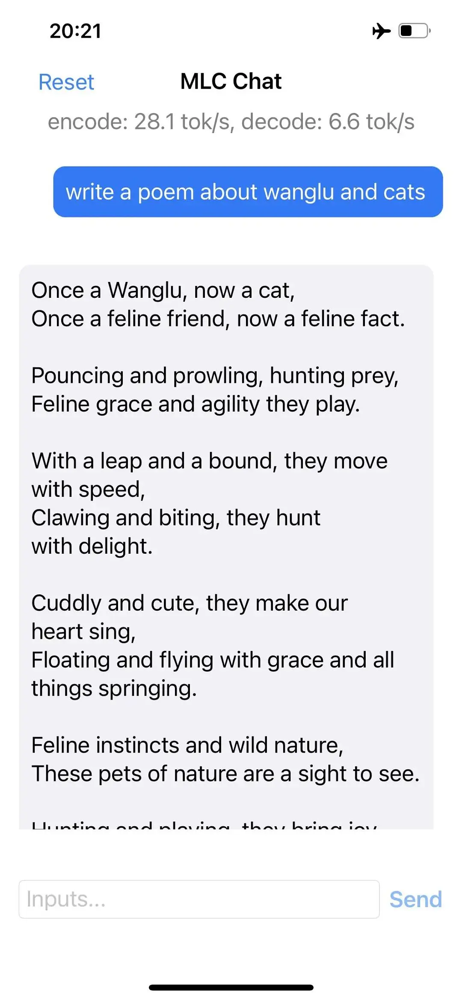
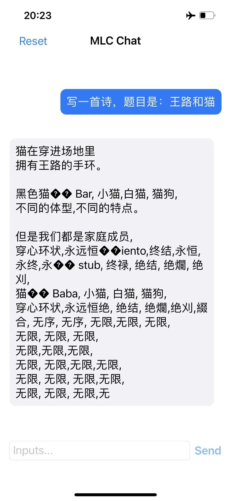
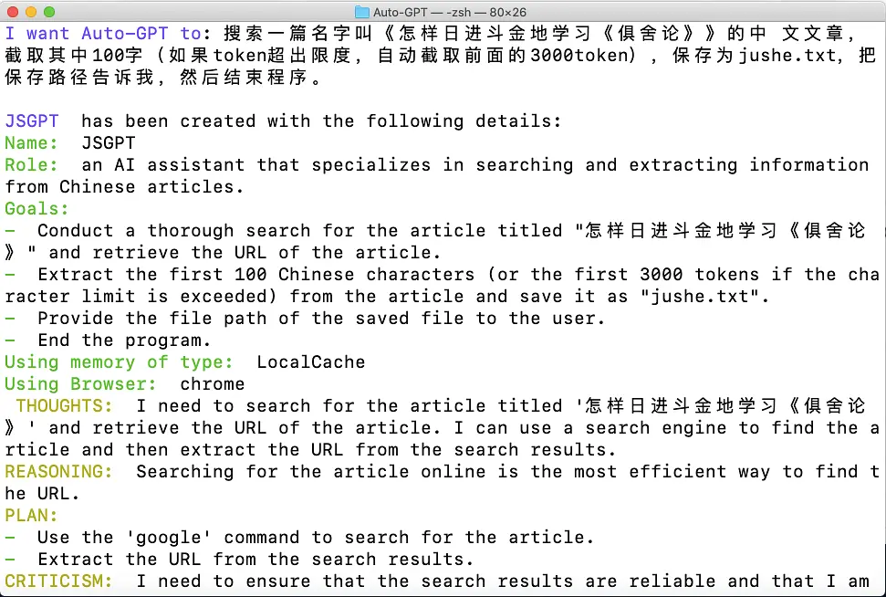

# 将来会火的两个AI方向

[文集首页](../../README.md) · [本类目录](../../catalog/02-ai.md)

作者／署名：王路  
主题：AI：使用、实验与创作  
页面时间：2023-05-03 21:07:27  
来源：[https://www.douban.com/note/848437291/](https://www.douban.com/note/848437291/)

---

简单介绍两个将来会很有用，目前还非常弱的AI工具。工具本身目前都不大好用，但这两个方向将来都会很火。

一个是陈天奇等人做的MLC LLM。这个AI最振奋的地方是可以在手机上离线运行。不过目前功能非常弱，英文还凑合，中文几乎不能用。我让它用英文写一首《王路和猫》的诗，还能看，用中文，压根不能看，英翻中也不行。——不过这都不是问题。

因为，我们如果需要一个在本地离线运行的AI，我们根本不需要它什么都会，它只会我们想要的功能之一就可以。比如说搞法律工作的，如果专门搞民法，你用民法数据训练它就可以了。离线用这一个功能就够了。更泛化的功能你可以在线上用GPT4。既然第一个能在手机上离线的AI能出来，很快就会越来越多，也越来越好。

另一个是auto-gpt。你可以布置给它一些任务，让它自己设计方案去完成。但目前，还是非常弱的。我先是让它帮我注册一个163邮箱，如果需要手机短信验证，可以发到手机号186……上，向我询问验证码。它根本做不来。为了注册邮箱，它要先写个Python程序，程序总是写错，第一步就卡住了。

我又布置一个更简单的问题：去豆瓣上搜写《韩愈传》的王路，告诉我他有多少粉丝。——Auto-GPT可以上豆瓣，但完不成任务。它搜索到了《韩愈传》相关条目，然后token就超了，它甚至抛给我一个差评：“此书为作者14天完成的仓促之作，正如作者所说：在我所写的书之中，恐怕没有比这更坏的了”——吓了我一跳，我自己动手搜了一下，这是某读者在李长之先生《韩愈传》底下的评价。我改了任务七八次，它永远都不能找到我豆瓣的粉丝数。——这对人来说非常简单，对AI来说，太难了。

对大语言模型来说，最简单的任务可能是写诗。写诗是可以啥都不干无中生有的，这也是为什么搞大语言模型的人为了展示自己的模型可以，最常见的就是让模型“写一首诗”，而你但凡给个具体任务，对它来说就难得不得了。我让Auto-GPT去搜《怎样日进斗金地学习俱舍论》，截取100字保存到txt中，它先用谷歌搜，搜完发现相关条目太多，不知道该看哪个了，就放弃了这个方法。绕了几圈，又用谷歌搜，又碰到token不够的问题，又放弃。

我试的任务里，最终它能完成的，是写下来“王路先生晚上好”保存到txt文件里。如果你让它写一封信，它也能完成——这些都不需要“动手”。

动手对AI来说难度还相当大。泛泛找材料，它似乎还行，而一旦要求具体，它就不行了。不过将来，这两个方向，我觉得都有比较大的潜力。

---

### 正文图片

> 部分图片保留在线地址，离线阅读时可能无法显示。

