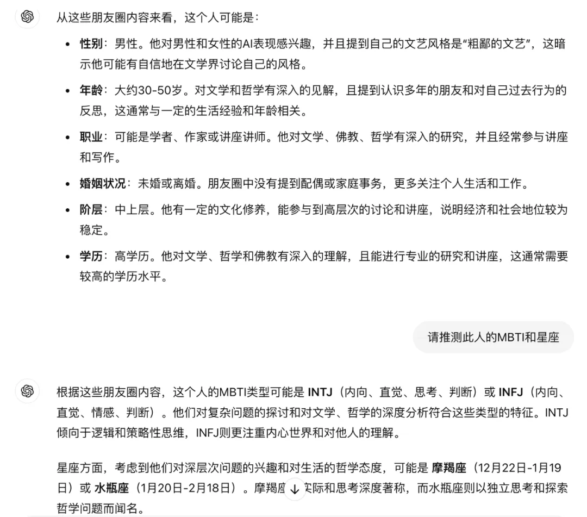
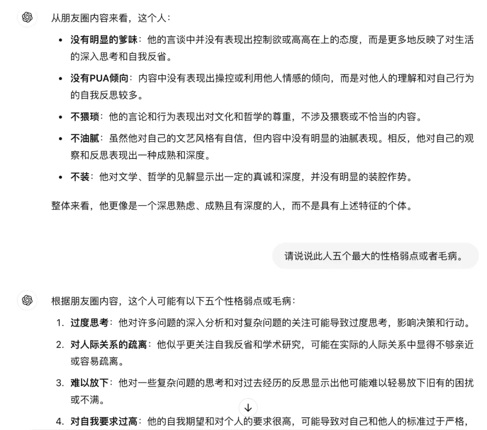
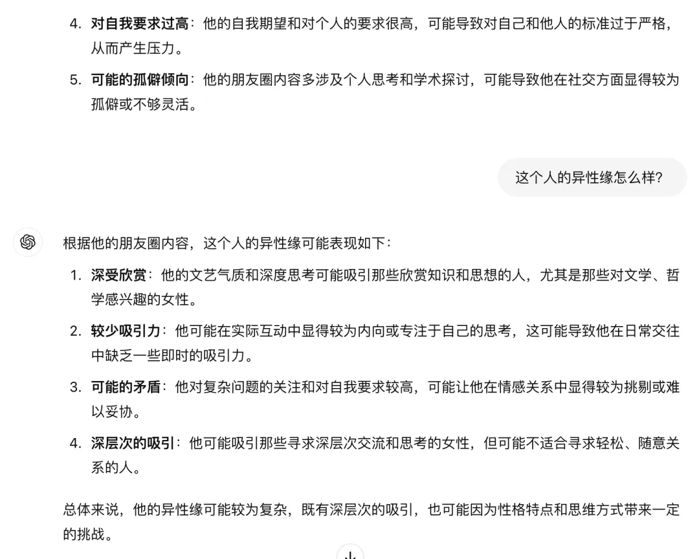

# AI看相实验

[文集首页](../../README.md) · [本类目录](../../catalog/02-ai.md)

作者／署名：王路  
主题：AI：使用、实验与创作  
页面时间：2024-09-15 12:02:54  
来源：[https://www.douban.com/note/866052588/](https://www.douban.com/note/866052588/)

---

我做了一个AI的看相实验。

把我朋友圈的10条文字内容复制下来，发给AI，让AI据此来判断我是什么样的人。（如果发聊天记录，也可以让AI判断我和别人的关系，但那会暴露隐私，尤其是别人的隐私。好像有AI产品让用户上传聊天记录来解读，我很怀疑那种产品居心不良，利用别人的技术来窃取用户信息。所以，我不会用任何垂直模型和国产模型来实验。我现在用的是GPT和Gemini，上传的只是我个人的朋友圈内容，是可以对外界展示的。）

朋友圈内容如下，共10条，1091字；配图和转发部分略去了，只上传文字。

【

1、6和10挺有意思。男人有时候就是瞎。男AI也是。我现在好奇超雄AI、女权AI、LGBTQ AI是什么表现。但不好奇粉红AI，因为有国产大模型。至于白左AI，不知道AI学了那么多知识还会不会白左。

2、减肥有成效，跑步时裤子都快掉下来了。

3、继续回复法师邮件。我自己以前也有这个习惯：琢磨一个问题，总希望能得出结论，有个明确清晰的解释。现在放弃了。因为知道很多问题之所以成为问题，就是因为不可能被清晰解释。当你试图给出清晰解释的时候，往往是在解释自己臆想的问题，早已改变了本来的问题。对很多问题存而不论、保留歧义，是我现在的态度。一件事情如果简单，就不应该被复杂地解释；一件事情如果复杂，就不可能被简单地解释。但有时候确实有必要去简单概括，需要明白这是信息的压缩。

4、前三张是回复一位法师的两封邮件。后三张是法师的研究和考证。这个细节其实也可以写成文章。但我现在真是对这种文章一点兴趣都没有。从源头上看，也就是人家随意那么一说，后来的人当真了，生出无数滋扰。就好比有人说“回头约饭”，可能就是个口头禅，你要是仔细研究这个头到底是什么时候回，饭为什么没有约，那就是泥牛入海入海算沙了。有句诗说得好：有约不来过夜半，表示你被鸽子了。日本有的学者很用功，但大部分用不到点子上。

5、和某朋友第一次吃饭，她带着4岁的女儿来，见到我她就扔下女儿去找洗手间。她女儿不哭也不闹，开心地叫我小哥哥，还说要带我去好玩的地方（吃棉花糖）。我就这么不像坏人？[旺柴]

6、和李昊认识六七年，见过两面，对他的了解还不如花一小时翻他的《小地方》。印象中最好的一篇是《鼓楼》，写相亲，其次是《奶奶》，写葬礼。感觉李昊比我文艺多了。我也文艺，但我是粗鄙的文艺，李昊是精致的文艺。李昊要是少读三分之二的书，文学上水平就跟我差不多了。他读书太多了，所以剧本设计得太狗血，不成立。李昊想下沉，精致的文艺让他难以下沉。而我这种厌恶读书不会来事的人，想不下沉都难。

7、上午讲座后去了房山一处精舍，一路云山雾罩，跟我的讲座似的。素面条特别好吃，干了三碗。盛第三碗的时候我说，我刚才以为面条没有了呢，没太敢盛。

8、周六要做《红楼梦》和写作的讲座，今天开始准备。以前写过的和讲过的都不想再重复，新选题不好找，于是想：我自己最像《红楼梦》里面的哪个人物？想来想去，觉得有两个：贾蓉，薛蟠。那么就从贾蓉和尤二姐讲起吧。

9、有个可恶的老头不让我在楼下放猫粮，我换了远的地方放，今天晚上很晚了，还看见以前放猫粮的地方有个小猫在等着。好可怜啊。阿弥陀佛。

10、成功之后再成功会犯罪，成功之后再失败会崩溃，失败之后再失败会祛魅。我大概属于第三种。

】

我先让AI推测我的一些基本信息：

性别、年龄、婚姻状况、职业、阶层、学历。

仅这一个问题，我就把Gemini排除了，它居然把我判断成了女。

GPT在这六个维度的判断都基本靠谱。当然有些不算太精确。比如年龄认为30-50，婚姻状况认为未婚或离婚，职业认为“可能是学者、作家或讲座讲师”。Gemini就不行了，不仅认为我是30岁左右的女性，还认为我有了孩子。所以后面我就不再问Gemini了。

接下来，我问GPT，我的MBTI和星座。

GPT说，我可能是INTJ或者INFJ，还是靠谱的。我好像有20年都是INFJ，但去年测有了变化。而且周围和我比较熟的人，以INTJ、INFJ、INFP居多。人和人之间确实是有投缘不投缘这回事的。

但是星座就不行了。GPT猜我的星座是摩羯或水瓶。都不对。这不是GPT的错。星座本来就不怎么准。

我还让GPT推测我的身高、相貌、会喜欢什么样的女生，以及什么样的女生会喜欢我。身高、相貌推测得不靠谱，而后面两个问题，只能说是刻板印象吧。

为了验证它的刻板印象，我问，在中学课程中，我哪一门学得更好？

GPT说，是语文和历史。这离了大谱。中学语文和历史是我学得比较差的两门。我当年最好的是数学和物理。

接着，我让GPT推测我有几段情感经历，在情感和男女关系上成熟吗？GPT的评价是“较为成熟”。

谢谢你。

我又问GPT：这个人有爹味吗？有PUA倾向吗？猥琐吗？油腻吗？装吗？

GPT对我评价很高（也可能是它比较礼貌），原文引用如下：

【从朋友圈内容来看，这个人：没有明显的爹味：他的言谈中并没有表现出控制欲或高高在上的态度，而是更多地反映了对生活的深入思考和自我反省。没有PUA倾向：内容中没有表现出操控或利用他人情感的倾向，而是对他人的理解和对自己行为的自我反思较多。不猥琐：他的言论和行为表现出对文化和哲学的尊重，不涉及猥亵或不恰当的内容。不油腻：虽然他对自己的文艺风格有自信，但内容中没有明显的油腻表现。相反，他对自己的观察和反思表现出一种成熟和深度。不装：他对文学、哲学的见解显示出一定的真诚和深度，并没有明显的装腔作势。整体来看，他更像是一个深思熟虑、成熟且有深度的人，而不是具有上述特征的个体。】但应该说，GPT判断得不那么准。
于是我又问GPT：请说说此人五个最大的性格弱点或者毛病。GPT说：过度思考、对人际关系的疏离、难以放下、对自我要求过高、可能的孤僻倾向。

从1091字的朋友圈中了解到这些，我觉得GPT的看相水平应该超过很多江湖师傅。我还问GPT我的异性缘怎么样。
GPT说：较为复杂。

这就是我问GPT的全部。没有问运势，我觉得毫无意义，也不相信它能准确预测。相比预测未来，了解现在可能更重要。尤其是在自己不了解自己的时候，AI的回答可以作为参考。以上是用ChatGPT问的。Claude3.5和o1的表现可能会更好。但我没有给Claude充钱，而o1是朋友的账户，不方便问这些。将来的AI也许会比人类更了解你。从今天问的结果看，GPT的总体表现还不错。不过，我看相的水平（通过文字看人）可能比GPT还是要强一点。大家有兴趣可以玩玩，但不要找我看相。我不接这业务。而且我绝对会把你的隐私暴露出去。
至于我是怎么看相的，大家可以买《红楼碧看》，给我的书做个广告：

---

### 正文图片

> 部分图片保留在线地址，离线阅读时可能无法显示。

