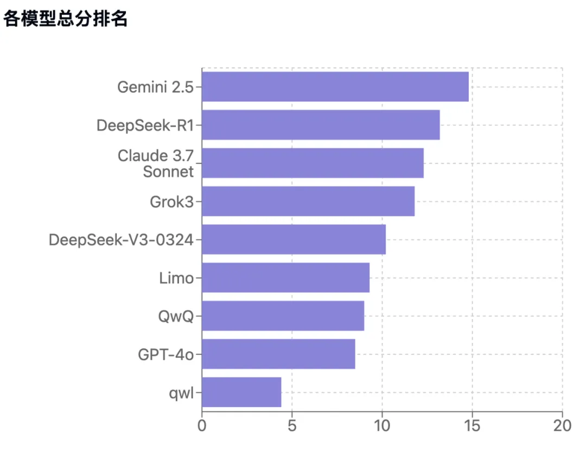
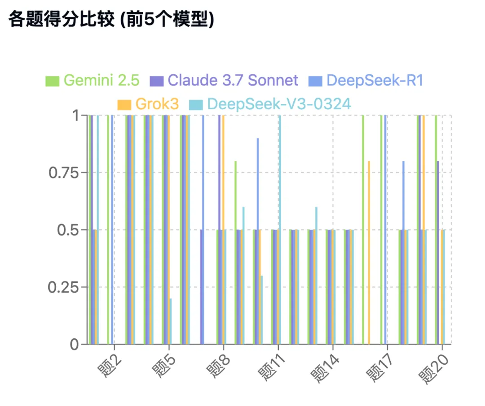

# Gemini 2.5 Pro 果然是王，不服不行……

[文集首页](../../README.md) · [本类目录](../../catalog/02-ai.md)

作者／署名：王路  
主题：AI：使用、实验与创作  
页面时间：2025-04-05 10:45:04  
来源：[https://www.douban.com/note/871761057/](https://www.douban.com/note/871761057/)

---

我上次不是用几个AI搞了个阿毗达磨竞赛嘛，有人说，怎么没让Gemini 2.5 Pro参赛呢？我想，是啊，因为平时用Grok和Claude比较多，也就没有把该请的选手都请来。所以，我回头又补充了几个选手：Gemini 2.5 Pro；DeepSeek-V3-0324；GPT-4o；QwQ32B。——注意，我上次用的QwQ并不是原封未动的QwQ32B，而是我用阿毗达磨数据微调过的，所以，这次我要把本尊请过来。我还测试了几个小模型，包括我用不同方式不同程度微调的，表现拉胯，所以20题我就没测完，也就不放出来了。

题目和答案之前的帖子已经公布了，这次我只扼要说一些有意思的点：

1、Gemini 2.5 Pro是真强。能得分的几乎不放过，哪怕拿不了1分，也要扯下0.5分来。20题中，它仅有1题得0分，是第7题“哪些地有无漏道？”——它把欲界算进去了，其他都对。但这主要不是它的错。因为我在题干中没有交待“欲界没有无漏道”，这导致参赛的13个大大小小模型中，11个都是0分，Gemini 2.5 Pro能拿0.5分，已经是第二名了。但是R1这道题拿了满分1分。这是因为R1在预训练中学过。

2、除了那道题之外，Gemini 2.5 Pro可以说横扫千军，锐不可当。仅在第10题和第18题稍逊于R1。第10题是“已离色染的圣者，成就果位的情况有几种？”R1在思考中多次想到“没有果位”这种情形，但它每次都犹豫说“这显然不可能”；而Gemini 2.5 Pro像其他大模型一样，没考虑这种情况。第18题是“依静虑中间见道的圣者，见道中有哪些刹那不断烦恼？”——Gemini 2.5 Pro像学者一样掉进那个万年坑里，把“道类智”看成了见道。

3、此前的测试中，Grok3在第16题表现惊艳，17题不行；R1反过来，16题不行，17题惊艳；而它们的惊艳和Gemini 2.5 Pro比起来就平常了，因为Gemini这两题稳稳地拿了满分。题目本身有没有问题？可能有问题。但是，只要有选手能拿满分，而且不是蒙的，那题目的问题就不是问题。

4、Gemini 2.5 Pro有个现象，它不仅是中英文混合思考，也是繁体简体混合思考。要知道，我的题干中没有给它任何繁体字。但阿毗达磨的经典资料确实都是繁体字。它能够主动用繁体字来思考，表示它预训练中学习到了经典的阿毗达磨知识，而且它知道更应该借助于那些来回答问题。另外，它还会使用一些不很标准的梵语，以及会自行翻译成英语：

【见道 (Jian Dao): Consists of 16 刹那 (kshanas): 8 无间道 (wu jian dao - uninterrupted paths) and 8 解脱道 (jie tuo dao - paths of liberation). Specifically, 苦法智忍, 苦法智, 苦类智忍, 苦类智, etc. (suffering-dharma-wisdom-tolerance, suffering-dharma-wisdom, suffering-category-wisdom-tolerance, suffering-category-wisdom, etc., replacing suffering with accumulation, cessation, path).】

其中，它把“忍”翻译tolerance，“集”翻译成accumulation，这并不是两个《俱舍》英译本的翻译方式。也许有学者这样用过，但毋宁把它看成是Gemini自己的理解和翻译。

5、看看Gemini自发地用多语言思考（但它的作答是明确的简体中文，和我的提问一致）：

【Identify Key Concepts:

"離第二靜慮染" (li di er jing lv ran): Means having eliminated the defilements associated with the Second Dhyāna.

"18地" (18 bhumis): The 18 planes/levels of existence.

"不能生到" (cannot be born into): Refers to future rebirth.

"煩惱" (kleshas/defilements): Mental factors that cause suffering and rebirth.

"斷除" (cut off/eliminate): Getting rid of defilements.

"界地" (bhumi/plane/level): A specific level of existence within the three realms.】

我们注意到它用bhumi指“地”，“kleshas”指烦恼，这是梵语；有时候它也会用grade指地，是英语；但如果碰到“品”的时候，grade就有误解的可能。像“離第二靜慮染”“煩惱”“斷除”，这是它自行用了繁体中文。

我有一个猜想：将来有了更强大的大模型，我问它更复杂的阿毗达磨问题的时候，它可能会在思考中更多地使用繁体中文。无论我是用简体中文、繁体中文还是英文问，只要阿毗达磨问题足够难、足够复杂，它在思考部分（非回答部分）的繁体中文比例就会越来越多——如果这个现象出现，就可以佐证我的一个论断：中文才是阿毗达磨真正意义上的母语。我们可以拭目以待。

6、现在说说V3。我完整测试了DeepSeek-V3-0324，它的阿毗达磨得分在5个大模型中是垫底的（如果不考虑GPT-4o的话，为什么不考虑，待会儿说）。它在阿毗达磨上的表现显著地不如R1。这不奇怪，DeepSeek-V3-0324相比DeepSeek-V3-1226可能主要加强的是代码能力，以及其他方面初步的对齐。不过，DeepSeek-V3-0324相比DeepSeek-V3-1226，得分表现是好很多的。DeepSeek-V3-1226没怎么对齐，导致指令遵循上表现很差，问它“几地”，它不依地回答而依界回答，有时候甚至会重复回答之前说过的内容。所以就没必要完整测试它了。

不过有点意外的是，在第11题上，竟然是V3-0324和GPT-4o这两个垫底的大模型拿到了满分，其他大模型都是0.5分。这是为什么呢？来看看题目：“阿罗汉是已经离三界染的有情。那么，圣者在现观的最后一刹那，获得果位的可能性有几种？”——原来这两道题，它们俩主要是通过预训练的知识答对的，而不是主要通过我给它的知识去推理分析。

就算DeepSeek-V3-0324，在回答中，有时候也会中英文夹杂，比如：

【Wait, this seems contradictory to my initial thought. Let me re-examine.

Actually, the "断对治"是指忍（无间道）对于自己所对治的烦恼，已断的不会再断，未断的必然会断。因此，对于第四静虑第五品烦恼：

……

But the question seems to imply that there can be variation, so perhaps I'm missing something.

Alternative interpretation: "断第四静虑第五品烦恼的刹那" could mean the number of moments where the fifth grade of the fourth dhyana's defilements is being actively severed, not necessarily that it is fully severed in each.

……】

这不是思考，这是正式的回答中。和Gemini不同。Gemini思考中会这样，回答就统一成简体中文了。

7、现在说GPT-4o。它是所有大模型里，在阿毗达磨上表现最不好的。甚至都不如Limo和QwQ32B这两个小模型。这也可以理解，GPT-4o不是中文为母语的模型嘛。模型到底有没有母语，这个事情很不好说，但模型的开发者是有母语的，在模型不够强大的时候，也会有一些影响吧。要是到Gemini 2.5 Pro这个地步，就无所谓母语不母语了。

可能是类似的原因，导致某些模型在非常简单的第二题上失分，“阿罗汉最后心，有没有等无间缘？”——Grok，Claude和GPT-4o，包括V3，可能都受了“阿罗汉最后心不是等无间缘”的影响，在这一题上栽了跟头，但是Gemini 2.5完全知道是在问什么。这些大模型和Limo以及QwQ这两个小模型，都答对了第4题“无心定是不是等无间缘？”，而GPT-4o居然连这一题都没答对。

对总是使用中文的人来说，GPT-4o不是什么好选择（玩图另当别论）。我最近没给openAI充钱是对的。之前充钱的时候也没怎么使用它。

8、Limo上次说过了，表现不错。虽然不能和一流的大模型比，但在某些方面并不比GPT-4o这种差。顺便说句，昨天的文章《密室逃脱馆的奇遇》，是我用基于Limo微调过的32B模型写的，我用大模型写过小一千篇文章了吧？（发出来的也有几十篇），但用小模型写了发出来的，昨天那个是第一篇。

9、QwQ和Limo相当。它们都没有专门针对阿毗达磨做过训练，但表现都还可以。你要是想用32B模型训练阿毗达磨，可能够呛，因为你把该知道的知识都告诉它们，它们的表现还是不行。这是我之前一个多月尝试得到的结论。打个比方说，你去教一个小孩学习微积分，是可以的；虽然他不会，但是他有学会微积分的基因，有这个潜能。但是你去教一头猪学习微积分，你去设计教学方案，研究授课流程，都没有太大用处，因为它没有学习微积分的基因。虽然它也是哺乳动物。

10、我最近了解到一篇论文：arXiv:2405.05904，这篇论文大意说，微调是很难学会新知识的，当模型开始去努力掌握预训练时不具备的新知识的时候，就是模型开始变废的时候。随着模型接触学习的新知识越多，模型也就越废。——我之前一个多月微调和强化学习阿毗达磨AI的尝试也大体佐证了这篇论文的见解。模型的知识应该是在预训练的时候注入的，如果预训练中这方面的知识不足，后面的微调和训练是起不到多少作用的。这告诉我们投胎很重要。有点像“书到今生读已迟”。如果你投胎的时候就没有投成个读书胚子，后天的狂卷只能把你卷废。世间的事情，不能勉强，不能较劲。要尊重事实，尊重规律。这辈子不行不要紧，眼光放长远一点：等下辈子吧。

密室逃脱馆的奇遇

AI的阿毗达磨竞赛：一个有问题却很能说明问题的测评

手搓阿毗达磨AI失败后，我嫌弃AI太不智能

---

### 正文中的链接

- [密室逃脱馆的奇遇](https://mp.weixin.qq.com/s?__biz=MzA5OTc3NzEzMw==&mid=2653685005&idx=1&sn=52b0bdb5caa76bfaca1a9a305d5aa7fe&scene=21#wechat_redirect)
- [AI的阿毗达磨竞赛：一个有问题却很能说明问题的测评](https://mp.weixin.qq.com/s?__biz=MzA5OTc3NzEzMw==&mid=2653685001&idx=1&sn=7a9c41cba48167fecd7339fda899c6d9&scene=21#wechat_redirect)
- [手搓阿毗达磨AI失败后，我嫌弃AI太不智能](https://mp.weixin.qq.com/s?__biz=MzA5OTc3NzEzMw==&mid=2653684984&idx=1&sn=c7681e628a760833f19b33e7939ffa89&scene=21#wechat_redirect)

---

### 正文图片

