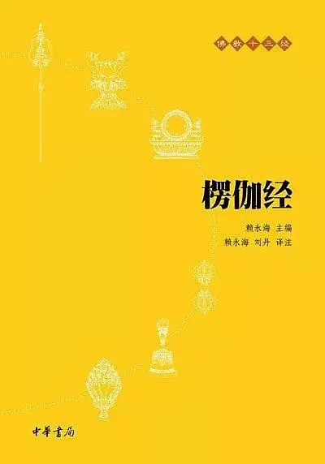

# 《楞伽经》白话误译举隅

[文集首页](../../README.md) · [本类目录](../../catalog/03-literature.md)

作者／署名：王路  
主题：写作、文学与影视  
页面时间：2019-10-06 17:28:22  
署名说明：按页面署名记录；转载署名以原文为准。  
评论对象：楞伽经  
来源：[https://book.douban.com/review/10557526/](https://book.douban.com/review/10557526/)

---

手头有一本中华书局2010年版的《佛教十三经》，是合订本，只有经。其中《楞伽经》是不全的。最近，想看无删节的《楞伽经》，就买了单行本，也是中华书局出的，赖永海主编，赖永海、刘丹译注，2010年5月第1版，2019年2月第13次印刷。

买回来发现，仍然是删节的，不过有简单的注释和翻译。就略微看了下，译注有些问题，略举数例：

1、

p10原经：断三相续见。p13译为：断除三界相续身见。

王路按：“三相续”，指贪瞋痴三毒；“三”不是指“三界”。

2、

p10原经：善修三昧三摩钵底。p13译为：善修正定，由定发慧而至殊胜之位。

王路按：“由定发慧而至殊胜之位”，这个意思原经完全没有，而“三摩钵底”又没翻译。从对应上看，大概是想用这句话解释“三摩钵底”。此书注释“三昧”“三摩钵底”时都解释为“禅定之一种”，介绍了异名，没介绍区别。“三昧”，是“等持”；“三摩钵底”，是“等至”。“三昧”，通摄一切有心位中心一境性，通定散位；“三摩钵底”，通目一切有心无心位中所有定体。这里可译为：善修等持、等至。

3、

p26原经：云何无色定？p27注释：无色定：此指外道之“四空定”，亦即虽空诸法，而不能见“我空”，故还流转于三世。p29译为：如何是小乘外道之四空定？

王路按：不知为什么把“无色定”注释为“外道之四空定”。无色定，不是外道特有的，二乘可以入，大乘也可以入。而且，“虽空诸法，而不能见我空”的说法是不对的，如果已达法空，必定见我空。

4、

p37原经：若蕴界处，法已现当灭，应知此则无相续生，以无因故……p38译为：蕴界处诸法虽生即灭，应知此等诸法无自性故……

王路按：“若蕴界处，法已现当灭”，中间的逗号应去掉，或者点在“法”后面。“已现当灭”，是“已灭、现灭、当灭”的省称，不是“虽生即灭”的意思。

5、

p43原经：但作是念，我灭诸识，入于三昧，实不灭识而入三昧……p46译为：自以为已灭诸识，入于三昧境界，实则未入三昧境界……

王路按：实际上也入了三昧境界，只是未灭诸识。“实不灭识而入三昧”，“不”字只是说“不灭识”，不是说“不入三昧”。

6、

p57原经：外道所说常不思议若因自相成彼则有常，但以作者为因相故，常不思议不成。p59译为：若因自相相应，则是常，非常不思议境。

王路按：这里以及前面未引的句子都把“成”翻译成“相应”。但原经这里的“成”，就是“成立”的意思，不是“相应”的意思。

7、

p88原经：而此毛轮，非有非无，见不见故…… 然彼水泡非珠非非珠，取不取故。p91译为：而彼毛轮本自无体，非有非无，既可见又不可见…… 然其水泡，非珠非非珠，既可取又不可取。

王路按：“而此毛轮，非有非无，见不见故”，是说，眼睛出毛病了，看见有毛轮，这毛轮不是有，也不是没有——不是有，因为正常的眼看不见；不是无，因为不正常的眼能看见。同理，水泡“非珠非非珠”，非珠，是因为不取著它，它就非珠；非非珠，是因为如果取著它，它就不能说非珠。并不是“既可见又不可见”“既可取又不可取”的意思。

8、

p93原经：渐次增胜至无想灭定……p95注释：无想灭定：诸外道以无想天为修行之最高境界…… 是灭诸心法，而达于无想无念。p96译为：由此渐增进至灭一切心法、无想无念之境界……

王路按：这里的“无想灭定”，并不是指无想天、无想定；而是指非想非非想天、灭尽定。本书用实叉难陀译本，原经只说是“声闻、缘觉”所行禅（求那跋陀罗、菩提流支译本不同，除了声闻缘觉，还说了外道），声闻缘觉是不可能入无想定的。对比菩提流支译本，也可知道这里是说灭尽定，不是说无想天、无想定。

9、

p100原经：谓诸圣者，于妄法中不起颠倒，非颠倒觉，若于妄法有少分想，则非圣智。p102译为：即如圣者那样，不于妄法起颠倒见，也不起真实见，若于妄法中生心动念，则非圣者之智。

王路按：不应说“也不起真实见”，不起颠倒见，就是真实，就是“非颠倒觉”。

10、

p106原经：我当说名句、文身相。p108注释：名句：显示体为“名”，诠释义为“句”…… 文身：名句所依之文字，二字以上者为“身”。p108译为：我当为你解说显体释义及其所依文字之名句、文身之相。

王路按：“名句文身”，是“名身、句身、文身”的省称，这个原经里就有，下文也翻译了“名身”“句身”，不知为何注释和标点为“名句、文身”。

11、

p110原经：下者于诸有中极七反生；中者三生五生；上者即于此生而入涅槃。p113译为：下者未断欲界之惑，须人间、天上七往返方能证得阿罗汉果；中者或三生、五生得阿罗汉果……

王路按：翻译在“下者”后多添了“未断欲界之惑”。实际上，没必要添，因为中者、上者也都“未断欲界之惑”。

12、

p112注释：斯陀含：又译作“一来”，声闻乘四果之一，因其只断欲界九地修惑中的前六品，尚余后三品，因此，得此果者还必须再于欲界之人间与天上受生一次，故名。

王路按：“欲界九地”的说法是错误的，欲界只有一地，应该说“欲界九品修惑”。而且，不是“必须”再于欲界之人间与天上受生一次，是最多再来一次。须陀洹最快都可以此生入涅槃，更何况斯陀含呢。

13、

p111原经：受等四蕴无色相故，色由大种而得生故。是诸大种互相因故，色不集故，如是观已，明见有无即时舍离。舍身见故，贪则不生，是名身见相。p114译为：受、想、行、识四蕴与色俱有名无体，无自性相；观色蕴由四大种所造，展转相因而生。四大既无主宰，谁能合集以成色？色蕴如此，余四蕴亦然，如是观察，明见有无俱妄不实，五蕴无体，身见即断。

王路按：不太能看明白翻译和原经的关系。原经是说受、想、行、识蕴没有色相，翻译成“四蕴与色俱有名无体”，不是经的意思。而且，“色由大种而得生故”，后面不应该是句号，这四句是并列关系，不是因果关系。翻译说，“观色蕴由四大种所造，展转相因而生”，好像是在说色蕴与四大种展转相因，而原经意思是四大种彼此相因，不是说色蕴与四大种互相因。“四大既无主宰，谁能合集以成色？色蕴如此，余四蕴亦然”，这是把德清《观楞伽经记》的内容抄过来了。但德清是“记”，不是“译”，而且德清这两句记并不能很好地解释原文意思。“心”有“集起”的意思，“色”并没有，“四大既无主宰”并不是“色不集”的原因，况且识蕴显然能集起，怎么能说“色蕴如此，余四蕴亦然”？原经“舍身见故，贪则不生”，也没有翻译。

14、

p111原经：于诸法中疑不得生，亦不于余生大师想为净不净，是名疑相。p114译为：于诸法中不生疑心，亦不生于尊者以为尊相，是净与不净，如此是名疑相。

王路按：这处翻译是直接把菩提流支译本稍作改动搬过来了。菩提流支译本为：“复不生心于余尊者以为尊相为净不净故”。流支译本“生心”的“心”字被去掉了；“余尊者”的“余”字被改成了“于”；而且，流支译本“相为净不净”的“相”，诸版本皆作“想”，唯大正藏本作“相”，应该是大正藏本搞错了，这里翻译仍然用“相”；“为净不净”改为“是净与不净”，遂变得无法理解。其实，这句意思是：对佛法是不生起怀疑的，也不对其他外道生起他们是大师的想法，也不怀疑佛是否清净。

15、

p112原经：烦恼诸苦分别永尽，是名阿罗汉。p115译为：招致诸苦之烦恼业悉以断尽，是名阿罗汉。

王路按：“苦”和“业”是不同的。这里并没有说“业”永尽。阿罗汉得名也不是由于“业悉以断尽”。

16、

p123原经：无有乘建立，我说为一乘。p126译为：无乘有乘者，我说为一乘。

王路按：如果说“无乘无乘者，我说为一乘”，或者“无乘与乘者”，意思还是通的；“无乘有乘者”，就不通了。

17、

p123原经：虽灭起烦恼，犹被习气缚。p126译为：虽已灭烦恼又更起烦恼，犹如被习气所缚。

王路按：“虽灭起烦恼”，是说把生起的烦恼都灭除了，不是说灭了烦恼又更起烦恼；“犹被习气缚”的“犹”，是“仍然”的意思，不是“犹如”的意思。

这部经有十品，以上都出于前两品中。后八品我还没有看。希望再版时可以改进。

---

### 同文来源

本篇合并以下日记／长评或重复发表版本：

- [《楞伽经》白话误译举隅](https://book.douban.com/review/10557526/)（book_review，页面时间 2019-10-06 17:28:22）
- [《楞伽经》白话误译举隅](https://www.douban.com/note/736879722/)（diary，页面时间 2019-10-06 17:22:06）

---

### 正文图片

> 部分图片保留在线地址，离线阅读时可能无法显示。

