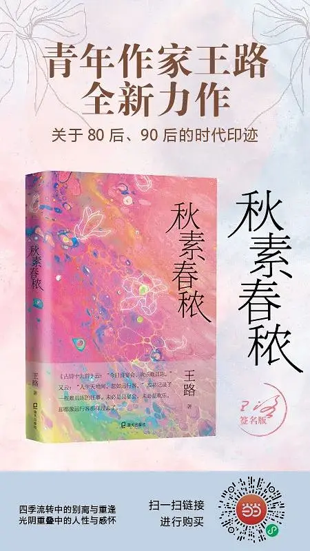

# 散文写作与《秋素春秾》

[文集首页](../../README.md) · [本类目录](../../catalog/03-literature.md)

作者／署名：王路  
主题：写作、文学与影视  
页面时间：2022-05-20 12:37:11  
评论对象：秋素春秾  
来源：[https://www.douban.com/note/831617730/](https://www.douban.com/note/831617730/)

---

《秋素春秾》出版了，我要写一篇文章。但我一直很头疼该怎么写文章推荐自己的书。

如果是别人的书——友情推荐除外，因为牵涉到太多人情，要是完全公允地评价，除非你根本不打算在那个圈子里混，也不怕得罪人——客观地评价，好的地方可以大声叫好，不好的地方可以激烈批评，一般对外国人的书、尤其是已经死掉了的外国人的书，是可以这样干的。但自己的书，不行。好的地方你叫好，不谦虚、尾巴翘上去了；不好的地方你承认不好，可能有点不好意思，人家也会说：既然不好还出它干吗？出版社也不高兴。因为书不仅是作者的作品，还是出版社的作品。

不过，我对自己的作品，尤其是拿出来出版的这些，还是比较满意的。——我写的文章里，大概只有不到五分之一出版了。平均下来，我每年写的大概有50万字。而出版的书，一般也就一两年一本，每本10来万字。最近5年，2018年没出，2019年出《水浒白看》（其中大部分是2015年写的），2020年没出，2021年出《韩愈传》（主要是2019年写的），2022年，现在，又出《秋素春秾》——这本书内容跨度更长，是从2013年到2020年的散文。哪怕一个人再菜，从七八年的散文里，挑出自己觉得最应该保留的，组成一本书，质量也是能有所保证的吧！而剩下的散文，我就不打算要了，以后也不会再出版。

在面向大众的各种文体里，散文是我最擅长的。散文和小说非常不一样，和调查记者的非虚构写作也不一样。调查记者那种非虚构写作近年比较流行，只要你有经费，总是可以去挖掘一些值得写的人和事。但那种写作，在文学上也存在一个弱点：往往来自二手素材。就是说，你写的是别人的生活，不是自己的生活。

而小说，就是虚构了。在自己不了解的地方，只能凭不切实际的想象甚至蹩脚的杜撰展开。但散文不一样。散文是适合每一个人写作的，而且是诚实地写作。

“诚实的写作”很难。这意味着你不要装，不要做作，不要卖弄，不要掩饰。人都是有毛病的，有性格上的偏颇乃至缺陷。你肯不肯不回避它？这是很难的。我们做不到十足的诚实。而且，“诚实”也很难理解。并不是说，把自己的隐私抖露出来就叫诚实。如果你抖露隐私是为了别的目的，或者恰恰为了掩饰什么，或者为了夺人眼球，这都不是诚实。诚实也不见得非得写一些很私密的事情。诚实意味着老实，能说多少说多少，不能说的，或者不想说的，告诉读者，你不能说。

即便这样，我们依然是做不到的。有时候，觉得自己能做到，可能是一种无知的自负。一个人对自己诚实，很多时候都是蛮难的。假如能有意提醒自己注意这一点，并能为此感到羞愧。也就差不多可以算“诚实的写作”了。

“诚实的写作”让人难为情。我现在教写作班，布置作业的时候，告诉大家，如果你写得足够好，我可能会拿到课堂上讲，如果你怕别人知道是你写的，可以匿名，或者要求不公开。对陌生人，很多时候我们甚至可以多袒露一些，因为你不怕这种袒露打碎了他们对你的刻板印象。尤其是周围亲近的人对你的刻板印象。所以，写作也是一种交游。像孔子说的，“诗可以群”。

很多人写文章，不怕陌生人看到，怕熟人看到。尤其是写散文，很多时候会牵涉到周围的人和事。写了谁，被那人看到，你和他都不好意思。有些事，常常要过去很多年才能写，要离开以前的圈子才好写。

我离开以前工作的单位好多年后，跟前同事大都不联系了，才好去写原单位的一点事情——就这还得收着。所以，散文的写作并不容易。有时候，一篇散文涉及的素材，已经酝酿多年才动笔。多年之后回头看，某些印象、某些看法，也已经改变了。再去咂摸生活，有些说不清的味道。我在《秋素春秾》的最后，也注上了文章最初的写作时间。这是自己生命中最难得的一段历程吧：从20多岁到30多岁。对每个人来说，这样的十年都是可珍惜的。

以下是书摘：

尘世：

走在夜幕中，觉得自己像放学回家的小学生。北风吹在河边枯柳上，路漫长无际。但我不着急。我知道旅程的尽头会有一场晚餐在。

有情：

在等待中，很多事情可以成就。粥可以一天比一天煮得好，菜可以一天比一天炒得香。也许并没有更好更香，只是更能接受一件事物是它本来的样子。也学着接受一件事物终于慢慢不再能回到本来的样子。一朝一夕就这样过去。流放的月色又何尝不是绝佳的景致。

行客：

没有钟声，没有烟花，我忽然想起卖唱人。想听他的歌，他的破锣嗓子。我鼓足勇气，不再惧怕哗众取宠，要给他的吉他袋里放进一张钱币。我暗暗下决心，要勇敢些，告诉他，“新年快乐”。可惜，在这旧年的最后一夕，他没有来。

光阴：

游弋在寂静太虚中的清凉皓月，无论阴晴变迁，寒暑代谢，无论是朔是望，是亏是盈，周遍皎洁的朗净圆满，终究常在。

春晖：

我把绿萝枯萎的叶子剪掉了。这盆绿萝，买它才花了二十块。但重要的不是买，而是把它带回家，浇了那么多次水，摆在床头看它一点点长大。所以，满城的春色都抵不上我这一盆绿萝。春色无主，而绿萝是我的。

有签名版和非签名版。上面是签名版，下面是非签名版。签名版要贵一些。现在是预售，大概一周后发货。

---

### 同文来源

本篇合并以下日记／长评或重复发表版本：

- [散文写作与《秋素春秾》](https://www.douban.com/note/831617730/)（diary，页面时间 2022-05-20 12:37:11）
- [散文写作与《秋素春秾》](https://book.douban.com/review/14407255/)（book_review，页面时间 2022-05-20 12:41:25）

---

### 正文图片

> 部分图片保留在线地址，离线阅读时可能无法显示。

