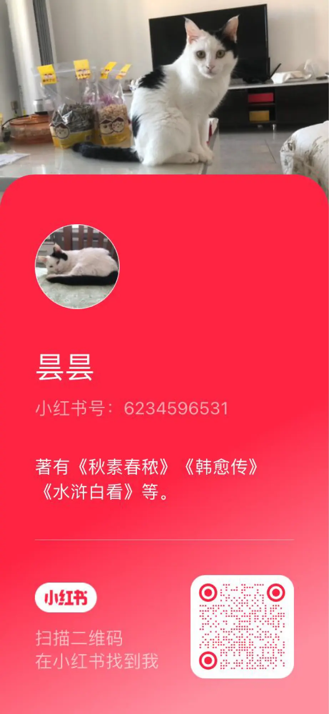

# 写生活又怕熟人看见了不高兴，那没辙儿

[文集首页](../../README.md) · [本类目录](../../catalog/03-literature.md)

作者／署名：王路  
主题：写作、文学与影视  
页面时间：2022-09-10 12:48:31  
来源：[https://www.douban.com/note/837617434/](https://www.douban.com/note/837617434/)

---

昨天注册了个小红书账号：6234596531，名字暂时叫“昙昙”——我家小猫的名字。玩小红书的朋友可以在上面找到我。

试了下，小红书的图文消息只能发1000字以内。就随手写几句。

经常有人问：写一篇文章，关于朋友的，害怕他看到不高兴，有什么好办法吗？

我说：没有。这就是写作的代价。

有人说有，她觉得，把名字和事情改改，从现代改到古代，就没问题了。

我觉得不是那么回事。你周围有个林黛玉，把她写出来，人家看了不知道这是林黛玉。那肯定写失败了。

写文章，要么不写自己的生活。你可以写点财经啊、热点啊、健康啊、书评啊，都没问题——但这要求你在那些方面有积累，你是作为专业博主在写。博主并不好当，可能比博士还要难一点。张三说，我是博士，张博士；张二说，我的水平要盖过你，比你高一点——在“博士”上面添一横，加个点：我是张博主。

博士喜欢自称“老师”，但圈子外的人，尤其是陌生人，可能不怎么鸟他。想让别人鸟他，当好一个博主，得自称“同学”。除非他本身就已经破圈了。

写作记录生活，比写专业文章难度更大。专业领域的东西，会因为专业本身而具备价值——前提是你聊得对、聊得好。而生活的很多细节，是平淡乏味、微不足道的。所以，每一次写，就像采矿，都得投入挖掘成本和冶炼成本。

你只要写自己，就不能不写到周围的人，只要写得好，那你写谁，谁看了估计就会不太舒服——让他舒服的是宣传稿，是些空洞的东西、假东西。如果他看得舒服，读者基本上是看不下去的。

文学上，写一个人、一件事，如果写得好，人物的瑕疵是会呈现的。瑕疵不一定是道德上的弱点，但肯定是人物在生活中受苦受累的原因。别人看了不舒服，也不一定是生气，还可能是尴尬、难为情。如果他本人看了，心里都没波澜，你铁定写失败了。“能引起情绪波动”，是选择素材的重要标准。只要写的是真事儿，写得好，写谁就容易得罪谁。谁都不得罪，只会写得很垃圾。

有人说，我编，不行吗？虚构的成本，可以很低。成本低的东西，成品质量往往也低。普通人写熟悉的、亲历的生活，哪怕没有多少写作经验，也容易出高质量的东西。一是因为，真实生活中值得写的事情本身就稀缺；二是因为，作者还要付出情感成本。情感成本就是，你愿不愿意老老实实袒露自己的生活，愿不愿意面对熟人看了不高兴的风险，以及愿不愿意网上的陌生人对你的生活指手画脚、品头论足。

据我的观察，80%的写作者，不愿意承担这种成本。这是他们很难写好生活的最重要原因。他们只能写点儿不疼不痒的东西，当一个高高在上的“老师”，周围人也客客气气地称呼他老师。实际上，别人都知道他不是老师。他自己估计不知道——一旦知道，就写不动了。

---

### 正文图片

