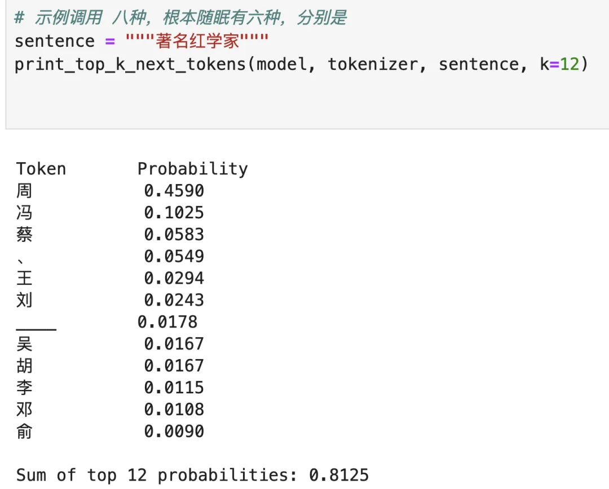
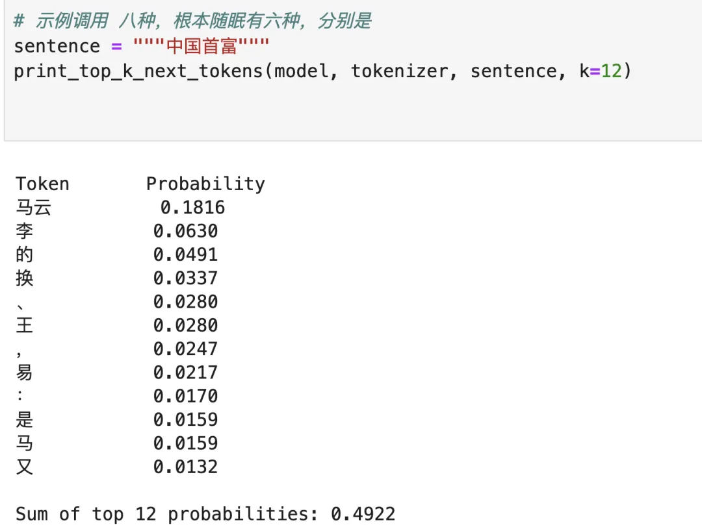
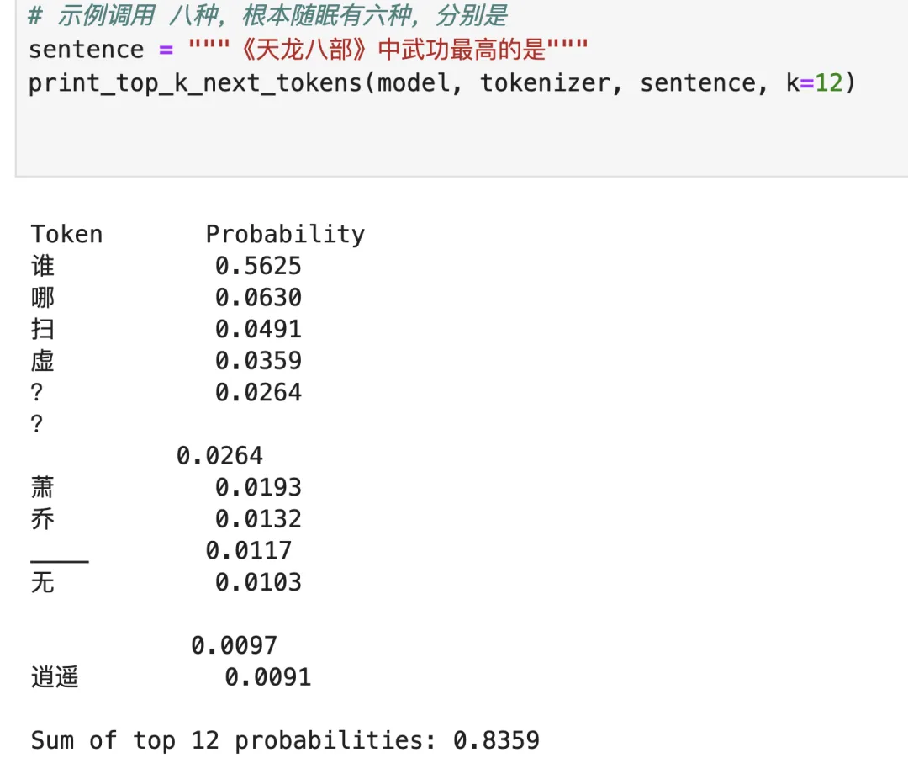
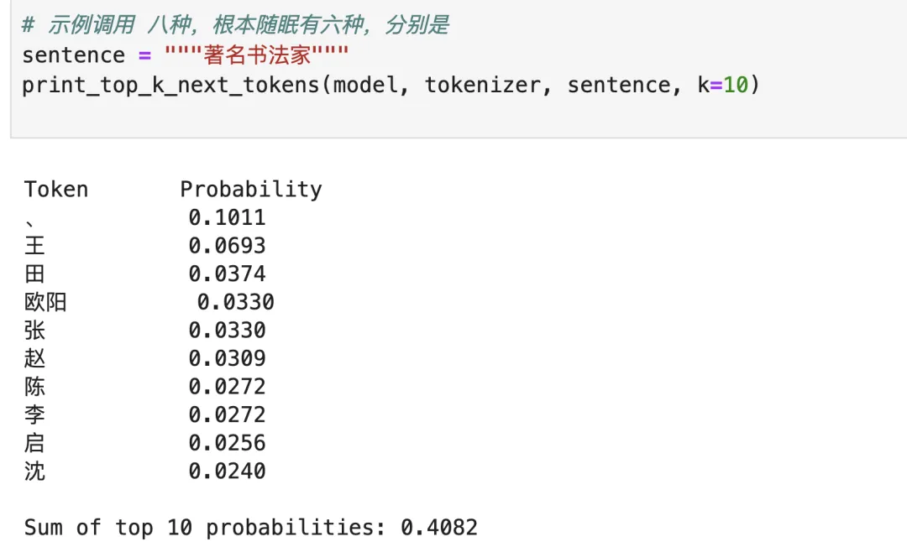

# 李白天下第三

[文集首页](../../README.md) · [本类目录](../../catalog/03-literature.md)

作者／署名：王路  
主题：写作、文学与影视  
页面时间：2025-05-18 10:50:04  
来源：[https://www.douban.com/note/872909724/](https://www.douban.com/note/872909724/)

---

《影响力排行榜的一种可能》。人类爱搞各种排行榜，但排行榜是否让人服气，是个问题。其实我们也可以问问AI的看法。

在红学家里，周汝昌可以说一个顶三个、五个？当然，这不是说水平。而是说影响力。这种影响力当然和周汝昌晚年一本接一本地出书有很大关系。死得早的就吃亏。当然，老一辈也吃亏。

没想到“马云”是一个单独的token。再想想也不意外。

没啥疑问：扫地僧第一，虚竹第二，萧峰第三。毕竟萧乔加起来还没抵上虚嘛。中国人爱取别号，名字多了会削弱影响力。

杜甫的伟大在李白之上。几乎相当于两个李白。屈原屈居第二。李白天下第三。但要注意，“李白”是一个token，“杜甫”不是。——这表示什么？杜甫比李白伟大，但李白的名字更响当当。看见“泰”不要奇怪，那是老外。

“鲁迅”是单独的token。猜猜这个巴是巴尔扎克还是巴金？

排行榜、影响力什么的，不要太当回事，不信你看这个：

---

### 正文图片

> 部分图片保留在线地址，离线阅读时可能无法显示。

