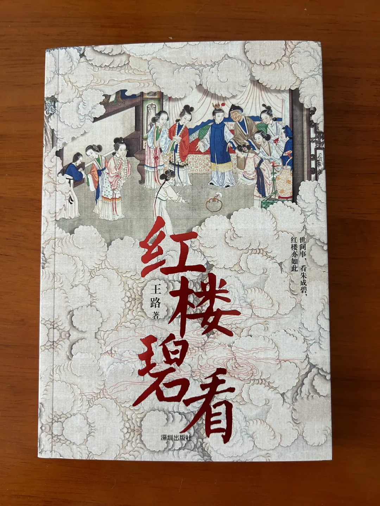

# 不上班八年，我的生活和感受

[文集首页](../../README.md) · [本类目录](../../catalog/06-society.md)

作者／署名：王路  
主题：社会、教育与经济生活  
页面时间：2024-05-20 11:32:26  
来源：[https://www.douban.com/note/862438529/](https://www.douban.com/note/862438529/)

---

我是2011年研究生毕业的，之后上了5年班，前三年在事业单位，后两年在互联网公司。2016年9月起，不再上班了，也没找过任何工作。不上班一年后，我就觉得自己这辈子可能都不会再上班了，除非缺钱。因为发现自己确实不适合上班。不上班可以，没收入不行。我这八年是有收入的，前面4年，收入来自微信公众号（我也有别的平台，那些平台没有收入）；后面3年多，收入来自开写作班和公众号。

2023年以来，这两块收入都在急剧萎缩。虽然萎缩，吃饭还是不成问题的。只要别瞎炒股、乱投资、生大病，吃饭应该不用担心。其实，除了炒股我也不会别的投资，要是会，现在可能就没饭吃了。我过去几年经历的最大折磨就是父母失败的“买商铺”投资，早前上班时候还经历过家里失败的民间借贷投资——两次官司都是我主张打的，对我理解社会非常有帮助，但真不想再有任何这种经验了。

不上班的八年，我对自己和社会都有了更清晰的认知。对社会的认知就不说了，说说对自己的认知：

1、我不适合上班，也不适合创业

我在2011年毕业后，进入事业单位刚工作一两个月，就发现了自己不想上班。其实，2008年本科毕业后，我也短暂工作过一个多月，那时候也发现自己不适应上班，但那时候不想上班可以有别的选择——考研。等研究生毕业不想上班，总不能再去读博——当时（2011年秋天），我倒真有一天晚上无聊地查过读博的事情，但又清楚不该通过那种方式逃避现实，甚至偏执地觉得，自己不适应社会是因为上学时候读了太多国学方面的书，从而勒令自己在一段时间内不要再碰国学。——现在看，那个想法恐怕不偏执。

我后来见过很多读国学的书读傻的，对社会的理解肤浅幼稚，又无从拓宽视野改变生活轨迹的。我在事业单位的三年基本就是这情况。稍微不一样的是，上班第一年我就出书了，并且不停地在网上（最早是人人网，后来是豆瓣、知乎、微博）写文章，给生活和事业找到了另一个窗口。也正是因为这个，三年合同期满后我才能跳槽到互联网公司（三年内跳槽需要赔一大笔违约金，即解决户口的费用）。但回过头看，那时候虽然在网上也拥有一些读者，但对社会对现实的了解极其匮乏。这是没有办法的事情，是环境限制了视野。

真正对社会多一些了解，是在2016年10月离职以后。让我增长社会经验的主要几件事情是：1、2017年我爷爷生病到去世；2、2018年参与朋友的纪录片项目；3、2017年到2019年接触学佛团体；4、2020年以来开写作班；5、2021年到2023年看房、买房和装修；6、2022年到2023年打官司。——这是从个人经验上说的，大环境带来的认知变化就不说了。其中，给自己带来最大焦虑的、在相当程度上影响自己对人生和社会认知的，是我爷爷生病到去世的半年，和打官司的一年三个月。我由此知道，一个人后来成为什么样，固然和先天气质有关，也是后天际遇塑造的。说白了，有你无从选择的地方。

可能有点跑题了。绕回来说。我不适合上班，是不适合听别人的命令。因为领导安排的事情在我看来几乎都是没有意义的。我说“不想上班”不是上班累，而是觉得生命不应该徒然耗费在没有任何意义的事情上。我在事业单位干的工作，对我个人而言，没有一件有意义。对单位而言，90%没有意义。但是，你来上班，总得给你派点活，用考勤来耗住你。如果没有任务，那就想出个任务让你干，是这么个逻辑。比如，一笔拨款到了年底没花掉，就把单位门口的路挖开修一遍。所以，这种工作我没有办法接受。

后来到互联网公司，我的岗位是主笔，相对自由很多，工作也比以前有意义多了；但仍然有领导，有单位的约束。这对一般人来说也许够好了，但对我来说，还是不能尽兴。那时候不用坐班，每周写两三篇自己命题的文章，类似全职专栏作家。只是在选题上更灵活。虽然灵活，但也总不能一星期啥也不写、三天不露面。所以，辞职一年后，就再也不想回到上班的状态了。

我也不适合创业，因为不喜欢命令别人。我受不了别人对我颐指气使，也做不到对别人颐指气使。我公众号后台只有自己操作，每一条留言都是我本人回复的，写作班也没有任何助教；包括剪录音这种机械的事情，也都是一个人做。我只有一个手机号、一个微信，实名上网。这些都注定我创不来业。

2、我始终很边缘

我是个作家。但不是典型的作家。如果要给作家归类，我恐怕只能归到“其他”一类。我不是搞严肃文学的。搞严肃文学的是那些在《人民文学》《收获》等杂志上发表文章的。我也不是搞网络文学的，自己都不看网络小说。我不是体制内作家。体制内作家是作协发工资的。我不是自媒体作家——虽然靠自媒体有收入，但公众号上的文章并不是自媒体的做法，我的公众号唯一像自媒体的地方就是有广告。我出的书也和自媒体没啥关系：《红楼碧看》《水浒白看》《秋素春秾》《韩愈传》等。我上班的5年出过4本书，不上班的8年又出了5本。翻翻书的封底，分类是“文学、畅销”。但是我的书不畅销，我也不是畅销书作家。我把畅销书理解为作者每本书可以拿到30万以上的版税。我出一本书，版税大概10万块，最多的一本20万出头，不算滞销，但也谈不上畅销。

我微信上加过一些作家，但和作家圈子不来往；加过一些媒体人，但和媒体圈子也不来往；加过一些人文学者，但和人文学者也不来往；加过一些学佛居士，但和学佛居士也不来往；加过一些影视从业者，但和影视从业者也不来往。我说的不来往，是指和圈子不来往，和其中的绝大多数人，在朋友圈甚至不点赞。但也有个别有私交的，比较密切的，是一年能见一两面那种。疫情之后，超过一年两面的关系，在我这里都是寥寥无几的。

不过我觉得，和人交流很重要。尤其是和专业、行业背景不一样的人交流。但深入交流的机会很稀缺。不仅我这样，成天混圈子的人恐怕也是这样。并不是约别人见面吃个饭，就能深入交流。很多时候要做事情。但并没有那么多值得做的事情。

3、我渐渐明确了自己的禀赋

也就是疫情以来的几年，我渐渐明确，自己的禀赋在阿毗达磨。我广泛阅读佛教著作是从2013年开始的。2016年秋天离职后，头几年也是广泛涉猎，没有自己的专攻。说白了，别人聊什么，自己也去掺乎。2020年夏天之后，重心慢慢转移到阿毗达磨上了。一个人要有自己的阵地，这是我毕业后花了10年才认识到的。好在毕业十年后，我终于确认了，阿毗达磨是我的阵地。

这种确认不是一下子完成的。对我不存在所谓的顿悟。而是花的时间在积累，对一些问题的思考和理解逐渐加深，有些东西就慢慢显现了。类似于天亮：天不是一下子就亮起来的，但从摸黑到天明，算一下时间，其实也不长。在一天当中，天色转明的过程可能也就半小时，相当于一天的1/48。如果用两年来比拟人生的1/48，我确认这件事情的时间大概是从2020年底到2022年底。虽然此前我也多次翻阅过《大毗婆沙论》，发现过阿毗达磨学者博论专著中的不少错误，但还说不上确认禀赋。我把确认禀赋看成是，有一种内在的东西给你带来信心，而不是外在的（比如别人的肯定）。很多年轻人把来自权威的肯定看得无比重要，不少不算年轻的人也是，那是不成熟的表现，是没有确认禀赋的体现。因为你一旦确认了自己的禀赋，谁有禀赋谁没禀赋你一眼就看出来了。

逐渐确认阿毗达磨禀赋的两年内，我主要做了三件事：1、背熟了《俱舍论》颂；2、自己设计解答了六七百道阿毗达磨问题；3、建了“尊重毗昙”群，和许国明讨论若干问题。此外，间或写过一些阿毗达磨随笔文章。

确认自己的禀赋是一件愉快的事情。是枯燥沉闷人生中为数不多的乐趣。它给我带来的重大转变是：渐渐放弃了对噪音的关注。

什么是噪音？来自社会和时代方方面面的声音，都是噪音居多。但在你听到清晰声音之前、乐音之前，你分辨不出来什么是噪音。因为没有比较，就没有鉴别。

有人会听社会上的动静，有人会听权威的动静，有人会听流行的动静。而当你捕捉到宇宙深处传来的一丝微弱声音，你会迅速失去对噪音的兴趣。只是，什么样的人有机会捕捉到那些微弱的乐音？可能是边缘的人。那为什么那些人会比较边缘？我想，主要是天生的。

4、我的写作进步了，兴趣也衰减了

写作是我相对普通的禀赋。我好像只有这两种禀赋。写作是高度依赖质料的技艺。质料就是生活。写作好比厨师的手艺，而生活是食材。无论厨师有多好的手艺，没有食材，他也拿不出一份像样的饭菜。而平庸的厨师一旦拥有好的食材，也能摆出一桌不错的菜。前一阵我看见一篇稿子，有个作者说自己写了十四年才挣十万块，他打工题材的书小火之后，有媒体采访他，他好像渴望跟记者聊马尔克斯、卡夫卡，而记者总是问他打工生活。我看到这段的时候想，他真是不懂，马尔克斯卡夫卡对他的写作毫不重要，打工经历才至关重要。只是很多作者不明白这一点。

我年轻一点的时候，写过十几年的毛笔字（当然不是每天写，但也总没有彻底放下），那时候我始终不明白的一点是：你想搞创作的话就应该直接创作、多创作——这里说的多创作是，使用不同的工具，不同的笔墨纸，尝试以不同的方式，写不同大小的字。而不是用同一种笔在同一种纸上临同一种帖若干年——那样的话，当你想创作的时候，一换笔一换纸，什么都不对了。就像学骑射的人，有些人在地上练得很好，骑上马背，马跑起来一颠，他连把箭从筒里拔出来都做不到。

我在互联网公司当主笔的时候，虽然每周都写两三篇，但现在看，那时候对文章的理解还不够深刻。那时候会细腻地处理，但理解远远没有现在深刻细致。现在深刻细致的理解，是开写作班教了几年之后才慢慢体会到的。不过，我现在写文章都很随意，甚至比较粗糙，因为热情没有二十来岁的时候高，懒得多花功夫了。

就像“善易者不卜”，一个擅长写作的人（说的是文学写作），最成功的地方不是写出了优秀作品，而是规避了有望成为好作品的素材出现在他的生活里。了解戏剧性的最大好处是，让生活不再出现戏剧性，把戏剧性扼杀在摇篮里。但是，生活中注定有些东西你无从扼杀，有些命运难以避免。

不写了，把我的新书《红楼碧看》购买链接放上：

王路：如何才能下雨天不上班？

王路：不上班了

王路：长期不上班是怎样的体验？

---

### 正文中的链接

- [王路：如何才能下雨天不上班？](http://mp.weixin.qq.com/s?__biz=MzA5OTc3NzEzMw==&mid=2653667175&idx=1&sn=0903d42fd45c4d47fab773fc7b8dfdb2&chksm=8b223065bc55b973745bab6c499300d1f4e5946d4ca7f95583e6239d0c23ef00132bb7394b68&scene=21#wechat_redirect)
- [王路：不上班了](http://mp.weixin.qq.com/s?__biz=MzA5OTc3NzEzMw==&mid=2653667340&idx=1&sn=11ca10e1ffb626cdde3a0111927c3f48&chksm=8b224f0ebc55c618f07f180d7a7d841d19b9c74c90b5c519822e7e44815a633b79f0318301a6&scene=21#wechat_redirect)
- [王路：长期不上班是怎样的体验？](http://mp.weixin.qq.com/s?__biz=MzA5OTc3NzEzMw==&mid=2653668155&idx=1&sn=c572e26ee8eda66d0811a81779058c40&chksm=8b224c39bc55c52f83ef30d37f6fcaae86b2b7b92157d99ac206fdf3152cca061d8b7826170e&scene=21#wechat_redirect)

---

### 正文图片

