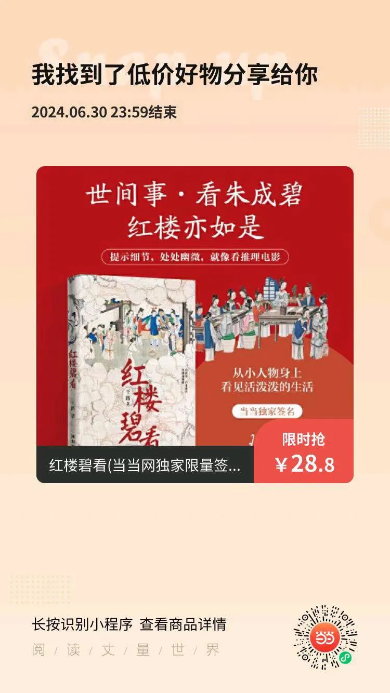

# 我的高考成绩不会被取消

[文集首页](../../README.md) · [本类目录](../../catalog/06-society.md)

作者／署名：王路  
主题：社会、教育与经济生活  
页面时间：2024-06-07 18:06:39  
来源：[https://www.douban.com/note/863031174/](https://www.douban.com/note/863031174/)

---

昨天直播时，有朋友说，毕业好多年了还梦见高考，醒来都要难受半天。我说，太正常了，我每个月都会梦见高考，不过，我每次醒来都很高兴，因为梦里发愁，该买的资料还没买，学习计划还没定，醒来发现已经硕士毕业了，而且毕业十几年了。再也不用干那些破事了，能不高兴吗。

有朋友说想回到年轻的时候，再年轻10岁就好了。我没那样的想法。我觉得自己的前半生总体上是越来越自由。后半生怎么样还不好说，因为年纪大了身体机能就要下滑，身体如果不好，人自然不会太自由。但前面的三十多年，我还是越来越自由的。

中小学的时候，一天24小时很少能自己支配，都被学校的课填得满满的，连睡觉的时间都不够。上了大学，还要上些毫无意义的课——我本科上过的课，除了微积分、线性代数和概率论，剩下90%的课都没意义，比如《交通运输地理学》《人口地理学》（还有一大堆我连名字都想不起来的课）。研究生好一点，《宏观》《微观》《计量》三门经济学是有意义的，但也有一半的课像什么《产业集群》《公司治理》之类的没有意义。

而且，无论上学还是上班，都得跟人相处。我不排斥跟人相处，但上学上班你要相处的人都不是自己能够选择的。大学要跟别人住同一间宿舍。我睡觉轻，喜欢安静，不爱参与学校乱七八糟的活动。想想是很可怕的。你在一个团体里面，不习惯像别人那样生活的时候，就非常容易质疑自己：我是不是有问题？

其实你没问题。但只有把时间放久远，看到很多人和你一样不适应集体生活、不胜任被安排的任务、不擅长融入圈子的时候，你才会越来越释然。但一个人在年轻的时候是看不到那些的，只会看到自己的周围，以为周围就是全部。

我是在毕业好多年后，才慢慢意识到这些的。2016年辞掉工作后，我有几次受邀参加活动，之后有鸡尾酒会，在一个大厅，摆些甜点饮料，很多人互不认识，随意勾搭。有些女孩非常自然地举着酒杯去跟老外搭讪。叫搭讪不好听，应该说是探讨问题，比如探讨全球气候变暖对人类的影响。我在这种时候都非常不自在。我不仅不能开启话题，甚至连别人举杯走到我面前寒暄的时候，也不知道该如何应对。如果我的工作日复一日都是这些，我会感觉自己是个loser。

我没有loser的感觉。别人看我可能有，那是别人的事。我明白自己的价值不是被那些场合定义的。但对一个中学生来说，他很难体会他的价值不是被升学定义的。因为你日复一日地在那个环境里，逃离不开。我有个朋友的女儿今年小升初，朋友是典型的海淀家长，小升初的事情让她发愁了好几个月。前两天小孩终于被第一志愿录取，她松了一大口气。上周末她还去了灵光寺、雍和宫和国子监。我觉得这就是不自由。但恐怕没有办法，我们的不自由源于家庭关系、社会关系、工作关系的捆绑。在这之前，还有个最基本的：身体健康。

对我来说，总要受身体健康和家庭关系的捆绑，好在越来越不受社会关系、工作关系和经济压力的捆绑。所以我不想回到过去。尽管这些年很多方面并不如意，如今依然蒙昧无知，但蒙昧相比十年前还是轻了一些，我惧怕回到蒙昧而不自由的状态。

蒙昧无知体现在你认为生活当中什么是重要的，认为自己存在和努力的意义是什么。前一阵我瞟到一个帖子，没细看，也不想细看，是说农村一对老两口，拼了一辈子给几个孩子盖了房子，老了生病，被孩子撵出家门，没地方住。他们日复一日努力搬砖——有人真的是搬砖，比如在城市里搞建筑的瓦工，手艺好的安徽瓦工贴一天瓷砖大概能挣七八百，但他们在北京租的是一个月七八百的房子，没厕所。这么奋斗一辈子，图个什么。

我又想，在鸡尾酒会上和陌生的打着领结的人讨论全球变暖的意义是什么？我相信有人会从这种交谈中得到快乐和满足，满足或许来自感觉自己正在融入上流社会的错觉，或许来自幻想通过这样积累的人脉有助于自己未来事业的辉煌，或者认为它可以锻炼口才、交际能力甚至英语口语。只是，我越来越变成那种自己不擅长什么就认为什么对自己毫无意义的人，也许是要通过这种方式让自己别失落，否则，你眼中意义重大的事情都是自己不擅长的，你还活不活了？

于是，在别人聊全球变暖的时候我就想：就算我勉强去聊那些，也不能给我带来一毛钱。的确是，对别人来说怎么样我不知道，对我来说是这样。我也接触过一些名人，加过微信寒过暄，但没有通过这种人脉赚到一毛钱。我工作上的成就、事业上的机会，没有一样是那些人脉带来的。我的收入来自读者，和我写作班上的学员；不来自大佬或者领导。

前两年我在老家，有个我爸新认识的朋友来我家吃饭，我爸把我出版过的书拿给他看，还要每样都送他一本。我心想：他不会自己买吗？想看去网上买呀。而且，就算送，送一本意思意思不就行了吗？吃饭的时候，那人说：你怎么不加入驻马店作协？我就笑。我被他问住了。这个问题我真回答不了。他又说，你要是加入咱市作协，以后你去哪个县调研，都有人接待；你想在《天中晚报》发表文章也不难。

我很怕这种场合。因为我不会解释。解释让我头大。但回过头想，很多人一生中做的很多事，都是解释——企图解释与说服。你的工作做成什么样，可能不重要，把它解释成什么样，能不能说服对方，尤其是说服那些根本不懂的人，可能更重要；无论是领导，还是权威，或是大众，还是韭菜。但我无法胜任那种工作，我不会介绍自己。

我出第一本书的时候，照例要在勒口上写“作者简介”，向读者解释你是谁。那是2012年，我刚毕业一年，有什么可以跟别人解释的？于是只能写“毕业于XX大学，供职于XX单位”。我内心觉得这蛮丢人。当一个人向别人介绍自己的时候，要靠学校和单位来让人家觉得“噢，这个家伙还行”，就表示行不到哪里。还好，没到介绍“高考XX分”的地步。

我现在还记得自己当年的高考分数，而且是每一科。当我做了高考的梦醒来，总会松一口气：我有高考分数了，622，这个成绩不会被取消。即便我现在跳出来说这个成绩是抄的，是作弊，都不会有人来取消我的成绩，保险了。更保险的是，就算取消，也不是大事。难道XX大学会禁止我入学吗？我入过学了，而且早毕业了。难道大学会取消我的学士学位吗？就算取消，我还有硕士学位。总不会因为我高考分数无效，把这些全都取消吧。过去的事情，板上钉钉了。板上钉钉的板，好像是棺材板的板，棺材板都钉上了，事情已经死了。

而且，就算真的连硕士学位也取消，又有什么大不了的？我不上班了，也不用找工作，不需要给用人单位看这些。新认识谁，也不需要向他介绍我是哪里毕业的、有什么学位。

我发现，在16岁以前，如果画个坐标系，高考对我的重要性是逐年增加的，在16岁以后，就陡然下跌了。硕士学位，在我23岁以前，是逐年重要的——我考了两次研，现在想，复习考研的那两年浪费了多少时间，尤其是刷马哲邓论的时候。而23岁以后，曾经的学位对我来说就越来越不重要。说难听点，现在把它烧了都没事。成年以后，谁还关心你的高考成绩？毕业以后，谁还关心你是哪里毕业。但我还真碰见过有些人，毕业好多年了介绍自己还要带上学校，于是忍不住想，这些人的脑子真是年轻呀。

（完）

6月写作班可以报名，简介和报名方式看之前的：

三四月写作班开课

教写作班的一点想法

写作班说明

不上班八年，我的生活和感受

---

### 正文中的链接

- [三四月写作班开课](http://mp.weixin.qq.com/s?__biz=MzA5OTc3NzEzMw==&mid=2653682914&idx=1&sn=7ec8d3af9b81ca2bf2221dc6e635114d&chksm=8b2273e0bc55faf6de4b97fa7f5828033b550c56056f85fdf6f8a3023af836b793f696a7314f&scene=21#wechat_redirect)
- [教写作班的一点想法](http://mp.weixin.qq.com/s?__biz=MzA5OTc3NzEzMw==&mid=2653682998&idx=1&sn=00ca253ded214b732ab7d1911c11ae58&chksm=8b227234bc55fb2294d5b63e02c33ed5845dd2520465121ca006fa1971b60ca8516ab1c1570d&scene=21#wechat_redirect)
- [写作班说明](http://mp.weixin.qq.com/s?__biz=MzA5OTc3NzEzMw==&mid=2653682999&idx=1&sn=d3c2180115b458dbc644a67524cc399e&chksm=8b227235bc55fb233da7be38db91f27e9d1868db1c126529e411331627f8af023cac6dc38f2c&scene=21#wechat_redirect)
- [不上班八年，我的生活和感受](http://mp.weixin.qq.com/s?__biz=MzA5OTc3NzEzMw==&mid=2653683439&idx=1&sn=99770a49aa531b6a7cb580d700484bce&chksm=8b2271edbc55f8fbdd7685b5f50b357f1563059873aaa0af95d9cd5718cc89a57c63f83880b5&scene=21#wechat_redirect)

---

### 正文图片

