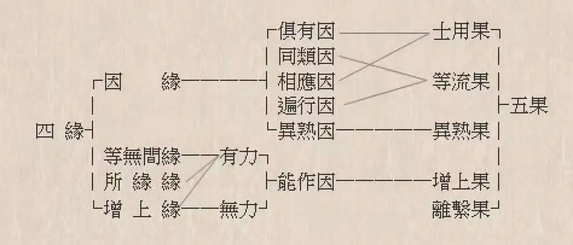

# 能知道这张图错在哪儿，表示你对因果理论入门了

[文集首页](../../README.md) · [本类目录](../../catalog/07-buddhism.md)

作者／署名：王路  
主题：佛教与阿毗达磨  
页面时间：2022-04-26 20:14:12  
来源：[https://www.douban.com/note/830239050/](https://www.douban.com/note/830239050/)

---

这是一张有错误的图。不知道出自哪里，朋友圈看到的。图上涉及的错误，恐怕治毗昙的人也很少能看出来，因此简单说几句。

1、所缘缘的角色没有与果功能，如果一法是所缘缘，又有与果功能，则该与果功能不是它作为所缘缘发挥的，而是它作为能作因（增上缘）发挥的。

2、等无间缘必有与果功能。该与果功能是等无间缘作为或同类因、或遍行因、或能作因发挥的。

3、不是所有的能作因都取果。不是所有的同类因都取果。不是所有的遍行因都取果。不是所有的异熟因都取果。不是所有的相应因都取果。不是所有的俱有因都取果。——“取果”换成“与果”一样成立。

4、不是所有的因缘都取果。不是所有的增上缘都取果。不是所有的所缘缘都取果。——“取果”换成“与果”一样成立。

5、所有的等无间缘都取果。——“取果”换成“与果”一样成立。

6、千万不要认为“所缘缘”对生果“有力”——任何对生果有力的所缘缘，都是因为它身兼的增上缘（能作因）角色才对生果有力，所缘缘角色对生果是无力的。

7、等无间缘对生果有力，未必因为它是能作因，也可以因为它是同类因或遍行因。

其实6、7和1、2是重复的；5和3、4是重复的。只是想表示强调，把话说得更明白。

---

### 正文图片

