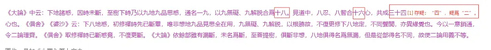

# 《三大部補註》的一段標點及湛然的誤解

[文集首页](../../README.md) · [本类目录](../../catalog/07-buddhism.md)

作者／署名：王路  
主题：佛教与阿毗达磨  
页面时间：2022-07-13 19:33:05  
来源：[https://www.douban.com/note/834563081/](https://www.douban.com/note/834563081/)

---

公眾號「中華書局1912」發佈的文章《做《大藏經》是一種怎樣的體驗？》（2019年10月31日）中有張截圖：

其中標點有不準確的地方，即「唯非想地九品見思全在，用九無礙、九解脫」「至菩提樹俱斷非想、八地」兩處。今重點如下：

《大論》中云：下地諸惑因時未斷，至樹下時，乃以九地九品思惑通名一九，以九無礙、九解脫合為十八，見道中八忍、八智合十六心，共成三十四心也。《俱舍》《婆沙》云：下八地惑，初修禪時，先已斷畢，唯非想地九品見思全在，用九無礙、九解脫。以根勝故，不復更修下八地定。不同聲聞，亦異緣覺也。今以一意銷通，令二論理齊。《俱舍》取修禪時已斷惑竟不復更斷；《大論》依餘部雖有漏斷未名為斷，至菩提樹俱斷非想、八地，俱得名為無漏。但是從部得名不同，故使二論用義不等。

此外，截圖這段，應出自《三大部補註》。其中見解，則鈔自《止觀輔行傳弘決》。而《三大部補註》與《止觀輔行傳弘決》此節，是在解釋《法華玄義》的一句。但《止觀輔行傳弘決》對《大智度論》的理解是錯誤的。「下地諸惑因時未斷」沒有問題，而以十八剎那斷「九地九品思惑」不唯在《大論》中沒有任何依據，且與《大論》別處文本相悖。也絕不是智者大師的意思。智者大師明說「三藏佛」，實不宜從《大論》中尋找依據。智者大師以「九無礙、九解脫」置於「八忍、八智」之後，是完全正確的。荊溪置於其前，則不正確。

《止觀輔行傳弘決》卷3：「『三十四心』者，今取論意與諸經論明斷少別。《大論》中云：下地諸惑因時未斷，至樹下時乃以九地九品思惑通名一九（故云『三藏菩薩位同凡夫』），以九無礙、九解脫合為十八；見道中八忍、八智合十六心，總前合成三十四心。《俱舍》《婆沙》意云：下八地惑初修禪時先已斷竟，唯非想地九品見思全在，用九無礙、九解脫。以根勝故，不復更修下八地定。不同聲聞，亦異緣覺。緣覺先曾離八地惑，一坐證覺。更於九地次第而修。更起無間、解脫二道。下八地中雖不斷惑，觀行次第法爾故也。地地各有一十八心，九地便成一百六十二心。見道十六合一百七十八心。菩薩不爾。故但三十四心。此與《俱舍》不同。什公翻譯及龍樹意，俱不應誤。不同意者，今且以一意銷通，令二論理齊。《俱舍》取修禪時已斷惑竟不復更斷；《智論》依餘部，雖有漏斷未名為斷，至菩提樹但（按：當作俱。）斷非想、八地，俱得名為無漏。但是從部得名不同。故使二論用義不等。」(CBETA 2022.Q1, T46, no. 1912, p. 234b11-c2)

《妙法蓮華經玄義》卷3：「三藏佛一時用三十四心：八忍、八智、九無礙、九解脫，斷正習盡。」(CBETA 2022.Q1, T33, no. 1716, p. 709a17-18)

《大智度論》卷17：「非有想非無想處離欲時，九無礙道、八解脫道中，但修一切無漏道。第九解脫道中，修三界善根及無漏道；除無心定。」(CBETA 2022.Q1, T25, no. 1509, p. 187a20-23)

---

### 正文图片

