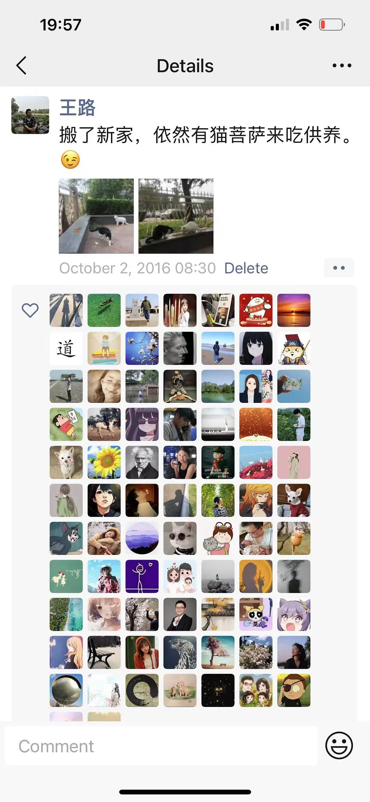
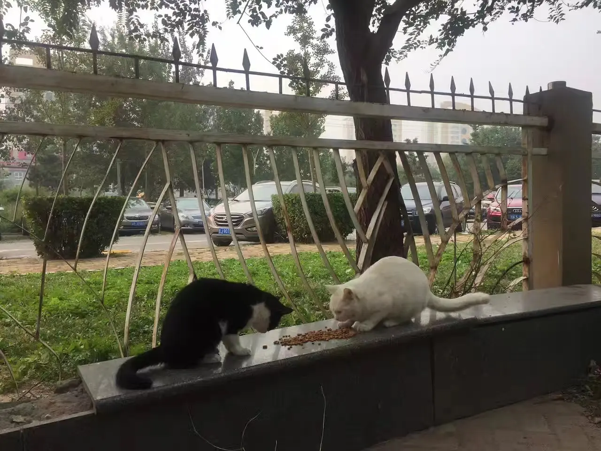

# 猫菩萨的庄严开示

[文集首页](../../README.md) · [本类目录](../../catalog/07-buddhism.md)

作者／署名：王路  
主题：佛教与阿毗达磨  
页面时间：2023-03-08 22:48:33  
来源：[https://www.douban.com/note/845977848/](https://www.douban.com/note/845977848/)

---

我信佛。

信的可能跟别人不大一样——非常朴素，甚至在很多谈吐高妙的人看来太低幼，就是简单一句话：

布施持戒，可以生天。

虽然我不怎么能布施，也没做到持戒，但我相信这一点。也不是说我就相信死了可以生到天上，但我相信，布施、持戒，能够带来好的结果。

这个世界上，很多事情是没有结果的。没有结果不是说什么结果也没有，是说没有理想的结果。我做了大半年短视频，拍了一百多条，没有结果。我爸年轻时候当兵，本来有考军校的机会，后来没考，没有结果；回到老家在百货公司上班，百货公司垮了，没有结果；又做生意二十多年，攒一点钱，被人骗了两次，没有结果。算起来一辈子到退休，没有理想的结果。我想，这种没有结果不是没有原因，我从一件小事上看见了原因。说出来别人可能不信，但我信。

没几天之前，我爸晚上跟战友出去吃饭喝酒，回来看电视，发现看不了了。他就抱怨，移动天天打电话让他升级升级，还说是免费升级，升得电视看不了，一个台也没有了。我和我妈也摆治了半天，没有结果。我就说，打客服电话问问吧。我爸以为要等到第二天，我说没事，晚上也有客服，那是夜里九点多。

拨通电话，客服听我们也说不清——我爸不会普通话，就算上北京心情好了能撇两句，这会儿喝了酒打客服电话也撇不好了。客服就问我们能不能打开摄像头，远程视频，花了十多分钟，解决了。我打开我爸的短信，想找回访信息，给客服一个好评——客服是个男的，听声音，年纪可能跟我差不多，或者比我还小些。挂掉电话时，系统提示稍后会发来短信，“请对我们的服务做出评价”。

我爸的手机双卡双待，我摸了半天没找到短信在哪儿。我爸就说：哎，不用管它，反正电视好了，发不发都中。——我看见这就是他一辈子想发财但是没有结果的原因。不是觉得，是坚信。你想发财，那么多人想发财，不管你想得多迫切，哪怕拼上身家性命，但是对这个世界来说，你发不发都中。

一件事情对你不重要，但对人家重要，实际上，对人家重要的事情，对你就重要。这就是缘起。如果不懂缘起，对自己至关重要的事情，别人就会漠然置之，因为对人家不重要。我们的行为营造了土壤，我们就生活在这样的土壤里。

我是一个睚眦必报的人。对看不惯的事情，学不会妥协。对不合理的事情，学不会接纳。对不正义的事情，也学不会原谅。什么宽容、大度、格局、定力，这些品质和本事，我一个也没有，也不打算有。但我对欣赏的东西，也不吝惜表达崇敬，对应当感谢的人和事，如果不能感谢，就难以心安理得。

世界上很多事情没有结果，无论你努力还是不努力。因为命运的权柄，并不掌握在自己手里。——我坚信这一点。很多人不信，觉得这样想太消极、不阳光、不正能量。我不觉得消极，我觉得这是认清事实、放弃幻想。认为命运的权柄掌握在自己手里的人，在我看来是不肯放弃幻想，狂妄而盲目。

不过，事情好也好在，虽然你不掌握命运，但并非不能干预。干预，就是施加影响。“布施持戒，可以生天”，这就是干预。也就是说，哪怕世界上很多事情没有结果，但好也好在，并不是一切事情都没有结果，有些事情还是有结果的。比如，喂流浪猫。

不管你走到哪儿，住到哪儿，只要你打算在这个地方喂流浪猫——第一天，你放了猫粮都不一定有猫知道；第二天，你放了猫粮就会被猫吃光（也不排除有时候是流浪狗吃的）；第三天，流浪猫就还会再来；第五天，你去的时候，流浪猫就会在那儿等着你。——放之四海，颠扑不破。

这个世界上能够等你的人不多。甚至不一定有。关系再好的人，约了时间，你让他等你两个小时，他都不一定乐意。除非他对你别有所图。王健林刚开始干生意的时候，不知道是等一个科级干部还是处级，一等能等一天，但他不会感激那个人的。

想想你能有什么权力？你在这个世界上多么微不足道，地球离了你照样转，但是，流浪猫能等你两个小时。你连着三天下午五点来，第四天第五天，天黑了，你七点才来，流浪猫还在那儿等你呢。我说的不是驻马店，也不是北京。我说的是一切地方的流浪猫。不信你试试。——只要三五天，它就愿意等你两个小时。刮风下雨，它都等你。这是我的亲身经历，屡试不爽。

2016年，我搬到珠江绿洲的第一天，去给流浪猫投食，转了一圈回来，发现两只流浪猫正蹲在那儿呢。那会儿我还发朋友圈，就拍下来发了一条：“搬了新家，依然有猫菩萨来吃供养。” 有人问，为什么把猫叫菩萨。猫对我来说就是菩萨。在人面前，你不重要；除了你爸妈，谁都可以不鸟你。除非你是领导。领导要是退了休，那又另当别论。但是，一个small potato，一文不名的人，流浪猫是很在乎你的，不管多大的官，到哪个级别，流浪猫都可以不鸟他，而鸟你。只要你没事扔一把猫粮，只要三天，最多五天，它们能等你两个小时。走到全世界，都这样。一把猫粮才多少钱？两块钱。两块钱，也不多，到不了香港新加坡，但新加坡的猫，香港的猫，照样等你两小时。

不要觉得自己不重要。虽然在现实中，你可能真的一点也不重要。左右不了人生的重大遭遇，无力解决中年危机，还不上贷款，找不到工作，碰不到一个能说理的地方。但是，只要你有事没事供养一把猫粮，就会有猫菩萨来开示你，授记你，让你明白，你有多重要，你是别的生命、无边众生的依靠。一个再也没有力量的人，弱者，可以是无边众生的依靠，可见无边众生有多么苦，多么可怜。由此，你有望明白世间到底有多苦，并明白无边苦难中永不熄灭的光何在。

2016年10月2日，北京市朝阳区珠江绿洲家园。

时间地点同上。是菩萨，也是大护法。

2023年3月8日，河南省正阳县金域华府。仔细看。人在做，天在看。

时间地点同上。再仔细看。白猫和7年前那只长得一样。这就是化身。

---

### 正文图片

> 部分图片保留在线地址，离线阅读时可能无法显示。

