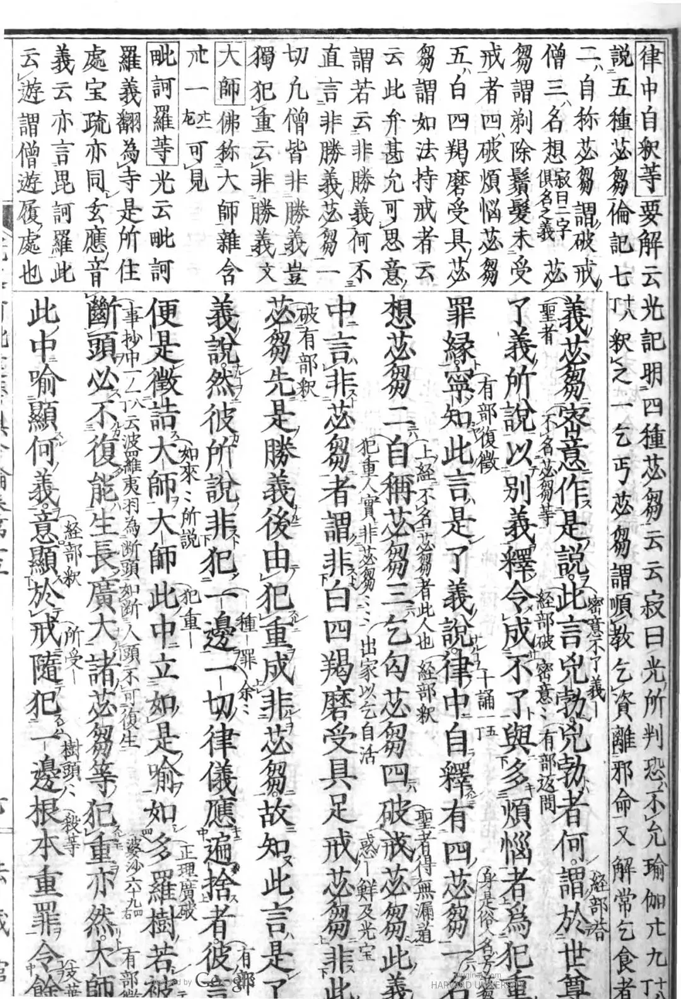

# 聊聊《俱舍》Pruden英文本

[文集首页](../../README.md) · [本类目录](../../catalog/07-buddhism.md)

作者／署名：王路  
主题：佛教与阿毗达磨  
页面时间：2023-06-09 21:24:41  
来源：[https://www.douban.com/note/850079234/](https://www.douban.com/note/850079234/)

---

若干年前，我在豆瓣上看到一条冯友兰《中国哲学简史》的短评，有人说，她看中文版《中国哲学简史》，几乎看不懂；找来英文版，很容易就看懂了。

这当然不是因为中文版翻译得不好——《中国哲学简史》是冯友兰用英文写的。中文版有不同的人翻译过。翻成中文时，引用的原典是直接把古文放上去。所以有读者不懂。有些人虽然中文是母语，但读古文要比读英语更费劲。
这让我想到，以汉语为母语的人学习《俱舍论》，如果直接读玄奘译本有困难，英语又很好的话，读英译本也不失为一种选择（但是想学好学精，还是要读汉语）。英文《俱舍》有多个版本，Pruden（1990）是比较经典的一个，是他从Poussin的法文版《俱舍论》翻译的。
我之前批评某学者对《俱舍论》某段话翻译得不准确，他说，他是基于Poussin和Pruden的翻译，二人的翻译有这样那样的问题，不能怪他。后来，我去翻了Pruden英译本对应的段落，发现没有问题。总体来说，Pruden英译本质量是可以的。对阿毗达磨的理解，比今天很多期刊论文好不少。既然Pruden是基于Poussin，不用说，Poussin的阿毗达磨也是很好的。（我不懂法语，没法直接读Poussin译本。）
为什么Poussin译本能做到不错呢？我个人觉得，这也跟玄奘所传阿毗达磨有关。
Poussin是第一个把《俱舍》翻译成欧洲语言的，出版于1923年到1931年。Poussin的翻译根据两个本子，一个是Yaśomitra的梵文本，一个是佐伯旭雅（Kyokuga Saeki）的《冠导俱舍论》（中文本）。
Pruden提到，Poussin法文本加了一些注释，注释的主要来源之一是《光记》《宝疏》。——我不清楚Pruden为什么把法宝写在普光前面（可能因为F在P前面），实际上，《光记》早于《宝疏》，对《俱舍》的参考意义也远大于《宝疏》，普光多坚持世亲菩萨的立场，法宝则更倾向众贤尊者的立场。根据《光记》《宝疏》，Poussin确定了《俱舍论》里论辩的每句话是谁说的，是己方还是对方——这一点在今天很多学者的论文里还经常搞混，比如后面会提到的 Gold（2015）。
《冠导俱舍论》是佐伯旭雅（Kyokuga Saeki）1869年在日本出版的，曾经风靡日本。CBETA目前有收录。但收了等于没收。CBETA是从蓝吉富主编的《大藏经补编》里收的《冠导俱舍论》。真正的《冠导俱舍论》长这样：
所谓“冠导”，特色就在天头上的字和夹注小字，大字就是《俱舍论》本身。CBETA只收了大字。所以，CBETA上的《冠导俱舍论》实际上不是《冠导俱舍论》。《冠导俱舍论》也在很大程度上参考了《光记》《宝疏》。因此，Poussin的阿毗达磨，实际上是受益于玄奘所传的。
Pruden的英译本不错，在我看来，有两个原因：一，内容相比汉译《俱舍》减少了，某些长行有省略——内容少，出错误的机会也会少（不过，偶尔也会有内容比奘译多的时候，比如“眼与眼识界，独俱得非等”，把奘译《俱舍》中没写的情况也给列上了）。二，Poussin和Pruden都学习了整个阿毗达磨。也就是说，《俱舍论》他们是通读了的——这好像是废话，不通读怎么全文翻译呢？但如果跟今天的很多阿毗达磨学者比起来，你会发现“通读《俱舍》”并不是“最低标准”，甚至是蛮高的标准，更不要说通读《婆沙》《正理》《发智》《六足》了。学者的常见做法是，先有“问题意识”，想到某个issue，去检索相关段落，只关注这些段落。
在Pruden英译本中，你会看到，长行如果涉及一些概念和知识点，旁边会标上相关颂文的编号（应该Poussin本就有）——这很重要。如果你学习《俱舍》能自己动手去标，效果会更好。也就是说，谈到一个问题，你要立马知道对应的颂有哪些。这是阿毗达磨能不能入门的关键。
Pruden翻译《俱舍论》，最先翻译的是第九卷，也就是最后一卷——是为了帮助自己学习和教课（不是为了发论文出专著）。为什么先翻译第九卷呢？
“I began with the Ninth Chapter (the Pudgala-pratisedha) and not with the First Chapter, holding to the Asian superstition that one will never finish a work if one begins on its first page.”
——这非常对。虽然要通读，但不意味着必须从第一页开始。
2015年，普林斯顿的Jonathan C. Gold，出了一本阿毗达磨著作：Paving the Great Way: Vasubandhu’s Unifying Buddhist
Philosophy. 我没找到电子版，昨天有朋友分享给我一篇书评，莱比锡大学的Eli Franco写的，把Gold这本书批得体无完肤，批之前还先把其他学者的表扬先放上来——“This book will forever change the way we read Vasubandhu”，但你看了Franco的批评，就有点怀疑这个表扬可能是高级黑。Franco说，“Gold’s work contains numerous gross misrepresentations of Vasubandhu’s thought and arguments…… The many mistranslations and misinterpretations suggest that although he based his book mainly on the Abhidharmakośa, Gold is not sufficiently knowledgeable in Abhidharma scholastics. Further, his general thesis remains unproved, even if we take it in a weaker form. ”
Franco举了个例子，“眼见色同分，非彼能依识”。他是完全基于梵文批驳Gold这一段的理解，没有用中文文献。我对照玄奘译本看了，和Franco的解释是契合的，也就是说，他没有冤枉Gold，只是表达过度了。
Oren Hanner（2021）写了篇关于《俱舍论》的综述，收入 Oxford Research Encyclopedia of Religion，其中提到的最新研究就是Gold (2015)，是那篇综述的压轴参考文献。但Gold (2015)这种著作，说实话，读了可能还会增加你对阿毗达磨的误解。比起Pruden（1990），应该说差太远了。有时候，旧的研究，会比新的研究更好。
Pruden的英译本，偶尔也有瑕疵，但一般问题不会很大。比方说，第98页：
“34c. Nine are non-appropriated.
What are these nine? The seven that have been mentioned which have an object, together with one-half of the eighth. ”
这容易让读者产生误解。我也有点怀疑Pruden有没有搞懂。玄奘译本中，这个颂叫：“七心法界半，有所缘余无，前八界及声，无执受余二。”“七心法界半”的“半”，只到“有所缘”，不能流到下句。而“七心法界”，则流到“前八界”这句。
也就是说，“that have been mentioned which have an object”的，不是the seven，而是the seven together with one-half of the eighth。Pruden这里如果想保留the seven，后半句的one-half 就该去掉；如果想保留one-half，前半句的the seven就该去掉——要么是7+1=8，要么是7.5+0.5=8，不能是7+0.5=7.5。
不过，Pruden后面说对了（有时候看学者论文也会这样，同一个问题，他前面说错，后面说对，或者后面说错，前面说对）：
34c. The eight that have been mentioned, and sound. These nine are never appropriated: the seven dhatus of mind
(i.l6c), the dharmadhatu (i.l5c), and sound are never appropriated.
这一段是对的。这里的(i.l6c)和(i.l5c)就是相关的颂文。这个记法很好。如果做成网页版，搞成超链接，会更好。当然，最好就是把颂背下来，记在脑子里。
有时候，Pruden的表达显得别扭，比如同一页的前面：
34a-b. The seven dhatus which are mind have an object.
Only the dhatus of visual, auditory, olfactory, taste, touch, and mental consciousness have an object, because they always grasp their spheres.
34b. And also one part of the dharmadhatu.
这里，为什么要说Only呢？说了Only，又说 And also，反正我感觉是有点别扭。问了BING和Claude，它们也都觉得不妥。另外，说的是The seven，Pruden只列举了6个，也就是六识界——当然，这对熟悉阿毗达磨的人来说，一点问题都没有，因为他已经知道是怎么回事了。但初学者，拿来当教材，恐怕是会有点迷糊的。
对比汉译，就可以体会到玄奘大师的精确：
《阿毘達磨俱舍論》卷2：「七心法界半， 有所緣餘無， 前八界及聲， 無執受餘二。論曰：六識意界及法界攝諸心所法，名有所緣，能取境故」(CBETA 2023.Q1, T29, no. 1558, p. 8b11-14)
“七心”是什么？“六识”，“意界”。虽然“六识界”等于“意界”，但把“意界”说出来，是能更好地和“七”对应的。而“无执受”的问题，玄奘本明确说了是“法界全”。
《阿毘達磨俱舍論》卷2：「十八界中九無執受，前七心界及法界全，此八及聲皆無執受。所餘九界各通二門，謂有執受、無執受故。」(CBETA 2023.Q1, T29, no. 1558, p. 8b16-18)
有时候，玄奘的汉译，相比梵本是有改变的——我不是说这里。比如，“第五二六明”那个颂，也就是“六通”的次序，玄奘本和真谛本不一样。这种改变，把阿毗达磨问题处理得更精确或者更优美了。所以我有个看法：通过汉语文献学习有部阿毗达磨，比通过梵文藏文，能最终抵达的天花板要高，这一方面因为汉文的有部文献更全，有《大毗婆沙论》《顺正理论》这样的经典，另一方面因为，玄奘大师的处理，使阿毗达磨文献达到了惊人的精确。当然，在简单问题上，比如写一篇综述，这一点很难看出来，但在复杂细节上，它就会屡屡显现。

附记：

下午发在公众号后，感谢丁一老师分享Sangpo本给我，我查了Sangpo本，“前八界及声”那里也错了（266页），而且是前后都错了。

另外，还顺带发现《品类足论》的一个错误（当然是传抄中的错误）：

《阿毘達磨品類足論》卷2〈3 辯諸處品〉：「此十二處，幾有執受、幾無執受？答：三無執受，九應分別。謂眼處，或有執受、或無執受。云何有執受？謂自體所攝眼處。云何無執受？謂非自體所攝眼處。色、耳、聲、鼻、香、舌、味、身、觸處亦爾。」(CBETA 2023.Q1, T26, no. 1542, pp. 696c29-697a4)

「聲」應刪去。

可參考：

《阿毘達磨品類足論》卷15：「幾有執受等者？三無執受，九應分別。謂眼處，或有執受、或無執受。云何有執受？謂自體所攝眼處。云何無執受？謂非自體所攝眼處。色、[3]耳、鼻、香、舌、味、身、觸處亦爾。」(CBETA 2023.Q1, T26, no. 1542, p. 757a18-22)[3] 耳【大】，耳聞【宋】【元】【明】【宮】

《阿毘達磨品類足論》卷18〈8 辨決擇品〉：「唯無執受法，九界三處四蘊攝，三智知謂他心滅道智，一識識，無色界一切，欲色界二部，及見苦集所斷非遍行隨眠隨增。」(CBETA 2023.Q1, T26, no. 1542, p. 767a15-18)

《阿毘達磨俱舍論》卷2：「十八界中九無執受，前七心界及法界全，此八及聲皆無執受。所餘九界各通二門，謂有執受、無執受故。」(CBETA 2023.Q1, T29, no. 1558, p. 8b16-18)

---

### 正文图片

