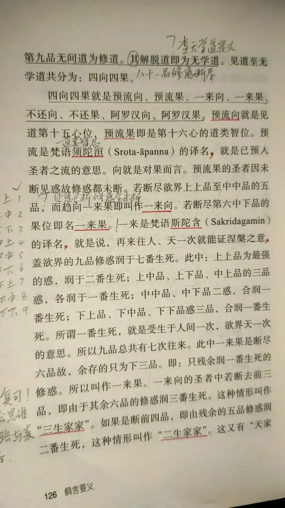
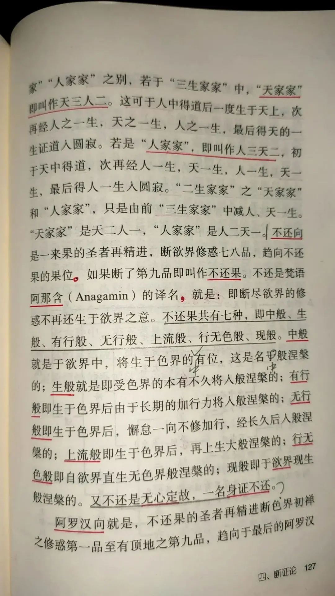

# 《俱舍要义》的11个错误和欲界九品修惑各润几生猜想的荒谬

[文集首页](../../README.md) · [本类目录](../../catalog/07-buddhism.md)

作者／署名：王路  
主题：佛教与阿毗达磨  
页面时间：2023-12-20 14:33:10  
来源：[https://www.douban.com/note/857465241/](https://www.douban.com/note/857465241/)

---

杨白衣的《俱舍要义》是一本简明扼要介绍《俱舍论》的读物。我在系统学习《俱舍》之前也借阅过，印象不错。后来的若干年里，直到现在，时不时有零基础的人问起学习《俱舍》该从哪里入手，原文读不懂怎么办，有时我也会建议先浏览《俱舍要义》。也听说一些学院和个人把它作为阿毗达磨教材学习。
前天晚上，“尊重毗昙”群里的李恒，发来《俱舍要义》的一页，怀疑有误。我浏览了说，他这里讲得不太行，很多错误，还是得看俱舍原文。李恒说，那一页讲到润生还是可取的。我说，润生问题唐人注疏中提过，但不是《俱舍》《婆沙》《正理》的内容，不权威，了解即可，细究是讲不通的。
我粗略看过那一页，怀疑有5个以上错误。由于页面折了角，我让李恒发来完整的一页，数了下，硬打硬的错误有7个，我说，下一页估计起码还得有3个错误，李恒又发来下一页，我找到4个错误。因此感慨，《俱舍要义》也就适合粗略翻翻，不能细看，更不适合当教材去反复研读——那样就会学到一堆错的东西。
口说无凭，干脆把这两页的错误简单解释一下，并聊聊“欲界九品修惑各润几生”的理解为什么不靠谱。
其实，四向四果的问题本来就有点难度，我寓目的论文专著中谈到这个问题，错得太多。所以，《俱舍要义》这两页虽然错误不少，其他章节的问题应该不至于如此密集。
一、指误
李恒发在群里的照片应该是大陆翻印版，因为没发书皮，恐怕也没有版权页，我也就不核实了。以下是针对如下图片，把逗号句号中间的内容算一处：
页126：
1、预流向就是见道第十五心位
按：预流向不一定是见道第十五心位，也可能是见道前十四心位；见道第十五心位不一定是预流向，也可能是一来向、不还向。
2、预流果即是第十六心的道类智位
按：道类智位不一定是预流果，也可能是一来果、不还果。
3、预流果的圣者因未断见惑故修惑都未断
按：预流果圣者已断所有见惑，容断欲界一品至五品修惑。
4、若断尽欲界上上品至中中品的五品，而趋向一来果即叫作一来向
按：具缚入正性离生，已越道类智位，为进断一品起加行道就是一来向，不需要等到断尽一品时，更不需要等到断尽五品时；另外，先断或六或七或八品，后入正性离生，见道位也是一来向。若已断尽五品入正性离生，至道类智位，乃至其后未起胜果道时，仍然不叫一来向。
5、此中一来果是断尽六品故
按：一来果也可以是断尽七品、八品者。
6、存余的只为下三品
按：一来果还存余色无色界一切修所断随眠。
7、即：只残余润一番生死的修惑
按：这是把上界修惑忘了。上界修惑能润几番生死根本就说不定。实际上，欲界修惑也不能说。润几番生的问题是因袭唐人，留到第二部分解释。
页127：
1、不还向是一来果的圣者再精进
按：不还向也可以是先离欲染后入正性离生者，所谓“离八地向三”，这时候根本没得过一来果。
2、再上生大般涅槃的
按：《婆沙》《俱舍》《正理》等阿毗达磨文献中不存在“大般涅槃”的概念。“大”可能是“入”的形讹。
3、又不还是无心定故，一名身证不还
按：这是没懂“得灭定不还，转名为身证”的意思，胡乱翻译。原文是说得灭尽定的不还也叫“身证”，其他不还不叫。
4、阿罗汉向就是，不还果的圣者再精进断色界初禅之修惑第一品至有顶地之第九品
按：这里不应说“第九品”，应说“第八品”，因为这里的断是“已断”的意思，不理解为“正断”。《俱舍》：“从断初定一品为初，至断有顶八品为后，应知转名阿罗汉向。”而“断有顶惑第九无间道”的“断”是“正断”，不是“已断”，所以，“断有顶惑第九无间道”属于“断八品”不属于“断九品”。不宜随意改《俱舍》的表述。
二、欲界九品修惑润生问题
毗昙部中，圆晖《颂疏》提到如下见解：
《俱舍論頌疏》卷24：「言斷三四品受三二生者，若斷三品名受三生，若斷四品名受二生，謂九品惑能潤七生，且上上品能潤兩生，上中、上下、中上各潤一生，中中、中下合潤一生，下三品惑共潤一生。既上三品能潤四生，故斷上三品，四生便損，名受三生。既言中上品潤一生，故斷中上品，復損一生。前斷三品已損四生，今斷中上，復損一生，故斷四品總損五生，受二生也。」(CBETA 2023.Q3, T41, no. 1823, pp. 948c26-949a6)
瑜伽部及其他部类中，提到得更多。该说法在唐朝就流行起来了。但一定要注意，《婆沙》《俱舍》《正理》中没有上述说法。
由于根据“三二生家家”等，不难脑补出这些，我不太怀疑这个说法很可能在迦湿弥罗论师中就有了，但《婆沙》等不采，乃至不以“有说”收入，足见该说法细究起来站不住脚。我们不要学站不住脚的东西，更不要把站不住脚的东西当成宝贝，以为比《婆沙》搞得还细。具体哪里站不住脚，以下稍作说明即知。
这里的“润一生”，并不是“一次受生”，而是人天各一次受生。
拿“住果极七返”的行者来说，“彼从此后欲人天中各受七生”。他在人间见道，于欲天受第一生终了，请问这时他有没有进断修惑？假设他断了一品，他就应该只受五返生死，但他还剩六返半，所以此时只能一品未断；他于人间更受第一生，也必须一品未断。此后，于欲天人间再各受第二生，也必须一品未断，因为《颂疏》说，“必无有断一品二品不断三品中间死生”。假设他第二次生于人间时，断了欲界一品，按照《颂疏》，就必断前三品，这样，他就成了家家，就不会再剩下“五返生死”，因此，他此生必须仍然一品未断；既然一品未断，他临命终时，为什么只剩下“五返生死”而不是“七返生死”呢？
对生极七返者，他在天上受第五生时，要成为家家（剩下人三天二），因此，他的欲界第一品乃至前三品修惑，都是于此一生当中断的。那么，此前的欲天人间各四生，都是哪些烦恼润的？尤其是，生极七返者的欲天人间第三四生，具体是哪一品烦恼润的？如果说是上上品润的，上上品已经润了两返，为什么还能润第三第四返？如果说是上中品润的，上上品未断，为什么未断却失去润生的功能了？
还可以通过“一来”“一间”来推出其说的荒谬，但前面的质疑已足，无需再举了。
可见，欲界九品修惑各润几生的说法，貌似精巧，细究起来，极不靠谱。学习《俱舍》，千万不要在这种地方上当。一定要知道哪些文本是权威，哪些不是。不要把参考资料的权威性和《婆沙》《俱舍》《正理》等量齐观，那就是舍本逐末了。
四向四果与胜果道

---

### 正文中的链接

- [四向四果与胜果道](http://mp.weixin.qq.com/s?__biz=MzA5OTc3NzEzMw==&mid=2653682158&idx=1&sn=0a2cfa58b0dd9c87e08c066dd13142ff&chksm=8b2276ecbc55fffac0a6aec93384c4e1c97d8f8ed674c9313725547923adf2c6430b28d68817&scene=21#wechat_redirect)

---

### 正文图片

