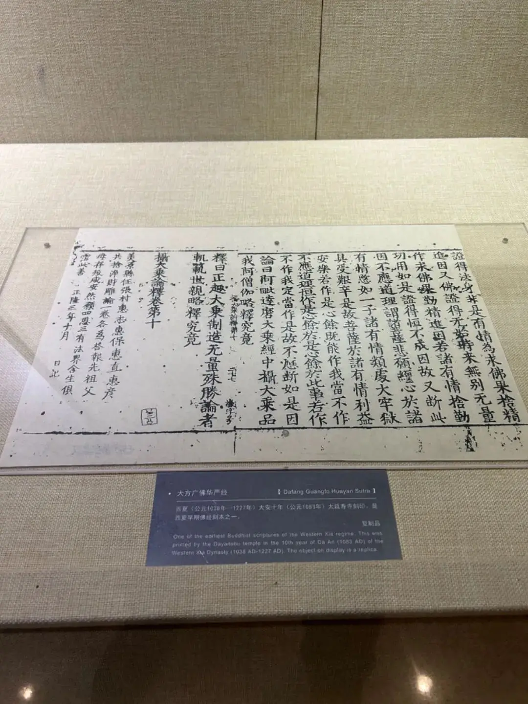

# 菩萨不共戒——印顺对玄奘的一处批评

[文集首页](../../README.md) · [本类目录](../../catalog/07-buddhism.md)

作者／署名：王路  
主题：佛教与阿毗达磨  
页面时间：2024-03-17 16:58:59  
来源：[https://www.douban.com/note/860361993/](https://www.douban.com/note/860361993/)

---

玄奘大师译无著菩萨《摄大乘论》，增上戒学部分，有这么一段话：

《攝大乘論本》卷3：「共不共學處殊勝者，謂諸菩薩一切性罪不現行故，與聲聞共；相似遮罪有現行故，與彼不共。」(CBETA 2023.Q4, T31, no. 1594, p. 146b16-18)

印顺法师认为玄奘译错了：

《攝大乘論講記》：「「菩薩」對於殺盜淫妄「一切性罪」，這不論如來制與未制，犯了就是有罪的，菩薩一定「不現行」，這「與聲聞」人的不犯性罪，是完全「共」同的。但關於「遮罪」的「不現行」（奘譯相似遮罪的相似二字，其餘的譯本都沒有。『相似遮罪有現行』故一句，應作『遮罪不現行故』，奘譯誤），菩薩「與彼不共」。」(CBETA 2023.Q4, Y06, no. 6, p. 407a7-11)

印顺法师主要提出两点。一是，玄奘译本多了“相似”；二是，应该译作“不现行”，奘译是“有现行”。

实际上，玄奘大师这里不错。不仅不错，还更加精确。

1、印顺法师是如何判断的？

印顺法师是根据真谛本、达磨笈多本。

真谛译本：

《攝大乘論》卷3〈6 依戒學勝相品〉：「共學處戒者，是菩薩遠離性罪戒。不共學處戒者，是菩薩遠離制罪所立戒。」(CBETA 2023.Q4, T31, no. 1593, p. 126c27-29)

笈多本：

《攝大乘論釋論》卷8：「共學者，聲聞及菩薩等，性罪不行故。不共學者，謂遮罪不行故。」(CBETA 2023.Q4, T31, no. 1596, p. 304c22-24)

“远离制罪”，“遮罪不行”，显然和奘译“遮罪有现行”是相反的。

2、《摄大乘论》只有一种梵本吗？

实际上，这种差别，不是玄奘翻译的问题，而是《摄大乘论论本》本身就不止一种。

这种事情太常见了。《大毗婆沙论》《俱舍论》《解深密经》，以及其他不少经典都有这种情况：在流传中，觉得哪个地方说得不好，就改了。要断定这里是玄奘的误译，必要条件之一，是其他本子都和玄奘译本相反。这一点就不成立。佛陀扇多本就和奘译一致：

《攝大乘論》卷2：「聲聞同戒，諸菩薩性重不同行。不同戒者，制重同行」(CBETA 2023.Q4, T31, no. 1592, p. 107b27-28)

佛陀扇多本译出在玄奘之前。佛陀扇多、玄奘，两本是同一种表述；真谛、达磨笈多，两本是另一种表述。——这很适合看成《摄大乘论》梵本就有截然相反的两种表述，而不是佛陀扇多和玄奘不约而同译错了。

那，为什么会有两种截然相反的表述？——这和“中国队大胜日本队”“中国队大败日本队”，是类似的。意思都是同样的意思，问题出在表述上。

3、菩萨到底是怎样不共声闻学处的？

论本是要表示，菩萨学处，有和声闻一致的，有和声闻不一致的。一致的不用多说，就是性罪，声闻不现行，菩萨也不现行，这叫“与声闻共”。那么，不一致的，遮罪，应当怎么表述呢？

声闻的遮罪和菩萨不一样，声闻的遮罪对菩萨来说，有些不是遮罪；菩萨的遮罪对声闻来说，有些不是遮罪。对各自的遮罪来说，都不现行；至于对方与自己不共的遮罪，自己都容现行。这就是论本后面立刻解释的。

我们再来看真谛本和笈多本：

真谛译本：

《攝大乘論》卷3〈6 依戒學勝相品〉：「共學處戒者，是菩薩遠離性罪戒。不共學處戒者，是菩薩遠離制罪所立戒。」(CBETA 2023.Q4, T31, no. 1593, p. 126c27-29)

“菩萨远离制罪”，那声闻远离不远离制罪？声闻当然也远离制罪。既然声闻和菩萨都远离制罪，和二者都远离性罪一样，为什么说这叫“不共学处戒”呢？

笈多本：

《攝大乘論釋論》卷8：「共學者，聲聞及菩薩等，性罪不行故。不共學者，謂遮罪不行故。」(CBETA 2023.Q4, T31, no. 1596, p. 304c22-24)

笈多本也一样，“性罪不行”“遮罪不行”，对声闻和菩萨都是成立的，性罪不行是共，遮罪不行怎么就成了不共？

所以，真谛本和笈多本，我们虽然能知道想表达的意思，但这个表述实在是不好。这种表述并不是真谛和笈多翻译的问题，而是论本就有这么一种表述。其实，所谓“不共”，就是彼此的戒不一样，声闻的某些戒（遮戒），菩萨可以不遵守，这叫“不共”。

这个意思，真谛本、笈多本以及其他本，具体的解释都是一样的。我们看真谛译世亲菩萨释论：

《攝大乘論釋》卷11〈6 釋依戒學勝相品〉：「如聲聞若安居中行則犯戒、不行則不犯，菩薩見遊行於眾生有利益，不行則犯戒、行則不犯。」(CBETA 2023.Q4, T31, no. 1595, p. 233a5-7)

笈多本世亲释：

《攝大乘論釋論》卷8：「共不共學處戒者，於中性罪，謂殺生等是為共。掘地斷草等制罪，是不共。此後學處，於聲聞有罪、菩薩無罪，如聲聞於夏中行是犯，菩薩見有眾生利益事不去是犯。」(CBETA 2023.Q4, T31, no. 1596, p. 305a3-6)

世亲菩萨解释得非常清楚：掘地、断草这些，对声闻来说是戒，对菩萨来说不是。但因为很难解释掘地、断草对众生有什么好处，所以又举了夏安居的例子。对声闻来说，夏安居中不能游行，但菩萨就可以游行，甚至不能不游行（如果游行“于众生有利益”的话）。——这就是遮戒的不共。

佛陀扇多的译本，其实就是表示这个意思：

《攝大乘論》卷2：「聲聞同戒，諸菩薩性重不同行。不同戒者，制重同行」(CBETA 2023.Q4, T31, no. 1592, p. 107b27-28)

菩萨哪些戒和声闻相同呢？性罪。菩萨也不现行，这和声闻不现行相同。哪些戒和声闻不同呢？遮罪。菩萨现行，声闻不现行，这和声闻不同。

4、玄奘本好在哪里？

佛陀扇多这个译本，确切地说，是佛陀扇多所依的原本，这样表述也存在一个问题：菩萨的遮罪和声闻的遮罪不同，说菩萨遮罪现行，读者就可能误以为，菩萨会现行菩萨的遮罪。其实想表达的是，菩萨会现行声闻的遮罪——这对菩萨来说不是遮罪。所以叫不共。为了表示，这并不是菩萨的遮罪，奘译在遮罪前加了两个字：“相似”。

《攝大乘論本》卷3：「共不共學處殊勝者，謂諸菩薩一切性罪不現行故，與聲聞共；相似遮罪有現行故，與彼不共。」(CBETA 2023.Q4, T31, no. 1594, p. 146b16-18)

“相似遮罪”，就表示，它看起来是遮罪（站在声闻立场上），但对菩萨来说，实际上不是，因此，菩萨于此有现行。——这正体现了菩萨学处与声闻的不共，也是其殊胜处。

根据汉译诸本，暂时难以判断，“相似”是不是玄奘大师自己添上去的。毕竟其他译本都没有。但可以认定的是，必定有梵本不存在“相似”。存在“相似”的本子更精确，也应该是后来改进的表述。至于“相似”是玄奘加进去的，还是其他人加进去的，也没那么重要；重要的是，加进去后，表述更严谨。

再看看奘译世亲释：

《攝大乘論釋》卷8：「釋曰：共不共中，一切性罪謂殺生等，說名為共。相似遮罪，為掘生地斷生草等，說名不共。」(CBETA 2023.Q4, T31, no. 1597, p. 361a9-11)

真谛译世亲释：

《攝大乘論釋》卷11〈6 釋依戒學勝相品〉：「釋曰：謂立掘地拔草等制，菩薩遠離與二乘不同。何以故？論曰：此戒中或聲聞是處有罪、菩薩於中無罪，或菩薩是處有罪、聲聞於中無罪。」(CBETA 2023.Q4, T31, no. 1595, pp. 232c28-233a2)

那么，掘地拔草这些，菩萨容现行吗？当然容现行——这才叫“不共”“不同”嘛。

因此，“相似遮罪有现行”，才是最确切的表述——虽然它恐怕不是最原始的表述。

很多经论，最早的表述有粗糙甚至矛盾的地方。在流传中，有些地方就被修改了。修改的结果是，后人比较不同译本，发现不一样，就有人想：是不是哪个译者翻译错了？其实不一定。也可能是所据梵本不同。那么，是不是越早的本子越好？也不一定。好的地方一般不需要故意修改；修改，往往是因为之前的理解或者表述不够合理。但这种修改，往往要迁就原来的表述，如果不理解修改的原因和问题所在，文本往往会变得费解。《解深密经》中的“胜义无自性性”就是典型。“胜义无自性性”，最初主要是说依他起相，顺带说圆成实相，后来反过来了。译本的差别就像化石，为我们保留了思想和表达流变的痕迹，只是有些时候比较晦涩。

（完）

一周前去中国印刷博物馆，发现展馆把《摄大乘论世亲释》写成了《华严经》。

高阶阿毗达磨、入群标准
9000字解释《解深密经》有些问题不值得
2000字解释《八识规矩颂》
我学唯识的经历和体会
《佛典解释》《佛典故事》系列考虑出版

---

### 正文中的链接

- [高阶阿毗达磨、入群标准](http://mp.weixin.qq.com/s?__biz=MzA5OTc3NzEzMw==&mid=2653683004&idx=1&sn=f366a8ee533552b135400613a9c891a5&chksm=8b22723ebc55fb28b145a252c0a55fb482b5fa444098826147c531021860c9095b69bf88cc49&scene=21#wechat_redirect)
- [9000字解释《解深密经》](http://mp.weixin.qq.com/s?__biz=MzA5OTc3NzEzMw==&mid=2653682886&idx=1&sn=5d715887dc1d36b040ef9bbdcdf41cc2&chksm=8b2273c4bc55fad2d6d6f08a4afffedc90f1dc81786797aa5c605fe736c0c6e73e72525a68a3&scene=21#wechat_redirect)
- [有些问题不值得](http://mp.weixin.qq.com/s?__biz=MzA5OTc3NzEzMw==&mid=2653683078&idx=1&sn=ba150ef8b893ed0f4af5d22acdcfcea9&chksm=8b227284bc55fb9253a3468972477b27f8f5d83a7209128241b47c698f4e441a8dc7430d22e9&scene=21#wechat_redirect)
- [2000字解释《八识规矩颂》](http://mp.weixin.qq.com/s?__biz=MzA5OTc3NzEzMw==&mid=2653683157&idx=1&sn=824dcd31334ef05157dd5f26e78cacc6&chksm=8b2272d7bc55fbc12bd20f12196660bae89e67714a19aa139d54b935247366a4082abaaf504a&scene=21#wechat_redirect)
- [我学唯识的经历和体会](http://mp.weixin.qq.com/s?__biz=MzA5OTc3NzEzMw==&mid=2653683038&idx=1&sn=b389f1564858f17a8b33498ce2e4e7c9&chksm=8b22725cbc55fb4af38b53f61b5a28fc6caffcff677204c543b91b22628c8a7114e91dfcfcbc&scene=21#wechat_redirect)
- [《佛典解释》《佛典故事》系列考虑出版](http://mp.weixin.qq.com/s?__biz=MzA5OTc3NzEzMw==&mid=2653683008&idx=1&sn=e482e00869b2c146042f1759f6ab20c2&chksm=8b227242bc55fb540382463967570e76a79b88cd954cbe8f1860154b5ea70782030dc97a1490&scene=21#wechat_redirect)

---

### 正文图片

