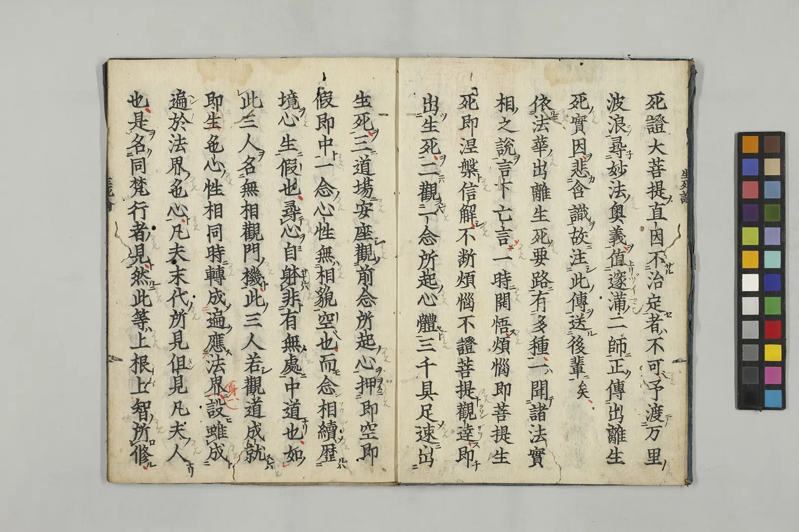

# 读陆扬《修禅道场碑与唐代天台宗复兴运动新解》

[文集首页](../../README.md) · [本类目录](../../catalog/07-buddhism.md)

作者／署名：王路  
主题：佛教与阿毗达磨  
页面时间：2024-04-02 13:04:57  
来源：[https://www.douban.com/note/860909294/](https://www.douban.com/note/860909294/)

---

上午读到陆扬老师《修禅道场碑与唐代天台宗复兴运动新解》一文。就几个小细节提一点建议。

1、

原文：【国清寺常有一百五十僧久住，夏节有三百已上人泊。禅林寺常有四十人住，夏即七十余人。国清寺有维蠲座主，每讲《止观》。禅林寺即是广修座主长，讲《法花经》《止观》玄义，冬夏不阙。】

按：一，“夏即七十余人”，“即”当作“节”。这里有异文。《入唐求法巡禮行記》卷1：「夏節([□@考]節東本作即)七十餘人。」(CBETA 2023.Q4, B18, no. 95, p. 22b16-17) 白化文、李鼎霞、许德楠校注《入唐求法巡礼行记校注》（中华书局，2019，页105）校勘：“小野本认为乃节字之误。”前一句刚刚出现过“夏节”。二，“禅林寺即是广修座主长，讲《法花经》……”，这是引用原文，宜标点为：“禅林寺即是广修座主，长讲《法花经》……》”，“长讲”是一个词，不宜点开。三，“……《法花经》《止观》玄义，冬夏不阙”，宜作“……《法花经》《止观》《玄义》，冬夏不阙”。《玄义》是《妙法莲华经玄义》，宜同加书名号。白化文等《校注》也未同前加书名号，宜加。

2、

原文：【释行满，生缘始姑苏，今即苏州是也。二十出家，二十五具戒。五年学律。……这段记载提供了几点重要信息：行满是有律学修养并投身天台法门的学问僧……】

按：陆老师认为行满“有律学修养”，是根据“五年学律”得出的结论。实际上，“五年学律”是新受戒者的常规流程，似不宜据此认为行满较其他僧人更有律学修养。《淨心誡觀法》卷1：「佛教新受戒者五年學律，然後學經。」(CBETA 2023.Q4, T45, no. 1893, p. 821a12)

3、

原文：【赞宁的记载相当粗略，连道邃的个人背景都以“不知何许人”带过，只提到他在大历中从湛然那里学习了其代表性著作《止观辅行传弘决》……】

按：“不知何许人”是僧传中非常常见的描述，只要不清楚籍贯，就说“不知何许人”，如淄州慧沼、丹霞天然、千福怀感这些大名鼎鼎的僧人都是“不知何许人”，而且对他们的记载篇幅也不如道邃。写玄奘法师传的彦悰也“未知何许人”。似不宜据此等说赞宁对道邃的记载“相当粗略”。

4、

原文：【比如《妙法莲华经出离生死血脉》中说：予渡万里波浪，寻妙法奥义，值邃、满二师，正传出离生死实因，悲含实故，注此传送后辈。】

按：“含实”应作“含识”，是“有情”“众生”的意思。这部文献网上容易找到，我看了下原图，是“含识”。

5、

原文：【说道邃“俗姓王氏。琅琊苗裔，桑梓西京，绣衣继代不可具。委身乃授监察御史，解组辞荣，从师学道，年二十四方乃进具于秦地”。】

按：宜标点为：【……绣衣继代不可具委。身乃授监察御史……】陆老师可能是依《大正藏》、CBETA的标点。但《大正藏》点错了。如果去词典中查，可能查不到“具委”一词，而能查到“委身”。但这里确实是“具委”，不是“委身”。在藏经中检索“具委”即可了然。另外，林佩莹（2021，The Tendai Use of Official Documents in the Ninth Century: Revisiting the Case of Monk Daosui，页266），也点错了“具委”。

---

### 正文图片

