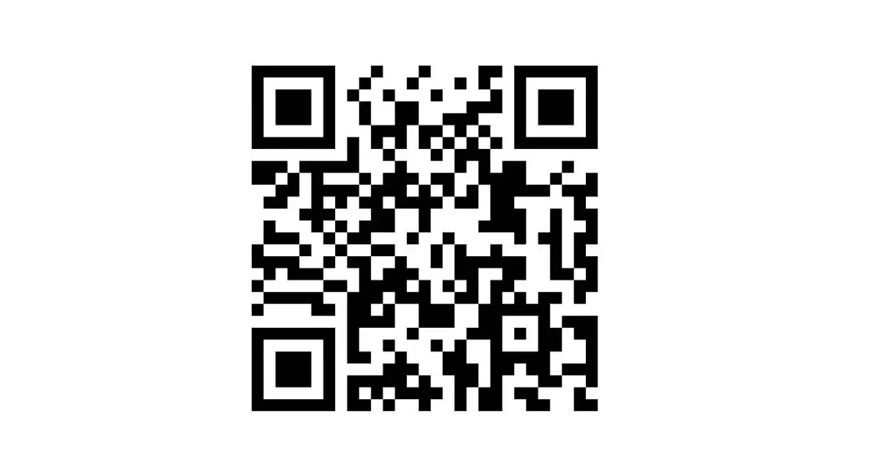

# 藏经阁中上千部佛典，谁在C位？

[文集首页](../../README.md) · [本类目录](../../catalog/07-buddhism.md)

作者／署名：王路  
主题：佛教与阿毗达磨  
页面时间：2025-06-10 11:10:33  
来源：[https://www.douban.com/note/873494534/](https://www.douban.com/note/873494534/)

---

（我在得到APP的《金刚经50讲》课程已经上线了。扫描下方二维码可以购买。《发刊词》我昨天发在了小号上：

《金刚经50讲》发刊词（无删节版），诚惶诚恐

今天发的这篇不是课程内容。课程会比较结构化，听起来主线更清晰、更系统。这篇是散文写法，比较信马由缰。）

世间人喜欢排座次。呼保义宋江，玉麒麟卢俊义，谁是第一，谁是第二，非常分明。出去吃饭，谁坐上席，谁喝鱼头酒，也都有讲究。有人就想：大藏经这么多，如果把它们照个合影，谁在C位呢？

一百年前，日本编过一部《大正藏》，是今天学界最常引用的藏经。把目录打开，看看谁排在前面，不就知道谁在C位了吗？《大正藏》共有100册，前两册是《阿含部》，照这么看，《阿含经》在C位？不能这么讲。你如果去问南传佛教的信仰者，毫无疑问，他们认为《阿含》是在C位。确切地说，是对应于汉语《阿含经》的巴利语佛典在C位。而《法华经》《华严经》这种在中国古代地位至高的佛经，他们根本不承认。因为那些经文在巴利文中找不到。

但如果你穿越回唐朝，问唐朝的居士，10个里面有9个半不认为《阿含经》在C位。他们会说：《阿含经》啊，是入门的。甚至很多人都没有听过《阿含经》。只有知识渊博的高僧和学者，才会告诉你：《阿含》呀，是藏教，是小教。

藏教和小教是什么意思呢？这就是古代中国的判教。“判”是“判断”的“判”，不是“叛徒”的“叛”。判教，就是判断一部经书，一种教法，在整个佛学地图上处于什么样的位置。说白了就是，合影的时候谁坐着、谁站着；谁在中间、谁在两边；谁坐前排、谁站后排。如果是两个人吃饭，没有那么多讲究，对面坐就行；三个人可以围成一圈，四个人可以两两对面，大体上都比较平等。但是，五个人，可能就牵涉到“谁打横”的问题。也就是说，“C位不C位”，这个问题不是天然就有的，而是演变出来的。人多了才存在C位，人少就不存在。

书也一样。经书少的时候，不太存在这个问题。经书多的时候，你看不完。哪怕要看，也可能得排出先后次序，分优先级。另一方面，不同经书上讲的东西不仅不一样，有时候甚至相互矛盾。你当然可以去圆，但至少在表面上存在矛盾。这就有个很现实的问题：到底该以哪一部经说的为准？

张三说：一切法，无自性。李四说：一切万法，不离自性。张三说李四是外道；李四说张三没入门。张三不服气，书包里掏出一部经，《大般若波罗蜜多经》，玄奘翻译的。当然，《大般若经》一个书包装不下，它有600卷，一般也很少有人去看。所以张三更可能从书包里掏出来的是《金刚经》。李四不服，也从书包里掏出一本书，《六祖坛经》。俩人互相一看，都傻眼了：到底怎么回事？法到底是有自性还是没有自性？

这就需要判教。有人可能听说过“三时教”“五时教”。三时教主要是唯识学者说得比较多，也叫瑜伽行派。是说佛陀说法，分三个阶段，每个阶段讲的内容不一样。五时教呢，主要是天台华严学者说得比较多，这是汉地的大乘。“大乘小乘”的“乘”，标准的读法是“sheng”，第四声。《论语》说“道千乘之国”，“乘”是车辆的意思。但今天很多人读cheng，语言尤其是语音是不断变化的，我们就尊重流行也读cheng。有人把cheng读第四声，一般没有必要。

为什么要分阶段呢？说白了就是，这一题对你来说超纲了。你才上小学低年级，认为2减3不能减，等上了初中，就知道2减3可以减，等于-1；但是你不知道-1也能开平方，负数开方对你来说又超纲了，等上了高中，发现-1也可以开平方。

这就是判教。判断一种教法处于哪个阶段，超纲不超纲。告诉你，每一部经书，甚至经书里面的某一段，是处于哪个阶段的教材。我这本书跟你的教材说得不一样，是因为这本书对你来说超纲了。你再学几年，就有能力看这本书了。藏传佛教里面，有个词叫“道次第”。实际上也有对应的书。宗喀巴大师造的：《菩提道次第广论》《密宗道次第广论》《菩提道次第略论》。就是说修道，学习，有一个次序。不同的阶段，学的东西不一样，理解的深度不一样，那么，很自然地，对具体问题的看法也不一样。

一旦经书多，传出来的说法互相打架的时候，“判教”就有必要了。判教就是一种排座次。但这种排座次，不意味着先出场的就是C位。先出场的意味着简单、基础，后面才是高级的、压轴的。所以，天台宗怎么排呢？——藏，通，别，圆。最开始的叫藏教，也叫三藏教，指的就是《阿含经》。所以，《阿含经》排在前面，在天台学者看来什么意思呢？《阿含经》是个打基础的。但要注意，这个“藏通别圆”，不是佛陀说法的时间顺序，它不是从时间上排的，而是按照不同佛经的功能去排的。

“藏通别圆”叫“天台四教”，也叫“化法四教”；加上“化仪四教”，叫“八教”，再加上“五时教”，就是五个阶段的说法，叫“五时八教”。这是天台宗的判教。

华严宗的判教类似，是借鉴了天台宗判教提出来的，叫：小、始、终、顿、圆。《阿含经》在最前面，是小教。“小”是个贬义词。今天汉地的人把自己称为“大乘”，把学《阿含经》为主的，尤其是南传佛教地区的行者称为“小乘”。这是在汉地流传了一千多年的传统，但是，放在今天看，非常不礼貌。因为古代，地区之间的交流非常不方便，在汉地生活了一辈子的僧人居士，可能都碰不到一个专门学《阿含》的。但是今天不一样了。你在北上广深，如果对禅修感兴趣，很容易发现周围有人去过缅甸、泰国禅修，或者学习他们的禅法。你称他们为小乘，非常不礼貌。他们会说，你不是大吗，干脆别叫“大乘”，你叫“巨乘佛教”算了。南传和汉传，对很多术语的翻译也都不一样。

其实，这种问题，唐朝的玄奘大师取经的时候就碰见过。中国在隋唐时期就是大乘佛教的化区，几乎没有小乘行者。大家都是大乘，由于南朝梁武帝的影响，和尚不吃肉了。玄奘往西走，就路过“说一切有部”的化区。“说一切有部”简称“有部”。这里提到的化区，不是指说一切有部的大本营，而是指接受那种学说的地区。玄奘跟别人谈起大乘，别人非常不高兴。你说你去取经，精神可嘉；问你取什么经，玄奘说，《瑜伽师地论》。对方叫木叉毱多，听了很不高兴：那都是伪经啊，都是在毁谤佛法，你不远万里去取那些？木叉毱多为什么对《瑜伽师地论》意见那么大？因为《瑜伽师地论》批评了有部，甚至可以说颠覆了有部。虽然它本身是继承了有部发展起来的。

所以，很多时候，不仅是教义的分歧，还有文化的差异。但是，难道《法华经》《华严经》这些，就真的比《阿含经》高吗？《法华经》是天台学者放在C位的；《华严经》是华严学者放在C位的；《阿含经》是阿含学者放在C位的。不同的学者有不同的地图，有历史上的地图，大家都公认的地图，也有各自内心的地图。比如金庸，他早年读《法华经》《维摩诘经》，觉得很玄妙，玄妙到他不太相信。

说到这儿我插一句，《维摩诘经》是很多文人居士比较喜欢的经典，为什么？它把居士的地位放得非常高，经中的主角儿，维摩诘，不是出家人而是在家人。如来座下的那些尊者，声闻弟子、阿罗汉，没有一个是维摩诘的对手。维摩诘生病了，如来让这个尊者去看他，那个尊者去看他，所有尊者都说：我不配。最后，终于出现一个配的，谁呢？文殊师利菩萨。我之前写过一首诗，称赞维摩诘居士，有两句叫：外道诸魔皆列侍，文殊师利是来宾。就是讲《维摩诘经》的故事。

维摩诘知道文殊菩萨要来，用神力把侍者都给变走了。文殊菩萨来到维摩诘的丈室，打眼一望，一个小房间空空荡荡，就说：你怎么连一个侍者都没有？维摩诘看看四周，说：我没有侍者吗？所有的魔王，一切的外道，都是我的侍者。都是我的服务员。为什么？没有他们，我修炼不到今天。这个说法很炫酷。所以一千多年来，很受文人雅士的喜欢。最典型的一个，是唐朝诗人王维，他就字“摩诘”。但是问题在哪儿呢？王维可能不懂梵语。“维摩诘”的意思是“无垢”，“没有尘垢”。“摩诘”是“垢”“污秽”的意思，“维”是前缀，表示否定，翻译成“无”。王维把否定的前缀给扔了。

不过，这问题不大。因为汉语是很灵活的。“大胜”和“大败”可以表示一样的意思。加不加否定的前缀，有时候也可以表示同样的意思。比如，“钱的问题”，实际上是“没钱的问题”，你有钱的话，就没问题了。“没钱的问题”，“没”字可以省略掉。为什么插这么一嘴呢？因为佛教里有个被普遍误解的词，叫“所知障”。很多人的理解是：什么是所知障？知道得太多了，成障碍了，叫“所知障”，这完全搞反了。“所知障”，是个唯识学术语，指知道得太少了，“没有智慧的障碍”，前面的“没有”省略了，叫“智慧的障碍”。“智慧的障碍”，不是智慧太多了，而是智慧太少了。所以，“所知障”最早的翻译是什么？是“智障”。没错，“智慧”的“智”，“障碍”的“障”。

“智障”这个词，是唯识学的核心术语，在唯识学的核心典籍《摄大乘论》里。《摄大乘论》因为太重要了，有不同的翻译和注释。我们说的是后魏佛陀扇多的翻译，你会发现里面讲到两种障碍：烦恼障、智障。这个“智障”，玄奘后来翻译成“所知障”。今天坊间也有人把它说成“知识障”，实际上，“所知”指的不是具体的知识，而是智慧。“所知障”，是所知不够，就像“钱的问题”，是钱不够。

我们说回金庸。金庸早年读《法华经》《维摩诘经》，那些大乘经典他都非常熟悉。但到了晚年，金庸的儿子在美国自杀了，对他打击非常大。一下子就消沉了。他就想从佛经里面找解脱之道，读《法华经》那些，没有用。最后读《阿含经》，从《阿含》里面找到了，越读越欢喜。所以说，哪部经对你有用，这是因人而异的。哪部经在C位，没有标准的、统一的答案。但是你心里面，可以有你自己的地图。

可以把佛学典籍分为三种：朴素的佛学、硬核的佛学、玄妙的佛学。对朴素的佛学来说，《阿含》就是C位。对硬核的佛学来说，谁在C位呢？你要问我，我可能把《大毗婆沙论》放在C位。如果你还年轻，不到30岁，智力超群，觉得天下没有你理解不了的问题，你不妨去看看《大毗婆沙论》。也有人把《瑜伽师地论》作为硬核佛学的C位，这是受宗派情结的影响。对玄妙的佛学来说，《金刚经》《法华经》《无量寿经》《解深密经》，它们各自是不同流派的C位。

至于这些不同的C位，尤其是《金刚经》的C位是怎么来的？可以在得到APP听我的课程。

---

### 正文中的链接

- [《金刚经50讲》发刊词（无删节版），诚惶诚恐](https://mp.weixin.qq.com/s?__biz=Mzk2NDU5MjIxNg==&mid=2247483771&idx=1&sn=47044ab9ab2dbef49bd2abb82be2be52&scene=21#wechat_redirect)

---

### 正文图片

