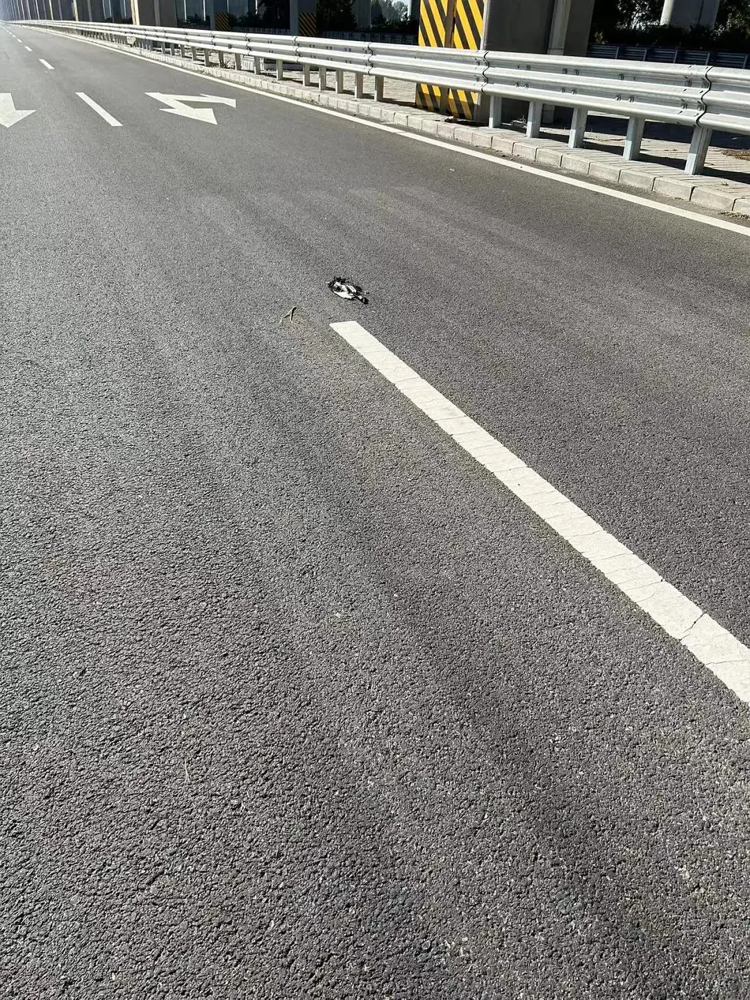
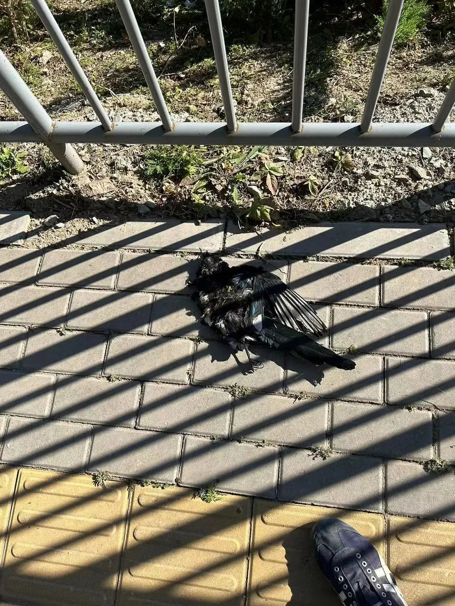

# 路遇一只死鸟

[文集首页](../../README.md) · [本类目录](../../catalog/08-life.md)

作者／署名：王路  
主题：散文、故事与生活记忆  
页面时间：2023-10-21 22:41:23  
来源：[https://www.douban.com/note/855278301/](https://www.douban.com/note/855278301/)

---

我开车去工地，在大兴机场高速下的辅路上，看见一只死鸟，横在路中间，稍微靠白线的位置。

我赶紧念了20声佛号。这是基本操作。我非常熟悉这套操作。从北京开车回河南时，960公里的高速，肯定会碰见几例小动物死在路边。还会碰见拉着猪或牛的大车，不用说，是拉去屠宰的。我就会念20声佛号，表示同情和慈悲，愿它们往生净土。

但是，你不觉得伪善吗？——什么都没有做，只是动动嘴皮子，就觉得把功德施与众生了。好像奔赴地狱的众生会因为自己的祝祷迁生天界或净域，而自己一毛钱都不用掏。——这不是很便宜的事情吗？我见过宁愿念100句佛号回向给别人，但不愿意请别人吃一碗面条的人。

车继续飞奔。我想到，其实可以停下来。虽然是单向三车道，但往来几乎没有车辆，只是偶尔有村民经过。算了吧，已经开出去几百米了。也许清洁工看见，会找个地方把它埋了——把积累福报的机会让给环卫工人吧。再伪善一次。

第二天早上，我又去工地。在同样的地方，又看见了那只鸟。注意到的时候，车又早已开出去了。这条路100年不堵车，我每次都狂奔。奔过去之后我意识到：还是昨天那只。它在这里至少躺了24小时。不知它是什么时候死在路中间的。死在路中间，不是很好的死法。人固有一死，鸟也固有一死，但无论是谁，最好都不要死在路中间。

车已经开出很远。其实也不算太远。虽然不能逆行，但走回来总是可以的。只是暖气师傅还在等着我——不久前，他打电话说到门口了，我说您稍等，我十分钟就到。于是又狂奔起来。

这不是一件重要的事情。第一天，我到了工地，见到装地板的师傅，就把鸟的事情忘了。似乎也没有理由记着。第一天返程没走这里，再次见到鸟，已经是第二天。第二天到了工地，见到暖气师傅，又把鸟的事情忘了。第二天返程走的还是这条路，但是是在高架桥的另一侧，所以还是没见到。第二天夜晚，我洗澡的时候，突然想起来了。

今天是第三天。车拐向大兴机场高速桥下没多久，我就想起来了。于是放慢速度，眼睛沿着路面扫。没有再见到鸟。应该是被清走了吧。我想到《旧年夜的卖唱人》。那是我2015年元旦写的文章。在望京凯德茂门口，有个男子在零下八度的寒风中裸着上身弹吉他，旁边扔着吉他箱。有两次，我晚饭后路过，觉得他很夸张。走过后想起，打开的吉他箱应该是在期待别人投钱。第一天，我已经走过去了；第二天，我在路过之前想起，但又不习惯当众打开钱包并逗留，于是又无动于衷地路过；第三天，邻近元旦，节日给了我勇气，我在晚饭后付账时掏出10块钱，揣在右裤兜里，预备路过时丢进吉他箱。可是那天晚上，他没有来。

想到这些，我心里没有波澜。我习惯了有情生命中的一再错过。其实不是错过，只是习惯。再来一次，你还是会照着从前那样做。所以也没有什么可惜，有的无非伪善。

这时，我看见了鸟。我前面有一辆三轮，一个老太太在蹬，不是机动的。老头坐在三轮上，应该是她老伴儿。有个骑电动车的逆行过来，让我不方便靠边。我打转向，刹车，小伙子大概觉得我很奇怪吧。

看看后视镜，确定没有后方来车，打开车门，走向马路中间。掏出手机要拍照。阳光让我看不清屏幕，想到是马路中间，我老远按下快门。走近，拎起羽毛，回到路边步道。

它的羽毛有一点华丽。扁扁平平，是被车轮碾死的，碾成了平面，像失败作家笔下的人物。我四下看看，没法掩埋。我是把它放在路边步道上，还是让它越过栏杆躺在泥土上？

如果放步道上，只有环卫工人可能把它掩埋。更可能的是扔进垃圾桶，葬身于臭烘烘的露天垃圾场。我不是没有掠过用车带走找个地方掩埋的念头，但觉得小题大做。步道的栏杆外，稀疏长着三五丛灌木，我想让它的遗骸受此荫蔽，庶几免乎日晒。风吹雨打是免不了的。但我不想投掷它的遗骸，最终，它还是简单地躺在没有灌木荫蔽的泥土上。唯一的欣慰，是身下有泥土，要强过水泥地吧？

拍拍手上的灰，驱车上路。写这篇文章时，我翻开白天的照片。两张。一张是它躺在马路中间，平静而辽阔；一张是它躺在步道上，栏杆影子打在它身上，像世间的牢笼。

（完）

11月、12月写作班现在可以报名，详情如前：

写作班搞起来

---

### 正文中的链接

- [写作班搞起来](http://mp.weixin.qq.com/s?__biz=MzA5OTc3NzEzMw==&mid=2653682194&idx=1&sn=9ab5fe46bbe7cce2a2a2e2594609ab71&chksm=8b227510bc55fc068e5ab0c9ab165afe63dc2929d4813a7a1e9a05becc7848ed3f37fbec5ce0&scene=21#wechat_redirect)

---

### 正文图片

