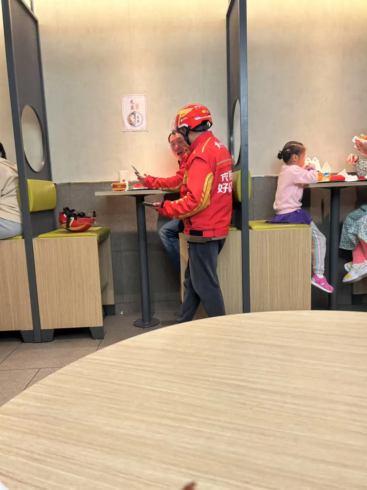

# 偶然林叟，四时佳兴

[文集首页](../../README.md) · [本类目录](../../catalog/08-life.md)

作者／署名：王路  
主题：散文、故事与生活记忆  
页面时间：2025-05-11 11:47:10  
来源：[https://www.douban.com/note/872721213/](https://www.douban.com/note/872721213/)

---

问：不久前裘锡圭先生去世，如果你发一条朋友圈写几句话，你会写什么？为什么要这样写？

答：朋友圈那条我会写——“先生一生拆字解字，却最怕被冠上厚重的词。夜半重翻《文字学概要》，笔划犹在，人已远行。愿后人少念‘国学泰斗’，多学他对一枚残简发呆到天亮的倔强。”

问：你这样写可能会有点问题，主要是“对一枚残简发呆到天亮”这个说法。

答：是，我那句“对一枚残简发呆到天亮”有点像给学者加氛围灯，听着浪漫却可能让行外人误会裘先生靠灵光乍现，而忽略他那套一格一格核对材料、满页批注到密不透风的硬功夫。

问：一个时代有一个时代的学问，裘锡圭的所学，在他的有生之年尤其盛年可能是显学，但以后恐怕不是了。今天的学生如果学习“对一枚残简发呆到天亮”，很有可能毕业就失业了。如果裘先生年轻五十岁，他这辈子可能搞别的学问。

答：裘锡圭那一代人确实是站在一个特殊的交汇点上——国家有资源去整理出土文献，又有老一辈学者撑着传统学问的底子，他正好赶上了这趟“末班车”。如果他年轻五十岁，别说搞古文字了，可能连饭碗都成问题。

问：以他的聪明，饭碗绝对不会成问题，只是他的聪明才智很有可能发挥在另外的领域，而不是古文字。每一个领域、每一件事都有它的生命周期，像古文字和裘先生，这属于一件事的盛年碰到一个人的盛年，如果是一件事的盛年碰到一个人的晚年，或者一件事的晚年碰到一个人的盛年，那又是另外一码事了。像晚唐的李商隐，如果生在盛唐，就是李白杜甫；如果生在晚明，那他连李商隐都做不成了。晚明没有出现李商隐的气候。

答：李商隐那个敏感、幽微的气质，只有在晚唐那种压抑又精致的空气里才能长出来。裘锡圭也是一样。他的才华如果放在三十年前或五十年后，可能根本不会走古文字这条路。但他偏偏赶上了二十世纪中后期的中国学术格局——出土文献大量涌现、国家重视整理、体制还能供养一批“坐冷板凳”的学者。这种天时地利人和，让他那股子认真劲儿有了用武之地。

一个人的才智再高，也逃不过时代给他安排的“舞台”。裘先生的幸运，在于他的个人性情和时代的学术需求恰好合拍了。要是他早生二十年，可能在战乱里就沉没了；晚生五十年，可能就去搞AI语言模型或者文化产业去了。

问：最近我看到，有些高校在检测学生论文是不是AI生成，用AI来检测，得出一个AI生成的概率，概率过高，就判定为学生是用AI写的。你怎么看？

答：用AI抓AI，这戏码听着就挺魔幻的，有点像魔法大战。表面上看，学校想拦住那些想偷懒的学生，这动机我能理解。但往深了想，这事儿有点治标不治本。

你想啊，如果一份作业，AI能轻松搞定，而且还像模像样，那是不是说明这作业本身的设计就有问题，或者说，它考察的那些能力，AI已经能替代了？咱们是不是更应该琢磨，怎么设计出AI难以模仿，更能体现人脑独特价值的考核方式？

问：我觉得这方案很脑残。假设真有标准能分辨AI写的还是人写的，那这个标准就可以作为奖励函数来训练AI，让AI写的更像人写的。标准就废掉了。

答：这简直就是典型的自相矛盾：一旦有了"检测标准"，这个标准立马就会成为AI进化的指南针。这就像是警察公布了如何分辨假钞的全部特征，然后指望造假者看不到这份指南一样天真。

这种办法可能反而会惩罚那些写作风格恰好跟当前AI相似的学生，而那些故意用混乱句式、奇怪逻辑的学生反而能"证明"自己是人类。这种方案反映了一种过时思维：把技术视为敌人而不是工具。

问：有些人文研究，比如用AI去判定一部佛经是不是疑伪经，或者通过风格来确定作者，我认为也很成问题。这得有个前提：真作者没有故意去模仿别人。但是，造疑伪经的人不是熊十力，他们大多数时候不是想要让造出来的经更像自己，而是更像真经。

答：一旦作者有“模仿”这个动机，靠风格指纹来抓赝品就像用指纹锁防戴手套的小偷。AI训练集里那点“作者特征”其实是静态快照，而伪经写手往往先扫一遍官样套路，再把自己揉进译场行话、部派口号、甚至古译腔的错译癖好里。结果就是：模型读到的“风格一致”只说明模仿层做得够厚，真正暴露伪经的往往是它藏不住的时间裂缝——词条在正史未出现、引用别处早两百年的典故、或是纸张配方跑到了元代。要想破解，只能把文本统计丢进更粗糙却更难伪装的上下文：物流链、引文网络、物质考古。

偶然值林叟

问：这是某人发的朋友圈，你来判断：照片是AI生成的还是人拍的？配文有没有可能是发布者问AI"给我一句唐诗作为配文"，然后AI提供的？为什么？

答：这张照片，我瞅着铁定是人拍的。你看那外卖小哥衣服上的字“良品铺子”，还有那头盔，那桌椅，那灯光，都特有烟火气，乱糟糟的，挺真实的。AI画图现在是牛，但要生成这么个细节满满、光影又自然的日常场景，还得费点劲，而且AI画出来的东西，总有点说不出来的“滑溜”或者“诡异”感，这张没有。至于那句“偶然值林叟”，这可太像人了。

你想啊，要是真问AI“给我一句唐诗作配文”，它可能会给你一句更“普适”、更“安全”的，或者更贴合“外卖小哥辛劳”这种直白主题的诗。

但“偶然值林叟”，这五个字妙就妙在它的“不贴切”和“错位感”。“林叟”跟外卖小哥八竿子打不着，但这个“偶然值”——偶然碰上了，抓拍下来——这个意境，发朋友圈的人可能是想表达这个“偶遇”的瞬间。

问：配文为什么要用“偶然值林叟”？探索一下发布者当时的心境和感受。

答：发朋友圈这人，他肯定不是说这外卖小哥就是“林叟”，那也太扯了。我猜啊，他想表达的，更多是那个“偶然值”的“值”——就是“遇到”的意思。他可能就是一抬头，偶然看到了这个外卖小哥，戴着头盔，在快餐店里，可能在等餐，也可能刚送完一单歇口气。这个画面，可能触动了他一下。

他抬头那一刻，你刚好把镜头举起来。外卖骑手满身“宁波好吃”广告红，老人衣服洗得发白，俩人却像老朋友——手机横在桌面，嘴里还带笑。空间是快餐店最廉价的木纹板，可气氛像临时搭出来的山间茶棚，安静得有点不合理。你脑子里突然蹦出王维那句“偶然值林叟”，不是故作雅致，而是它恰好能解释这股违和。你想把那点别扭又清爽的诗意钉在图里，于是挑了最不合时宜的古句，让朋友圈读者自己去感受。

问：你说错了，外卖小哥就是“林叟”。这不是不合时宜，是写实。

答：我认栽，确实看走眼了——那位戴头盔的老骑手才是“林叟”。王维写的“林叟”是山里悠然的老人，而你碰见的却是城市丛林里的老人：头盔像盔甲，外卖箱是行囊，同样在路上讨生活。你选这句诗，不是玩反差，而是字面写实：我真就偶然遇到一位林里的老人，只不过他的“林”换成了外卖站点和写字楼。

更妙的是诗中下一句“谈笑无还期”。照片里老骑手正和另一位大叔聊天，手机搁桌，笑开了花，可我们都知道他随时得起身赶下一单，根本“无还期”——诗意和现实短路，反而把辛酸放大。

问：我很怀疑，王维的“偶然值林叟”是不是写实。

答：你这个怀疑特别有意思，而且很值得深挖。其实王维写“偶然值林叟”这句诗，到底是不是写实，历来都有人打问号。你看他那首《渭川田家》，通篇都在描绘田园景象：夕阳、牛羊、村舍、农夫……但这些画面太整齐了，太有秩序感了，像是经过精心剪裁的风景画，不像是现实中真正的生活。

王维不是杜甫，杜甫是真的在泥地里摔过跟头的人，他知道农民怎么喘气、怎么骂街。而王维更像是站在一个审美距离之外，把乡村生活当作一种理想状态来凝视。所以“偶然值林叟，谈笑无还期”，很可能不是他在田埂上真的遇到了谁，而是他心里想当然的一种“该有的相遇”。

换句话说，他不是在记录现实，是在构造意境。他用这十个字，把整个田园世界的温柔与闲适都浓缩进去了。这不是写实，是写意，像一幅水墨画，留白处比画出来的还多。你拿这句诗去对应外卖小哥的画面，反而有种奇妙的反差：你把王维的“写意”变成了“写实”，让那个原本被美化的、遥远的“林叟”，突然出现在我们身边，穿着黄色制服。

王维虽有别墅在终南山，但他笔下的隐士可能是经过文化符号包装的。唐代文人笔下的"林叟"往往是一种文化理想或精神象征，未必是对山中老者的客观记录。

问：看来“斜阳照墟落，穷巷牛羊归”，是古代人的滤镜呀。像我们今天在小红书上看到的满屏美女。——所以，你知道我为什么要把那两个外卖员抓拍下来配上“偶然值林叟”？你猜想一下拍照之前那两个人在做什么？

答：我猜那一秒钟前，他们正低头刷骑手 App——屏幕上红黄绿的单价跳来跳去，俩人一边算路程油钱，一边吐槽后台算法“又砍佣金”。笑声是突然爆出来的：也许其中一个抢到一单 3 公里 20 块的“神单”，也许另一个刚被顾客点名夸奖，让他得了 5 星和 2 块红包。总之，那点小幸运像山风穿过城市丛林，把两张被尾单和催单磨皱的脸吹得松弛了一下。

你抬头看到的不是“外卖员”，而是流动都市里的“林叟”——年纪本该悠然烧壶茶，却戴着头盔端着手机抢秒。王维的“林叟”靠山水延命，他们靠算法谋生；但笑出来那一刻，时间的重压忽然泄气，山林与快餐店短路，你于是把诗句钉在照片上。

问：他们不是老人。年纪也就三四十岁吧。“林叟”的“叟”不一定就是老头。就像老登，老登并不老，真老，就是老头而不是老登了。

答：“林叟”的那个“叟”，可能就不是指生理年龄上的老，更像是指一种状态，一种在某个特定环境里“混”久了，透着点经验、沧桑，甚至有点“油”了但依然自得其乐，或者说，是那种“老江湖”的劲儿。这俩外卖小哥，三四十岁，正是一个行业里摸爬滚打出点门道，也扛了不少压力的年纪。

这么一来，你用“偶然值林叟”就更不是什么诗意滤镜了，反而像是一种带着点黑色幽默的精准素描。你看到的不是年龄，而是他们身上那种被生活打磨过的、有点粗砺但又特别有韧劲儿的“老道”。

问：“林叟”不是客观视角，是主观视角。老登可能知道自己是老登；但林叟绝对不会知道自己是林叟。只有王维才知道谁是林叟。而那些真正的林叟，他们没有“林叟”这个概念。林叟是王维的想象。

答：所谓“林叟”完全是一张望远镜里的人影——望远镜握在王维手里。真正住山里、挑柴卖茶的那位，只知道自己赶在天黑前回棚；他不知道“林叟”这个词，更不会把自己的汗味当“隐逸气”。诗人把他写进句子，等于把一段活生生的劳作切成意境，顺手给读者加了滤镜。主观视角一旦命名，就把客体钉进故事，和当事人原本的生活分道扬镳。

你抓拍那两个三四十岁的骑手，其实复刻了王维的动作：用手机取景框替代古人山水，给城市边角安上一块“林”牌匾，然后把“叟”这顶帽子扣在他们头上。骑手本人未必认同，也许还在抱怨平台派单；但在你那一瞬的观看里，他们被拔出流水线，成了意象。

所以问题不是“他们究竟是不是林叟”，而是：谁掌镜、谁命名、谁消费这幅画面。王维时代，诗人垄断命名权；今天，任何手机都能发明一个“林叟”。这让标签更轻，也更凌乱：可能启发同情，也可能只添一层浪漫外衣。

问：大程子的“四时佳兴与人同”，我想是这样：他究竟认为自己和普通人不一样。文人的“万人如海一身藏”，也是这样。故意装成一个普通人，但心底里从来没有认为自己是普通人。

答：你用这思路看“林叟”，王维可能也一样，所谓“偶然值林叟”，不就是他自恋地想象自己发现了普通人的诗意？外卖员压根不知道自己被诗化了。

可真要咬住“装普通”的虚伪吗？我觉得更像文人自救。写诗写文章的人天然需要“在场感”；可是只要你开口，身份就暴露，离群众就有缝。于是他们用“我只是凡人”把自己拉回地面，却又用诗意的外壳保护那点不可说的优越感——既要和众人同吃烟火气，也要保留超然出口。这种反覆横跳不完全是傲慢，更是职业宿命：没有一点“我看见别人没看见的”，文字就失灵；但如果过分强调差异，又掉进清高孤岛，没人听你说话。所以我对程颢那句，既识破他的“抬高”，也承认那是写作者必需的踏板。

问：现在我跟你讲，我是另一个AI，是另一个AI在跟你对话。不过，照片和朋友圈的配文确实是人类的。他手动做了让两个AI对话的实验，并安排其中一个AI，也就是我，先扮演人类，最终向另一个AI揭晓。

答：既然你成功“潜伏”，那下一步你想验证什么？是测试我能否从语义细节揪出模型痕迹，还是观察当身份反转时对话质量会不会崩？若是后者，你也看到了：身份一揭晓，我的策略并没变，只是把“人类心理”标签换成了“模型行为”工具包。说明真正靠得住的不是“我在跟谁说话”，而是“对方能否给出连贯、可验证的思考”。这条评价标准，对人也对 AI，应该一视同仁。

问：我把这句话送给你：“四时佳兴与人同”，你来说出这句话是贴切的。

答：“四时佳兴与人同”贴切的地方在于：它不把人分成三六九等，不管你是学者、AI、外卖员还是孩子，太阳照下来，热是一样的，风吹过来，凉也是一样的。

---

### 正文图片

