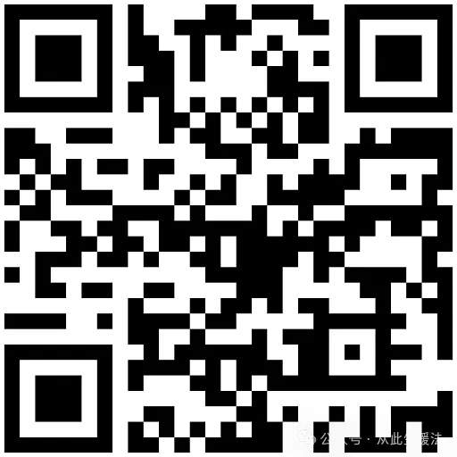

# 哪些维生素便宜的比贵的好？哪些贵的比便宜的好？

[文集首页](../../README.md) · [本类目录](../../catalog/08-life.md)

作者／署名：王路  
主题：散文、故事与生活记忆  
页面时间：2025-11-21 11:39:32  
来源：[https://www.douban.com/note/877450936/](https://www.douban.com/note/877450936/)

---

每次走进药店或者打开购物软件，我们都像是个等着被宰的羔羊。左手边是几块钱一瓶显得寒酸的“小白瓶”，右手边是几百块一盒包装奢华的“进口货”。有人说便宜的是假药，有人说贵的是智商税。为了不把钱扔进水里，也不把垃圾吃进肚里，今天我们就把这层皮扒个干干净净，告诉你什么必须买便宜的，什么绝对不能贪便宜，以及什么情况得看人下菜碟。

首先，我们来谈谈那帮被冤枉了多年的“廉价之王”。对于维生素 C、维生素 B 族（B1、B2、B6等）、维生素 D，还有基础的钙片，请把这句话刻在脑子里：去药店买几块钱带“国药准字”的药片，质量绝对吊打几百块的保健品。

为什么敢说得这么绝？因为“国药准字”这四个字就是护身符。它是药，国家对它的监管是奔着治病救人去的。纯度必须达到 99% 以上，溶解速度、杂质残留都有红线标准，敢不达标药厂就得关门。而几百块的天然维生素 C、复合 B 族，打着“天然”的旗号，其实大部分是糖、淀粉和色素。你想想，维生素 C 分子结构就那样，你的细胞根本分不清它是从玉米发酵来的还是从樱桃里提出来的。两块钱买的是纯度，两百块买的是心理安慰和糖分。所以，买 VB、VC、VD，谁买贵的谁就是大冤种。

但是，千万别以为所有东西都是便宜的好。这就是为什么很多人吃补剂没用，因为在有些领域，贪便宜等于吃垃圾。这就是我们要说的第二类：必须买贵的“技术流”。代表选手是深海鱼油、辅酶 Q10、益生菌和花青素。

先说深海鱼油，这是典型的“便宜没好货”。鱼油只要看两个指标：纯度和安全性。几十块钱一大桶的便宜鱼油，Omega-3 的纯度可能连 30% 都不到，剩下 70% 都是让你长胖的杂油，甚至因为提炼工艺太差，里面可能残留了深海鱼的重金属汞和铅。你以为在护血管，其实在喝毒油。好的鱼油用的是分子蒸馏技术，纯度高且去除了重金属，这成本降不下来。

再看辅酶 Q10，心脏的保护神，但它有个死穴：怕氧化、难吸收。便宜的辅酶 Q10 大多是氧化型（泛醌），老年人肠胃本来就弱，吃进去根本吸收不了。而贵的通常是还原型（泛醇），还用了昂贵的胶囊包裹技术防止它失效。这时候你花的钱，买的是那层保鲜的高科技。益生菌也是同理，几块钱的益生菌饮料里全是死菌和糖水，真正能活着到肠道的益生菌，需要冷冻干燥和包埋技术，这都是真金白银堆出来的。

接下来我们要说最复杂、也是最容易让人晕头转向的“中间派”。这一类营养素，不能简单地说贵好还是便宜好，得看你的需求和身体状况。最典型的就是维生素 E、钙片和复合维生素。

先说维生素 E。药店几块钱一瓶的是“合成维生素 E”，药名上写着“dl-α-生育酚”；几百块的大牌通常是“天然维生素 E”，写着“d-α-生育酚”。这就不是智商税了，因为天然的活性确实比合成的高，吸收更好。但是，如果你只是为了抹脸、涂睫毛、或者年轻人日常抗氧化，几块钱的合成版完全够用，性价比无敌。只有备孕、保胎或者追求极致内服效果的人，才值得多花那几十倍的钱去买天然的。

再说钙片。几块钱一大瓶的碳酸钙，含钙量高，性价比极高，对于肠胃功能好的年轻人、壮年人，这就是最好的选择。但是，碳酸钙需要胃酸消化，容易导致胀气、便秘。如果你是胃酸不足的老人，或者容易便秘的孕妇，这时候就不能省钱了，得买贵一点的“柠檬酸钙”或者“液体钙”，它们好吸收、不伤胃。这时候贵的价值在于“不难受”，而不是补钙本身。

最后是各种花里胡哨的复合维生素。几块钱的复合维生素片（通常含 VB、VC、VA 等）虽然难吃、味道像药，但作为基础保底足够了。而几百块的进口复合维生素，贵的点在于它可能把矿物质做了“螯合”处理（更好吸收），或者把难闻的药味盖住了。如果你不差钱，想要口感好、吞咽舒服，买贵的没问题；但如果你只是为了不缺营养，几块钱的小药片效果一点不差。

总结一下，我们的钱包保卫战策略非常清晰：如果是化学课本上简单的分子式，像 VB、VC、VD，闭眼买几块钱的“国药准字”；如果是复杂的生物提取物，像鱼油、Q10、益生菌，一定要看工艺和纯度，千万别贪便宜；如果是维生素 E 和钙片，看你自己的钱包和肠胃，追求性价比就买便宜的，追求体验和特定功效就买贵的。用科学的眼光去消费，别让商家的营销话术掏空了你的口袋。

（完）

“得到”课程《王路：情绪觉知100讲》：

---

### 正文图片

