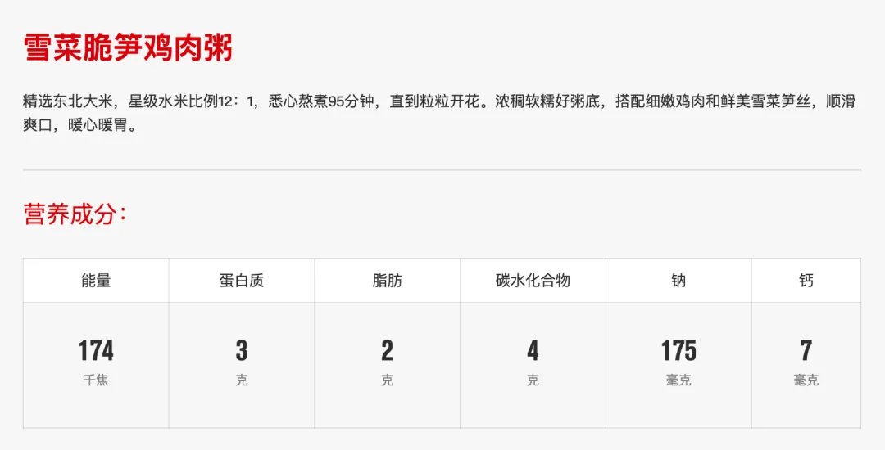

# 麦当劳的粥真的只有4克碳水吗？

[文集首页](../../README.md) · [本类目录](../../catalog/09-health.md)

作者／署名：王路  
主题：身体、健康与医学  
页面时间：2025-11-25 09:32:13  
来源：[https://www.douban.com/note/877536623/](https://www.douban.com/note/877536623/)

---

王路按：这篇文章是我于2025年11月25日早上8:18发布在微信公众号“王路在隐身”上的，并同步到我个人的知乎、豆瓣专栏。当天，麦当劳公司看到文章，第一时间内部对数据进行了复核及更正；周三，通过公众号后台联系到我表示感谢。麦当劳反馈说：【我们一直坚持在做餐品营养的数据透明化，从2018年开始上线营养计算器，然后每年都会对所有的常规餐品进行营养测算并更新，……真的多亏王老师你们的反馈，我们才能及时修正每个细节！】我留意过不少食品标签，实验误差或标注出错的情况并不罕见。但像麦当劳这样在文章发出后迅速复核、更正，并积极联系作者坦诚沟通的，确实不多见。这种对数据透明化的坚持和解决问题的效率，值得赞赏。

以下原文：

我们常常被那个写在海报角落里的数字所蛊惑。当你站在麦当劳的点餐台前，看着那一杯热气腾腾的粥，旁边的营养成分表里赫然写着“碳水化合物：4克”，你心里可能会涌起一阵窃喜。你以为自己发现了一个现代饮食的漏洞：一个既能填满肚子、抚慰中国胃，又几乎不给胰岛素惹麻烦的完美早餐。

但很遗憾，物理学和数学不会为了快餐巨头而弯曲。如果你愿意稍微动用一点小学算术，拿着一把名为“物质守恒”的手术刀去解剖这杯粥，你会发现这个“4克”的谎言，在常识面前是多么的不堪一击。

我们要做的第一件事，是把抽象的营养学数据还原成具体的物理实体。4克碳水化合物是什么概念？大米和杂粮的碳水含量通常稳定在80%左右。这意味着，所谓的4克碳水，倒推回原料端，大约仅仅等于5克生米。

请你在脑海里想象一下5克生米的分量。它大概就是一个普通矿泉水瓶盖那么多的量，是你做饭时手抖洒在灶台上的那一小撮，是一只麻雀都能轻松吃完的一顿下午茶。

接下来，我们把这少得可怜的5克米扔进锅里。为了不冤枉麦当劳，我们按照它说的“水米比12:1”计算。5克米配上60克水，总重量是65克。考虑到淀粉糊化后的体积微弱膨胀，这锅“粥”煮出来的最终体积，撑死也不会超过75毫升。即便把“水米比12:1”看成是体积来计算，加上雪菜笋丁或者皮蛋鸡肉，总体积100毫升顶天了。

这时候，审判的时刻到了。请找来一个我们办公室最常见的、用来喝水的一次性纸杯。这种标准纸杯的容量通常是200毫升左右——这也恰好是麦当劳那杯粥的大致容器规格。可参考的是麦当劳的小杯豆浆是9盎司，大约266毫升。

现在，把我们刚才那锅用“4克碳水”煮出来的75毫升粥倒进这个一次性纸杯。

你会看到一个令人尴尬的景象：这坨稀烂的流体，甚至连纸杯的一半都装不满，只占了杯子的不到四成。它静静地躺在杯底，看起来不像是卖给你的早餐，倒像是上一位顾客喝剩下的残渣。

然而，当你此时此刻坐在麦当劳的硬板凳上，摆在你面前的那杯真实的粥是什么样子的？它是满的。它满满当当，液面逼近杯沿。这意味着它的实际体积有200毫升，也就是我们计算值的2.5倍以上。

为了让你更直观地感受到这个数据的荒谬，我们不妨看看菜单上的两位“邻居”。

同样是麦当劳，一杯200毫升的纯牛奶，碳水含量是10克；一杯小杯的豆浆，碳水含量更是高达25克。

请仔细品味这个对比的魔幻之处：牛奶，一种液体，主要成分是水和蛋白，仅仅因为里面那点天然的乳糖，碳水都是10克。而旁边这杯粥，明明是用纯淀粉（米）熬出来的，明明是浓稠的糊状物，明明体积和牛奶一样大，商家却试图让你相信，它的碳水含量连牛奶的一半都不到，甚至只有那杯甜豆浆的六分之一。

这在物理上是不可能的。除非这杯粥里装的不是米，而是水和空气；又或者，麦当劳发明了一种能让淀粉凭空消失的反物质大米。

如果这杯粥真的像它表现出来的那么满、那么有米粒感，按照最基本的物理推算，要填满这200毫升的空间并维持那种粘稠度，起步至少需要20克生米。这意味着，它真实的碳水含量应该是15克到20克之间——这与宣传的“4克”相比，是整整4到5倍的差距。

那么，那个“4克”的数字是怎么来的？麦当劳的官方解释是：“由国家认可的实验室测定，经汇总和验证后得出。您所购买的餐品，有可能因原料批次、产地和供应季节，生产加工工艺和餐厅烹制过程，实际供应份量的不同有所差异。”

但无论解释多么花哨，身体是最诚实的。当你喝下这杯实际上含有十几二十克碳水的“碳水混合物”时，你的血糖不会因为看了一眼海报就保持平稳。所以，不要被那个诱人的数字欺骗。在这个充满糖衣炮弹的世界里，相信牛奶的诚实，相信豆浆的坦率，唯独不要相信一碗号称比牛奶还“瘦”的淀粉粥。数学，才是唯一的防身术。

（数据：https://www.mcdonalds.com.cn/product）

“得到”课程《王路：情绪觉知100讲》：

---

### 正文中的链接

- [https://www.mcdonalds.com.cn/product](https://www.mcdonalds.com.cn/product)

---

### 正文图片

