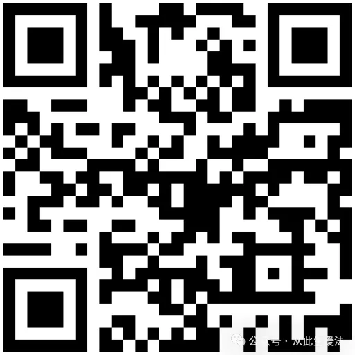

# 怎么吃脂肪？

[文集首页](../../README.md) · [本类目录](../../catalog/09-health.md)

作者／署名：王路  
主题：身体、健康与医学  
页面时间：2025-12-06 10:35:05  
来源：[https://www.douban.com/note/877807325/](https://www.douban.com/note/877807325/)

---

如果要真正讲透怎么吃脂肪，我们首先得把脑子里那个“好坏脂肪对照表”给撕了。

绝大多数人认为，脂肪的好坏是天生的：橄榄油是好人，猪油是坏人，牛油果是天使，炸鸡油是恶魔。

这个认知太幼稚了，也太危险了。脂肪不是死物，它是化学性质极不稳定的“活物”。 一个所谓的“健康脂肪”，只要你放错地方、用错温度，瞬间就会黑化成毒药。

所以，我们先不谈“买什么”，先谈一个被严重忽视的概念：脂肪的“性格”。

你要吃对脂肪，首先得懂它的脾气。那些被吹捧上天的“不饱和脂肪酸”（比如亚麻籽油、极品初榨橄榄油、核桃油），它们的化学结构非常松散，这意味着它们极其“敏感”且“脆弱”。它们就像那种才华横溢但神经质的艺术家，稍微见点光、遇点热、接触点氧气，立马就“疯”了——发生氧化反应，产生自由基和致癌物。

这就是现代家庭厨房最大的惨案现场：很多人花大价钱买了特级初榨橄榄油，觉得它健康，结果拿来下锅爆炒。就在油冒烟的那一刻，你其实是在吃“高级致癌物”。对于这类“健康脂肪”，只要下了油锅，它就是不健康的。它们唯一的归宿，只能是凉拌，或者出锅淋上去。

反过来，那些被骂了多年的饱和脂肪（牛油、猪油、椰子油），因为结构死板、紧密，反而极其“抗造”。它们像那种迟钝但皮实的老实人，耐高温，不起反应。如果你非要炒菜、要煎炸，这些被污名化的脂肪，反而是对身体伤害最小的选择，因为它们不会变成乱七八糟的氧化产物。

懂了这个逻辑，你就能推导出一个惊人的结论：

并不存在绝对“健康”的瓶装油。因为只要是榨出来的油，就失去了天然食物外壳的保护，直接暴露在氧气中。

你要想吃到真正顶级的健康脂肪，唯一的办法是“吃原装的”。

大自然非常鸡贼，它把最容易氧化的脂肪，严严实实地包裹在种子、果实和细胞壁里。你看核桃、杏仁、牛油果，甚至是肥肉，它们只要没被加工破碎，里面的脂肪就是最鲜活、最稳定的。

所以，最好的策略是：少用油，多吃脂。

与其纠结买花生油还是玉米油，不如直接吃花生和玉米（当然玉米主要是碳水）。当你吃整块的肉、整个的坚果、切开的牛油果时，你不仅吃到了脂肪，还吃到了与之匹配的抗氧化剂和纤维素。这才是身体能听懂的语言。

接下来，我们要面对那个更阴险的敌人：怎样避开不健康的脂肪？

避开反式脂肪酸现在已经很容易了，只要不吃廉价加工零食就行。真正让你防不胜防的，是潜伏在你每一顿外卖、每一袋面包里的“Omega-6 泛滥”。

这是现代人身体常年处于“低度发炎”状态的罪魁祸首。

大部分植物油（大豆油、玉米油、葵花籽油）都富含 Omega-6 脂肪酸。这东西本身没毒，甚至也是人体必需的。但坏就坏在比例。

在人类几百万年的历史里，我们要么吃肉要么吃果子，摄入的 Omega-6 和 Omega-3（主要来自深海鱼、草饲肉）的比例大概是 1:1。这两种脂肪酸在身体里打配合，一个负责启动炎症（帮你杀菌、愈合伤口），一个负责消炎（让你恢复平静）。

但现在的工业饮食，把这个比例搞成了夸张的 20:1。

为什么？因为大豆油、玉米油太便宜了。所有的餐厅、食堂、加工食品，为了控制成本，用的全是这种油。结果就是，你哪怕觉得自己吃得很清淡，只要你在外面吃饭，你身体里的 Omega-6 就已经爆表了。

这意味着什么？意味着你的身体时刻处于一种“准备打仗”的亢奋发炎状态。血管壁发炎、关节发炎、皮肤发炎，最后就是慢性的代谢崩溃。

所以，避免不健康脂肪的核心，不是去盯着某一种油看它是不是地沟油，而是极力在生活中削减廉价植物油的摄入。

这里有几条不仅深刻而且实操性极强的“避坑逻辑”：

第一，警惕一切“清澈透明”的塑料桶装油。正常的油，比如自家榨的猪油或压榨的菜油，是有颜色、有浑浊度的。那些超市里晶莹剔透的油，是经过了“精炼”工序的（脱胶、脱酸、脱色、脱臭）。这个过程往往用到了高温和化学溶剂，虽然油看起来干净了，但其实营养死光了，而且可能残留了反式脂肪。

第二，如果你无法在自家厨房里通过简单的物理方式（压、煮、熬）把这种油弄出来，那就别吃它。

你想想，猪油是可以熬出来的，橄榄油是可以压出来的，椰子油是可以分离出来的。

但是，玉米油和大豆油是怎么出来的？你拿个锤子砸玉米粒，砸到天荒地老也砸不出油。它们必须通过工业溶剂浸出。这意味着它们生来就是工业品，不是食物。

第三，最隐蔽的脂肪刺客，其实是“糖油混合物”。

单纯的肥肉虽然腻，但吃不了多少，身体也还能代谢。单纯的糖，虽然升糖快，但也还好。

但当脂肪和糖（也就是碳水）以 1:1 的比例混合——比如蛋糕、饼干、油条、薯片、葱油饼——这简直就是针对人类基因设计的“致死代码”。这种组合会同时打开身体的脂肪储存开关和炎症开关，让大脑失去饱腹感信号。这不是在吃饭，这是在给你的代谢系统投毒。

总结一下，如果你想在这场脂肪的混战中全身而退：

要把脂肪当成娇贵的食材，而不是随便泼洒的佐料。

能吃“肉”本身，就别吃榨出来的“油”。

家里做饭，高温用猪油、椰子油、黄油；低温凉拌用初榨橄榄油。

在外面，哪怕是吃水煮菜，也要警惕那上面淋的亮晶晶的廉价植物油。

最后，永远警惕那些好吃到让你停不下来的“酥脆”和“绵软”，那通常是劣质脂肪和精制碳水的一场合谋。

（完）

“得到”课程《王路：情绪觉知100讲》：

---

### 正文图片

